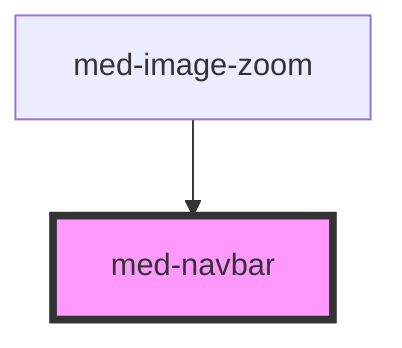

# med-navbar

<!-- Auto Generated Below -->

## Events

| Event       | Description | Type                                   |
| ----------- | ----------- | -------------------------------------- |
| `medResize` |             | `CustomEvent<navbarResizeEventDetail>` |

## Dependencies

### Used by

 - [med-image-zoom](../med-image-zoom)

### Graph

----------------------------------------------

*Built with [StencilJS](https://stenciljs.com/)*
