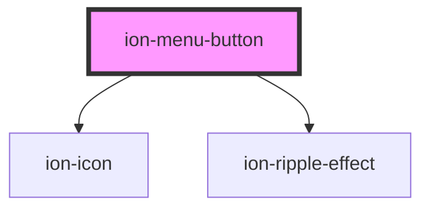

# ion-menu-button

Menu Button is component that automatically creates the icon and functionality to open a menu on a page.

<!-- Auto Generated Below -->

## Properties

| Property   | Attribute   | Description                                                                                                                                                                                                                                                            | Type                              | Default     |
| ---------- | ----------- | ---------------------------------------------------------------------------------------------------------------------------------------------------------------------------------------------------------------------------------------------------------------------- | --------------------------------- | ----------- |
| `autoHide` | `auto-hide` | Automatically hides the menu button when the corresponding menu is not active                                                                                                                                                                                          | `boolean`                         | `true`      |
| `color`    | `color`     | The color to use from your application's color palette. Default options are: `"primary"`, `"secondary"`, `"tertiary"`, `"success"`, `"warning"`, `"danger"`, `"light"`, `"medium"`, and `"dark"`. For more information on colors, see [theming](/docs/theming/basics). | `string \| undefined`             | `undefined` |
| `disabled` | `disabled`  | If `true`, the user cannot interact with the menu button.                                                                                                                                                                                                              | `boolean`                         | `false`     |
| `menu`     | `menu`      | Optional property that maps to a Menu's `menuId` prop. Can also be `start` or `end` for the menu side. This is used to find the correct menu to toggle                                                                                                                 | `string \| undefined`             | `undefined` |
| `type`     | `type`      | The type of the button.                                                                                                                                                                                                                                                | `"button" \| "reset" \| "submit"` | `'button'`  |

## CSS Custom Properties

| Name                   | Description                                                                                               |
| ---------------------- | --------------------------------------------------------------------------------------------------------- |
| `--background`         | Background of the menu button                                                                             |
| `--background-focused` | Background of the menu button when focused with the tab key                                               |
| `--background-hover`   | Background of the menu button on hover                                                                    |
| `--border-radius`      | Border radius of the menu button                                                                          |
| `--color`              | Color of the menu button                                                                                  |
| `--color-focused`      | Color of the menu button when focused with the tab key                                                    |
| `--color-hover`        | Color of the menu button on hover                                                                         |
| `--padding-bottom`     | Bottom padding of the button                                                                              |
| `--padding-end`        | Right padding if direction is left-to-right, and left padding if direction is right-to-left of the button |
| `--padding-start`      | Left padding if direction is left-to-right, and right padding if direction is right-to-left of the button |
| `--padding-top`        | Top padding of the button                                                                                 |

## Dependencies

### Depends on

- ion-icon
- [ion-ripple-effect](../ripple-effect)

### Graph

----------------------------------------------

*Built with [StencilJS](https://stenciljs.com/)*
