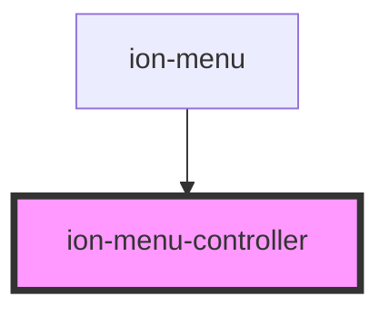

# ion-menu-controller

The Menu Controller makes it easy to control a Menu. The methods provided can be used to display the menu, enable the menu, toggle the menu, and more. The controller will grab a reference to the menu by the side, or id. if neither of these are passed to it, it will grab the first menu it finds.

<!-- Auto Generated Below -->

## Methods

### `close(menu?: string | null | undefined) => Promise<boolean>`

Close the menu. If a menu is specified, it will close that menu.
If no menu is specified, then it will close any menu that is open.
If it does not find any open menus, it will return `false`.

#### Returns

Type: `Promise<boolean>`

### `enable(enable: boolean, menu?: string | null | undefined) => Promise<HTMLIonMenuElement | undefined>`

Enable or disable a menu. Disabling a menu will not allow gestures
for that menu or any calls to open it. This is useful when there are
multiple menus on the same side and only one of them should be allowed
to open. Enabling a menu will automatically disable all other menus
on that side.

#### Returns

Type: `Promise<HTMLIonMenuElement | undefined>`

### `get(menu?: string | null | undefined) => Promise<HTMLIonMenuElement | undefined>`

Get a menu instance. If a menu is not provided then it will return the first
menu found. If the specified menu is `start` or `end`, then it will return the
enabled menu on that side. Otherwise, it will try to find the menu using the menu's
`id` property. If a menu is not found then it will return `null`.

#### Returns

Type: `Promise<HTMLIonMenuElement | undefined>`

### `getMenus() => Promise<HTMLIonMenuElement[]>`

Get all menu instances.

#### Returns

Type: `Promise<HTMLIonMenuElement[]>`

### `getOpen() => Promise<HTMLIonMenuElement | undefined>`

Get the instance of the opened menu. Returns `null` if a menu is not found.

#### Returns

Type: `Promise<HTMLIonMenuElement | undefined>`

### `isAnimating() => Promise<boolean>`

Get whether or not a menu is animating. Returns `true` if any
menu is currently animating.

#### Returns

Type: `Promise<boolean>`

### `isEnabled(menu?: string | null | undefined) => Promise<boolean>`

Get whether or not the menu is enabled. Returns `true` if the
specified menu is enabled. Returns `false` if a menu is disabled
or not found.

#### Returns

Type: `Promise<boolean>`

### `isOpen(menu?: string | null | undefined) => Promise<boolean>`

Get whether or not the menu is open. Returns `true` if the specified
menu is open. If a menu is not specified, it will return `true` if
any menu is currently open.

#### Returns

Type: `Promise<boolean>`

### `open(menu?: string | null | undefined) => Promise<boolean>`

Open the menu. If a menu is not provided then it will open the first
menu found. If the specified menu is `start` or `end`, then it will open
the enabled menu on that side. Otherwise, it will try to find the menu
using the menu's `id` property. If a menu is not found then it will
return `false`.

#### Returns

Type: `Promise<boolean>`

### `registerAnimation(name: string, animation: AnimationBuilder) => Promise<void>`

Registers a new animation that can be used with any `ion-menu` by
passing the name of the animation in its `type` property.

#### Returns

Type: `Promise<void>`

### `swipeGesture(enable: boolean, menu?: string | null | undefined) => Promise<HTMLIonMenuElement | undefined>`

Enable or disable the ability to swipe open the menu.

#### Returns

Type: `Promise<HTMLIonMenuElement | undefined>`

### `toggle(menu?: string | null | undefined) => Promise<boolean>`

Toggle the menu open or closed. If the menu is already open, it will try to
close the menu, otherwise it will try to open it. Returns `false` if
a menu is not found.

#### Returns

Type: `Promise<boolean>`

## Dependencies

### Used by

 - [ion-menu](../menu)

### Graph

----------------------------------------------

*Built with [StencilJS](https://stenciljs.com/)*
