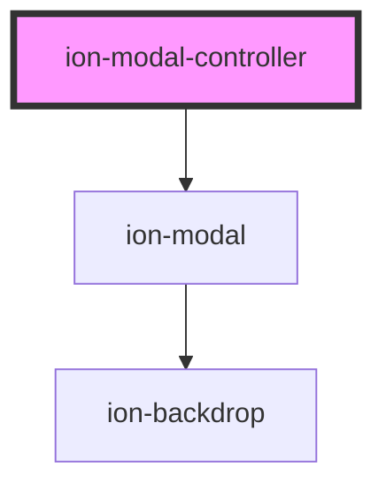

# ion-modal-controller

Modal controllers programmatically control the modal component. Modals can be created and dismissed from the modal controller. View the [Modal](../modal) documentation for a full list of options to pass upon creation.

<!-- Auto Generated Below -->

## Methods

### `create<T extends ComponentRef>(opts: ModalOptions<T>) => Promise<HTMLIonModalElement>`

Create a modal overlay with modal options.

#### Returns

Type: `Promise<HTMLIonModalElement>`

### `dismiss(data?: any, role?: string | undefined, id?: string | undefined) => Promise<boolean>`

Dismiss the open modal overlay.

#### Returns

Type: `Promise<boolean>`

### `getTop() => Promise<HTMLIonModalElement | undefined>`

Get the most recently opened modal overlay.

#### Returns

Type: `Promise<HTMLIonModalElement | undefined>`

## Dependencies

**Depends on:** [ion-modal](../modal)

----------------------------------------------

*Built with [StencilJS](https://stenciljs.com/)*
