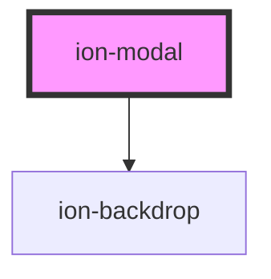

# ion-modal

A Modal is a dialog that appears on top of the app's content, and must be dismissed by the app before interaction can resume. It is useful as a select component when there are a lot of options to choose from, or when filtering items in a list, as well as many other use cases.

## Dismissing

The modal can be dismissed after creation by calling the `dismiss()` method on the modal controller. The `onDidDismiss` function can be called to perform an action after the modal is dismissed.

## Customization

Modal uses scoped encapsulation, which means it will automatically scope its CSS by appending each of the styles with an additional class at runtime. Overriding scoped selectors in CSS requires a [higher specificity](https://developer.mozilla.org/en-US/docs/Web/CSS/Specificity) selector.

We recommend passing a custom class to `cssClass` in the `create` method and using that to add custom styles to the host and inner elements. This property can also accept multiple classes separated by spaces. View the [Usage](#usage) section for an example of how to pass a class using `cssClass`.

```css
/* DOES NOT WORK - not specific enough */
.modal-wrapper {
  background: #222;
}

/* Works - pass "my-custom-class" in cssClass to increase specificity */
.my-custom-class .modal-wrapper {
  background: #222;
}
```

Any of the defined [CSS Custom Properties](#css-custom-properties) can be used to style the Modal without needing to target individual elements:

```css
.my-custom-class {
  --background: #222;
}
```

> If you are building an Ionic Angular app, the styles need to be added to a global stylesheet file. Read [Style Placement](#style-placement) in the Angular section below for more information.

<!-- Auto Generated Below -->


## Usage

### Angular

```typescript
import { Component } from '@angular/core';
import { ModalController } from '@ionic/angular';
import { ModalPage } from '../modal/modal.page';

@Component({
  selector: 'modal-example',
  templateUrl: 'modal-example.html',
  styleUrls: ['./modal-example.css']
})
export class ModalExample {
  constructor(public modalController: ModalController) {

  }

  async presentModal() {
    const modal = await this.modalController.create({
      component: ModalPage,
      cssClass: 'my-custom-class'
    });
    return await modal.present();
  }
}
```

```typescript
import { Component, Input } from '@angular/core';

@Component({
  selector: 'modal-page',
})
export class ModalPage {

  constructor() {}

}
```

### Passing Data

During creation of a modal, data can be passed in through the `componentProps`.
The previous example can be written to include data:

```typescript
async presentModal() {
  const modal = await this.modalController.create({
    component: ModalPage,
    cssClass: 'my-custom-class',
    componentProps: {
      'firstName': 'Douglas',
      'lastName': 'Adams',
      'middleInitial': 'N'
    }
  });
  return await modal.present();
}
```

To get the data passed into the `componentProps`, set it as an `@Input`:

```typescript
export class ModalPage {

  // Data passed in by componentProps
  @Input() firstName: string;
  @Input() lastName: string;
  @Input() middleInitial: string;

}
```

### Dismissing a Modal

A modal can be dismissed by calling the dismiss method on the modal controller and optionally passing any data from the modal.

```javascript
export class ModalPage {
  ...

  dismiss() {
    // using the injected ModalController this page
    // can "dismiss" itself and optionally pass back data
    this.modalCtrl.dismiss({
      'dismissed': true
    });
  }
}
```

After being dismissed, the data can be read in through the `onWillDismiss` or `onDidDismiss` attached to the modal after creation:

```javascript
const { data } = await modal.onWillDismiss();
console.log(data);
```


#### Lazy Loading

When lazy loading a modal, it's important to note that the modal will not be loaded when it is opened, but rather when the module that imports the modal's module is loaded.

For example, say there exists a `CalendarComponent` and an `EventModal`. The modal is presented by clicking a button in the `CalendarComponent`. In Angular, the `EventModalModule` would need to be included in the `CalendarComponentModule` since the modal is created in the `CalendarComponent`:

```typescript
import { NgModule } from '@angular/core';
import { CommonModule } from '@angular/common';
import { IonicModule } from '@ionic/angular';

import { CalendarComponent } from './calendar.component';
import { EventModalModule } from '../modals/event/event.module';

@NgModule({
  declarations: [
    CalendarComponent
  ],
  imports: [
    IonicModule,
    CommonModule,
    EventModalModule
  ],
  exports: [
    CalendarComponent
  ]
})

export class CalendarComponentModule {}
```

### Swipeable Modals

Modals in iOS mode have the ability to be presented in a card-style and swiped to close. The card-style presentation and swipe to close gesture are not mutually exclusive, meaning you can pick and choose which features you want to use. For example, you can have a card-style modal that cannot be swiped or a full sized modal that can be swiped.

If you are creating an application that uses `ion-tabs`, it is recommended that you get the parent `ion-router-outlet` using `this.routerOutlet.parentOutlet.nativeEl`, otherwise the tabbar will not scale down when the modal opens.

```javascript
import { IonRouterOutlet } from '@ionic/angular';

constructor(private routerOutlet: IonRouterOutlet) {}

async presentModal() {
  const modal = await this.modalController.create({
    component: ModalPage,
    cssClass: 'my-custom-class',
    swipeToClose: true,
    presentingElement: this.routerOutlet.nativeEl
  });
  return await modal.present();
}
```

In most scenarios, using the `ion-router-outlet` element as the `presentingElement` is fine. In cases where you are presenting a card-style modal from within another modal, you should pass in the top-most `ion-modal` element as the `presentingElement`.

```javascript
import { ModalController } from '@ionic/angular';

constructor(private modalCtrl: ModalController) {}

async presentModal() {
  const modal = await this.modalController.create({
    component: ModalPage,
    cssClass: 'my-custom-class',
    swipeToClose: true,
    presentingElement: await this.modalCtrl.getTop() // Get the top-most ion-modal
  });
  return await modal.present();
}
```


### Style Placement

In Angular, the CSS of a specific page is scoped only to elements of that page. Even though the Modal can be presented from within a page, the `ion-modal` element is appended outside of the current page. This means that any custom styles need to go in a global stylesheet file. In an Ionic Angular starter this can be the `src/global.scss` file or you can register a new global style file by [adding to the `styles` build option in `angular.json`](https://angular.io/guide/workspace-config#style-script-config).


### Javascript

```javascript
customElements.define('modal-page', class extends HTMLElement {
  connectedCallback() {
    this.innerHTML = `
<ion-header>
  <ion-toolbar>
    <ion-title>Modal Header</ion-title>
    <ion-buttons slot="primary">
      <ion-button onClick="dismissModal()">
        <ion-icon slot="icon-only" name="close"></ion-icon>
      </ion-button>
    </ion-buttons>
  </ion-toolbar>
</ion-header>
<ion-content class="ion-padding">
  Modal Content
</ion-content>`;
  }
});

function presentModal() {
  // create the modal with the `modal-page` component
  const modalElement = document.createElement('ion-modal');
  modalElement.component = 'modal-page';
  modalElement.cssClass = 'my-custom-class';

  // present the modal
  document.body.appendChild(modalElement);
  return modalElement.present();
}
```

### Passing Data

During creation of a modal, data can be passed in through the `componentProps`. The previous example can be written to include data:

```javascript
const modalElement = document.createElement('ion-modal');
modalElement.component = 'modal-page';
modalElement.cssClass = 'my-custom-class';
modalElement.componentProps = {
  'firstName': 'Douglas',
  'lastName': 'Adams',
  'middleInitial': 'N'
};
```

To get the data passed into the `componentProps`, query for the modal in the `modal-page`:

```js
customElements.define('modal-page', class extends HTMLElement {
  connectedCallback() {
    const modalElement = document.querySelector('ion-modal');
    console.log(modalElement.componentProps.firstName);

    ...
  }
}
```


### Dismissing a Modal

A modal can be dismissed by calling the dismiss method and optionally passing any data from the modal.

```javascript
async function dismissModal() {
  await modal.dismiss({
    'dismissed': true
  });
}
```

After being dismissed, the data can be read in through the `onWillDismiss` or `onDidDismiss` attached to the modal after creation:

```javascript
const { data } = await modalElement.onWillDismiss();
console.log(data);
```


### Swipeable Modals

Modals in iOS mode have the ability to be presented in a card-style and swiped to close. The card-style presentation and swipe to close gesture are not mutually exclusive, meaning you can pick and choose which features you want to use. For example, you can have a card-style modal that cannot be swiped or a full sized modal that can be swiped.

```javascript
const modalElement = document.createElement('ion-modal');
modalElement.component = 'modal-page';
modalElement.cssClass = 'my-custom-class';
modalElement.swipeToClose = true;
modalElement.presentingElement = document.querySelector('ion-nav');
```

In most scenarios, using the `ion-nav` element as the `presentingElement` is fine. In cases where you are presenting a card-style modal from within a modal, you should pass in the top-most `ion-modal` element as the `presentingElement`.

```javascript
const modalElement = document.createElement('ion-modal');
modalElement.component = 'modal-page';
modalElement.cssClass = 'my-custom-class';
modalElement.swipeToClose = true;
modalElement.presentingElement = await modalController.getTop(); // Get the top-most ion-modal
```


### React

```tsx
import React, { useState } from 'react';
import { IonModal, IonButton, IonContent } from '@ionic/react';

export const ModalExample: React.FC = () => {
  const [showModal, setShowModal] = useState(false);

  return (
    <IonContent>
      <IonModal isOpen={showModal} cssClass='my-custom-class'>
        <p>This is modal content</p>
        <IonButton onClick={() => setShowModal(false)}>Close Modal</IonButton>
      </IonModal>
      <IonButton onClick={() => setShowModal(true)}>Show Modal</IonButton>
    </IonContent>
  );
};
```

### Swipeable Modals

Modals in iOS mode have the ability to be presented in a card-style and swiped to close. The card-style presentation and swipe to close gesture are not mutually exclusive, meaning you can pick and choose which features you want to use. For example, you can have a card-style modal that cannot be swiped or a full sized modal that can be swiped.

```tsx
<IonModal
  isOpen={showModal}
  cssClass='my-custom-class'
  swipeToClose={true}
  presentingElement={pageRef.current}
  onDidDismiss={() => setShowModal(false)}>
    <p>This is modal content</p>
    <IonButton onClick={() => setShowModal(false)}>Close Modal</IonButton>
</IonModal>
```

In most scenarios, setting a ref on `IonPage` and passing that ref's `current` value to `presentingElement` is fine. In cases where you are presenting a card-style modal from within another modal, you should pass in the top-most `ion-modal` ref as the `presentingElement`.

```tsx
<IonModal
  ref={firstModalRef}
  isOpen={showModal}
  cssClass='my-custom-class'
  swipeToClose={true}
  presentingElement={pageRef.current}
  onDidDismiss={() => setShowModal(false)}>
    <p>This is modal content</p>
    <IonButton onClick={() => setShow2ndModal(true)}>Show 2nd Modal</IonButton>
    <IonButton onClick={() => setShowModal(false)}>Close Modal</IonButton>
</IonModal>
<IonModal
  isOpen={show2ndModal}
  cssClass='my-custom-class'
  presentingElement={firstModalRef.current}
  onDidDismiss={() => setShow2ndModal(false)}>
  <p>This is more modal content</p>
  <IonButton onClick={() => setShow2ndModal(false)}>Close Modal</IonButton>
</IonModal>
```


### Stencil

```tsx
import { Component, h } from '@stencil/core';

import { modalController } from '@ionic/core';

@Component({
  tag: 'modal-example',
  styleUrl: 'modal-example.css'
})
export class ModalExample {
  async presentModal() {
    const modal = await modalController.create({
      component: 'page-modal',
      cssClass: 'my-custom-class'
    });
    await modal.present();
  }
}
```

```tsx
import { Component, h } from '@stencil/core';

@Component({
  tag: 'page-modal',
  styleUrl: 'page-modal.css',
})
export class PageModal {
  render() {
    return [
      <ion-list>
        <ion-item>
          <ion-label>Documentation</ion-label>
        </ion-item>
        <ion-item>
          <ion-label>Feedback</ion-label>
        </ion-item>
        <ion-item>
          <ion-label>Settings</ion-label>
        </ion-item>
      </ion-list>
    ];
  }
}
```

### Passing Data

During creation of a modal, data can be passed in through the `componentProps`.
The previous example can be written to include data:

```tsx
async presentModal() {
  const modal = await modalController.create({
    component: 'page-modal',
    cssClass: 'my-custom-class',
    componentProps: {
      'firstName': 'Douglas',
      'lastName': 'Adams',
      'middleInitial': 'N'
    }
  });
  await modal.present();
}
```

To get the data passed into the `componentProps`, set each one as a `@Prop`:

```tsx
import { Component, Prop, h } from '@stencil/core';

@Component({
  tag: 'page-modal',
  styleUrl: 'page-modal.css',
})
export class PageModal {
  // Data passed in by componentProps
  @Prop() firstName: string;
  @Prop() lastName: string;
  @Prop() middleInitial: string;
}
```

### Dismissing a Modal

A modal can be dismissed by calling the dismiss method on the modal controller and optionally passing any data from the modal.

```tsx
export class ModalPage {
  ...

  dismiss(data?: any) {
    // dismiss the closest modal and optionally pass back data
    (this.el.closest('ion-modal') as any).dismiss({
      'dismissed': true
    });
  }
}
```

After being dismissed, the data can be read in through the `onWillDismiss` or `onDidDismiss` attached to the modal after creation:

```tsx
const { data } = await modal.onWillDismiss();
console.log(data);
```

### Swipeable Modals

Modals in iOS mode have the ability to be presented in a card-style and swiped to close. The card-style presentation and swipe to close gesture are not mutually exclusive, meaning you can pick and choose which features you want to use. For example, you can have a card-style modal that cannot be swiped or a full sized modal that can be swiped.

```tsx
import { Component, Element, h } from '@stencil/core';

import { modalController } from '@ionic/core';

@Component({
  tag: 'modal-example',
  styleUrl: 'modal-example.css'
})
export class ModalExample {
  @Element() el: any;

  async presentModal() {
    const modal = await modalController.create({
      component: 'page-modal',
      cssClass: 'my-custom-class',
      swipeToClose: true,
      presentingElement: this.el.closest('ion-router-outlet'),
    });
    await modal.present();
  }

}
```

In most scenarios, using the `ion-router-outlet` element as the `presentingElement` is fine. In cases where you are presenting a card-style modal from within another modal, you should pass in the top-most `ion-modal` element as the `presentingElement`.

```tsx
async presentModal() {
  const modal = await modalController.create({
    component: 'page-modal',
    cssClass: 'my-custom-class',
    swipeToClose: true,
    presentingElement: await modalController.getTop() // Get the top-most ion-modal
  });
  await modal.present();
}
```


### Vue

```html
<template>
  <div>
    <ion-header>
      <ion-toolbar>
        <ion-title>{{ title }}</ion-title>
      </ion-toolbar>
    </ion-header>
    <ion-content class="ion-padding">
      {{ content }}
    </ion-content>
  </div>
</template>

<script>
export default {
  name: 'Modal',
  props: {
    title: { type: String, default: 'Super Modal' },
  },
  data() {
    return {
      content: 'Content',
    }
  },
}
</script>
```

```html
<template>
  <ion-page class="ion-page">
    <ion-content class="ion-content ion-padding">
      <ion-button @click="openModal">Open Modal</ion-button>
    </ion-content>
  </ion-page>
</template>

<script>
import Modal from './modal.vue'

export default {
  methods: {
    openModal() {
      return this.$ionic.modalController
        .create({
          component: Modal,
          cssClass: 'my-custom-class',
          componentProps: {
            data: {
              content: 'New Content',
            },
            propsData: {
              title: 'New title',
            },
          },
        })
        .then(m => m.present())
    },
  },
}
</script>
```


## Properties

| Property                 | Attribute          | Description                                                                                                                                                       | Type                                                    | Default     |
| ------------------------ | ------------------ | ----------------------------------------------------------------------------------------------------------------------------------------------------------------- | ------------------------------------------------------- | ----------- |
| `animated`               | `animated`         | If `true`, the modal will animate.                                                                                                                                | `boolean`                                               | `true`      |
| `backdropDismiss`        | `backdrop-dismiss` | If `true`, the modal will be dismissed when the backdrop is clicked.                                                                                              | `boolean`                                               | `true`      |
| `component` _(required)_ | `component`        | The component to display inside of the modal.                                                                                                                     | `Function \| HTMLElement \| null \| string`             | `undefined` |
| `componentProps`         | --                 | The data to pass to the modal component.                                                                                                                          | `undefined \| { [key: string]: any; }`                  | `undefined` |
| `cssClass`               | `css-class`        | Additional classes to apply for custom CSS. If multiple classes are provided they should be separated by spaces.                                                  | `string \| string[] \| undefined`                       | `undefined` |
| `enterAnimation`         | --                 | Animation to use when the modal is presented.                                                                                                                     | `((baseEl: any, opts?: any) => Animation) \| undefined` | `undefined` |
| `keyboardClose`          | `keyboard-close`   | If `true`, the keyboard will be automatically dismissed when the overlay is presented.                                                                            | `boolean`                                               | `true`      |
| `leaveAnimation`         | --                 | Animation to use when the modal is dismissed.                                                                                                                     | `((baseEl: any, opts?: any) => Animation) \| undefined` | `undefined` |
| `mode`                   | `mode`             | The mode determines which platform styles to use.                                                                                                                 | `"ios" \| "md"`                                         | `undefined` |
| `presentingElement`      | --                 | The element that presented the modal. This is used for card presentation effects and for stacking multiple modals on top of each other. Only applies in iOS mode. | `HTMLElement \| undefined`                              | `undefined` |
| `showBackdrop`           | `show-backdrop`    | If `true`, a backdrop will be displayed behind the modal.                                                                                                         | `boolean`                                               | `true`      |
| `swipeToClose`           | `swipe-to-close`   | If `true`, the modal can be swiped to dismiss. Only applies in iOS mode.                                                                                          | `boolean`                                               | `false`     |


## Events

| Event                 | Description                             | Type                                   |
| --------------------- | --------------------------------------- | -------------------------------------- |
| `ionModalDidDismiss`  | Emitted after the modal has dismissed.  | `CustomEvent<OverlayEventDetail<any>>` |
| `ionModalDidPresent`  | Emitted after the modal has presented.  | `CustomEvent<void>`                    |
| `ionModalWillDismiss` | Emitted before the modal has dismissed. | `CustomEvent<OverlayEventDetail<any>>` |
| `ionModalWillPresent` | Emitted before the modal has presented. | `CustomEvent<void>`                    |


## Methods

### `dismiss(data?: any, role?: string | undefined) => Promise<boolean>`

Dismiss the modal overlay after it has been presented.

#### Returns

Type: `Promise<boolean>`


### `onDidDismiss() => Promise<OverlayEventDetail<any>>`

Returns a promise that resolves when the modal did dismiss.

#### Returns

Type: `Promise<OverlayEventDetail<any>>`


### `onWillDismiss() => Promise<OverlayEventDetail<any>>`

Returns a promise that resolves when the modal will dismiss.

#### Returns

Type: `Promise<OverlayEventDetail<any>>`


### `present() => Promise<void>`

Present the modal overlay after it has been created.

#### Returns

Type: `Promise<void>`


## CSS Custom Properties

| Name                 | Description                        |
| -------------------- | ---------------------------------- |
| `--backdrop-opacity` | Opacity of the backdrop            |
| `--background`       | Background of the modal content    |
| `--border-color`     | Border color of the modal content  |
| `--border-radius`    | Border radius of the modal content |
| `--border-style`     | Border style of the modal content  |
| `--border-width`     | Border width of the modal content  |
| `--height`           | Height of the modal                |
| `--max-height`       | Maximum height of the modal        |
| `--max-width`        | Maximum width of the modal         |
| `--min-height`       | Minimum height of the modal        |
| `--min-width`        | Minimum width of the modal         |
| `--width`            | Width of the modal                 |


## Dependencies

### Depends on

- [ion-backdrop](../backdrop)

### Graph


----------------------------------------------

*Built with [StencilJS](https://stenciljs.com/)*
