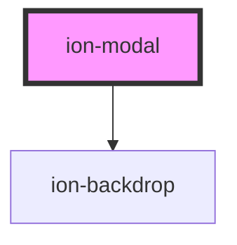

# ion-modal

A Modal is a dialog that appears on top of the app's content, and must be dismissed by the app before interaction can resume. It is useful as a select component when there are a lot of options to choose from, or when filtering items in a list, as well as many other use cases.


### Creating

Modals can be created using a [Modal Controller](../modal-controller). They can be customized by passing modal options in the modal controller's `create()` method.


### Dismissing

The modal can be dismissed after creation by calling the `dismiss()` method on the modal controller. The `onDidDismiss` function can be called to perform an action after the modal is dismissed.


<!-- Auto Generated Below -->


## Usage

### Angular

```typescript
import { Component } from '@angular/core';
import { ModalController } from '@ionic/angular';
import { ModalPage } from '../modal/modal.page';

@Component({
  selector: 'modal-example',
  templateUrl: 'modal-example.html',
  styleUrls: ['./modal-example.css']
})
export class ModalExample {
  constructor(public modalController: ModalController) {

  }

  async presentModal() {
    const modal = await this.modalController.create({
      component: ModalPage
    });
    return await modal.present();
  }
}
```

```typescript
import { Component, Input } from '@angular/core';
import { NavParams } from '@ionic/angular';

@Component({
  selector: 'modal-page',
})
export class ModalPage {

  constructor() {

  }

}
```

### Passing Data

During creation of a modal, data can be passed in through the `componentProps`. The previous example can be written to include data:

```typescript
async presentModal() {
  const modal = await this.modalController.create({
    component: ModalPage,
    componentProps: {
      'firstName': 'Douglas',
      'lastName': 'Adams',
      'middleInitial': 'N'
    }
  });
  return await modal.present();
}
```

To get the data passed into the `componentProps`, either set it as an `@Input` or access it via `NavParams` on the `ModalPage`:

```typescript
export class ModalPage {

  // Data passed in by componentProps
  @Input() firstName: string;
  @Input() lastName: string;
  @Input() middleInitial: string;

  constructor(navParams: NavParams) {
    // componentProps can also be accessed at construction time using NavParams
    console.log(navParams.get('firstName');
  }

}
```

### Dismissing a Modal

A modal can be dismissed by calling the dismiss method on the modal controller and optionally passing any data from the modal.

```javascript
export class ModalPage {
  ...

  dismiss() {
    // using the injected ModalController this page
    // can "dismiss" itself and optionally pass back data
    this.modalCtrl.dismiss({
      'dismissed': true
    });
  }
}
```

After being dismissed, the data can be read in through the `onWillDismiss` or `onDidDismiss` attached to the modal after creation:

```javascript
const { data } = await modal.onWillDismiss();
console.log(data);
```


#### Lazy Loading

When lazy loading a modal, it's important to note that the modal will not be loaded when it is opened, but rather when the module that imports the modal's module is loaded.

For example, say there exists a `CalendarComponent` and an `EventModal`. The modal is presented by clicking a button in the `CalendarComponent`. In Angular, the `EventModalModule` would need to be included in the `CalendarComponentModule` since the modal is created in the `CalendarComponent`:

```typescript
import { NgModule } from '@angular/core';
import { CommonModule } from '@angular/common';
import { IonicModule } from '@ionic/angular';

import { CalendarComponent } from './calendar.component';
import { EventModalModule } from '../modals/event/event.module';

@NgModule({
  declarations: [
    CalendarComponent
  ],
  imports: [
    IonicModule,
    CommonModule,
    EventModalModule
  ],
  exports: [
    CalendarComponent
  ]
})

export class CalendarComponentModule {}
```


### Javascript

```html
<body>
  <ion-modal-controller></ion-modal-controller>
</body>
```

```javascript
customElements.define('modal-page', class extends HTMLElement {
  connectedCallback() {
    this.innerHTML = `
<ion-header>
  <ion-toolbar>
    <ion-title>Modal Header</ion-title>
    <ion-buttons slot="primary">
      <ion-button onClick="dismissModal()">
        <ion-icon slot="icon-only" name="close"></ion-icon>
      </ion-button>
    </ion-buttons>
  </ion-toolbar>
</ion-header>
<ion-content class="ion-padding">
  Modal Content
</ion-content>`;
  }
});

async function presentModal() {
  // initialize controller
  const modalController = document.querySelector('ion-modal-controller');
  await modalController.componentOnReady();

  // create the modal with the `modal-page` component
  const modalElement = await modalController.create({
    component: 'modal-page'
  });

  // present the modal
  await modalElement.present();
}
```

### Passing Data

During creation of a modal, data can be passed in through the `componentProps`. The previous example can be written to include data:

```javascript
const modalElement = await modalController.create({
  component: 'modal-page',
  componentProps: {
    'firstName': 'Douglas',
    'lastName': 'Adams',
    'middleInitial': 'N'
  }
});
```

To get the data passed into the `componentProps`, query for the modal in the `modal-page`:

```js
customElements.define('modal-page', class extends HTMLElement {
  connectedCallback() {
    const modalElement = document.querySelector('ion-modal');
    console.log(modalElement.componentProps.firstName);

    ...
  }
}
```


### Dismissing a Modal

A modal can be dismissed by calling the dismiss method on the modal controller and optionally passing any data from the modal.

```javascript
async function dismissModal() {
  await modalController.dismiss({
    'dismissed': true
  });
}
```

After being dismissed, the data can be read in through the `onWillDismiss` or `onDidDismiss` attached to the modal after creation:

```javascript
const { data } = await modalElement.onWillDismiss();
console.log(data);
```


### React

```tsx
import React, { useState } from 'react';
import { IonModal, IonButton, IonContent } from '@ionic/react';

export const ModalExample: React.FunctionComponent = () => {
  const [showModal, setShowModal] = useState(false);

  return (
    <IonContent>
      <IonModal isOpen={showModal}>
        <p>This is modal content</p>
        <IonButton onClick={() => setShowModal(false)}>Close Modal</IonButton>
      </IonModal>
      <IonButton onClick={() => setShowModal(true)}>Show Modal</IonButton>
    </IonContent>
  );
};
```


### Vue

```html
<template>
  <div>
    <ion-header>
      <ion-toolbar>
        <ion-title>{{ title }}</ion-title>
      </ion-toolbar>
    </ion-header>
    <ion-content padding>
      {{ content }}
    </ion-content>
  </div>
</template>

<script>
export default {
  name: 'Modal',
  props: {
    title: { type: String, default: 'Super Modal' },
  },
  data() {
    return {
      content: 'Content',
    }
  },
}
</script>
```

```html
<template>
  <ion-page class="ion-page" main>
    <ion-content class="ion-content" padding>
      <ion-button @click="openModal">Open Modal</ion-button>
    </ion-content>
  </ion-page>
</template>

<script>
import Modal from './modal.vue'

export default {
  methods: {
    openModal() {
      return this.$ionic.modalController
        .create({
          component: Modal,
          componentProps: {
            data: {
              content: 'New Content',
            },
            propsData: {
              title: 'New title',
            },
          },
        })
        .then(m => m.present())
    },
  },
}
</script>
```


## Properties

| Property                 | Attribute          | Description                                                                                                      | Type                                                                                   | Default     |
| ------------------------ | ------------------ | ---------------------------------------------------------------------------------------------------------------- | -------------------------------------------------------------------------------------- | ----------- |
| `animated`               | `animated`         | If `true`, the modal will animate.                                                                               | `boolean`                                                                              | `true`      |
| `backdropDismiss`        | `backdrop-dismiss` | If `true`, the modal will be dismissed when the backdrop is clicked.                                             | `boolean`                                                                              | `true`      |
| `component` _(required)_ | `component`        | The component to display inside of the modal.                                                                    | `Function \| HTMLElement \| null \| string`                                            | `undefined` |
| `componentProps`         | --                 | The data to pass to the modal component.                                                                         | `undefined \| { [key: string]: any; }`                                                 | `undefined` |
| `cssClass`               | `css-class`        | Additional classes to apply for custom CSS. If multiple classes are provided they should be separated by spaces. | `string \| string[] \| undefined`                                                      | `undefined` |
| `enterAnimation`         | --                 | Animation to use when the modal is presented.                                                                    | `((Animation: Animation, baseEl: any, opts?: any) => Promise<Animation>) \| undefined` | `undefined` |
| `keyboardClose`          | `keyboard-close`   | If `true`, the keyboard will be automatically dismissed when the overlay is presented.                           | `boolean`                                                                              | `true`      |
| `leaveAnimation`         | --                 | Animation to use when the modal is dismissed.                                                                    | `((Animation: Animation, baseEl: any, opts?: any) => Promise<Animation>) \| undefined` | `undefined` |
| `mode`                   | `mode`             | The mode determines which platform styles to use.                                                                | `"ios" \| "md"`                                                                        | `undefined` |
| `showBackdrop`           | `show-backdrop`    | If `true`, a backdrop will be displayed behind the modal.                                                        | `boolean`                                                                              | `true`      |


## Events

| Event                 | Description                             | Type                                   |
| --------------------- | --------------------------------------- | -------------------------------------- |
| `ionModalDidDismiss`  | Emitted after the modal has dismissed.  | `CustomEvent<OverlayEventDetail<any>>` |
| `ionModalDidPresent`  | Emitted after the modal has presented.  | `CustomEvent<void>`                    |
| `ionModalWillDismiss` | Emitted before the modal has dismissed. | `CustomEvent<OverlayEventDetail<any>>` |
| `ionModalWillPresent` | Emitted before the modal has presented. | `CustomEvent<void>`                    |


## Methods

### `dismiss(data?: any, role?: string | undefined) => Promise<boolean>`

Dismiss the modal overlay after it has been presented.

#### Returns

Type: `Promise<boolean>`


### `onDidDismiss() => Promise<OverlayEventDetail<any>>`

Returns a promise that resolves when the modal did dismiss.

#### Returns

Type: `Promise<OverlayEventDetail<any>>`


### `onWillDismiss() => Promise<OverlayEventDetail<any>>`

Returns a promise that resolves when the modal will dismiss.

#### Returns

Type: `Promise<OverlayEventDetail<any>>`


### `present() => Promise<void>`

Present the modal overlay after it has been created.

#### Returns

Type: `Promise<void>`


## CSS Custom Properties

| Name              | Description                        |
| ----------------- | ---------------------------------- |
| `--background`    | Background of the modal content    |
| `--border-color`  | Border color of the modal content  |
| `--border-radius` | Border radius of the modal content |
| `--border-style`  | Border style of the modal content  |
| `--border-width`  | Border width of the modal content  |
| `--height`        | Height of the modal                |
| `--max-height`    | Maximum height of the modal        |
| `--max-width`     | Maximum width of the modal         |
| `--min-height`    | Minimum height of the modal        |
| `--min-width`     | Minimum width of the modal         |
| `--width`         | Width of the modal                 |


## Dependencies

### Depends on

- [ion-backdrop](../backdrop)

### Graph


----------------------------------------------

*Built with [StencilJS](https://stenciljs.com/)*
