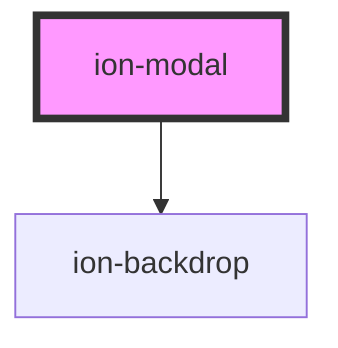

# ion-modal

A Modal is a dialog that appears on top of the app's content, and must be dismissed by the app before interaction can resume. It is useful as a select component when there are a lot of options to choose from, or when filtering items in a list, as well as many other use cases.

## Presenting

There are two ways to use `ion-modal`: inline or via the `modalController`. Each method comes with different considerations, so be sure to use the approach that best fits your use case.

## Inline Modals

`ion-modal` can be used by writing the component directly in your template. This reduces the number of handlers you need to wire up in order to present the modal. See [Usage](#usage) for an example of how to write a modal inline. 

When using `ion-modal` with Angular, React, or Vue, the component you pass in will be destroyed when the modal is dismissed. As this functionality is provided by the JavaScript framework, using `ion-modal` without a JavaScript framework will not destroy the component you passed in. If this is a needed functionality, we recommend using the `modalController` instead.

### Angular 

Since the component you passed in needs to be created when the modal is presented and destroyed when the modal is dismissed, we are unable to project the content using `<ng-content>` internally. Instead, we use `<ng-container>` which expects an `<ng-template>` to be passed in. As a result, when passing in your component you will need to wrap it in an `<ng-template>`:

```html
<ion-modal [isOpen]="isModalOpen">
  <ng-template>
    <app-modal-content></app-modal-content>
  </ng-template>
</ion-modal>
```

### When to use

Using a modal inline is useful when you do not want to explicitly wire up click events to open the modal. For example, you can use the `is-open` property to easily present or dismiss a modal based on some state in your application.

If you need fine grained control over when the modal is presented and dismissed, we recommend you use the `modalController`. 

## Controller Modals

`ion-modal` can also be presented programmatically by using the `modalController` imported from Ionic Framework. This allows you to have complete control over when a modal is presented above and beyond the customization that inline modals give you. See [Usage](#usage) for an example of how to use the `modalController`.

### When to use

We typically recommend that you write your modals inline as it streamlines the amount of code in your application. You should only use the `modalController` for complex use cases where writing a modal inline is impractical.

## Card Modal

Developers can create a card modal effect where the modal appears as a card stacked on top of your app's main content. To create a card modal, developers need to set the `presentingElement` property and the `swipeToClose` properties on `ion-modal`.

The `presentingElement` property accepts a reference to the element that should display under your modal. This is typically a reference to `ion-router-outlet`.

The `swipeToClose` property can be used to control whether or not the card modal can be swiped to close.

See [Usage](#usage) for examples on how to use the sheet modal.

## Sheet Modal

Developers can create a sheet modal effect similar to the drawer components available in maps applications. To create a sheet modal, developers need to set the `breakpoints` and `initialBreakpoint` properties on `ion-modal`.

The `breakpoints` property accepts an array which states each breakpoint that the sheet can snap to when swiped. A `breakpoints` property of `[0, 0.5, 1]` would indicate that the sheet can be swiped to show 0% of the modal, 50% of the modal, and 100% of the modal. When the modal is swiped to 0%, the modal will be automatically dismissed.

The `initialBreakpoint` property is required so that the sheet modal knows which breakpoint to start at when presenting. The `initialBreakpoint` value must also exist in the `breakpoints` array. Given a `breakpoints` value of `[0, 0.5, 1]`, an `initialBreakpoint` value of `0.5` would be valid as `0.5` is in the `breakpoints` array. An `initialBreakpoint` value of `0.25` would not be valid as `0.25` does not exist in the `breakpoints` array.

The `backdropBreakpoint` property can be used to customize the point at which the `ion-backdrop` will begin to fade in. This is useful when creating interfaces that have content underneath the sheet that should remain interactive. A common use case is a sheet modal that overlays a map where the map is interactive until the sheet is fully expanded.

See [Usage](#usage) for examples on how to use the sheet modal.

> Note: The `swipeToClose` property has no effect when using a sheet modal as sheet modals must be swipeable in order to be usable.

## Preventing a Modal from Dismissing

When entering data into a modal, it is often desirable to have a way of preventing accidental data loss. The `canDismiss` property on `ion-modal` gives developers control over when a modal is allowed to dismiss.

There are two different ways of using the `canDismiss` property.

> Note: When using a sheet modal, `canDismiss` will not be checked on swipe if there is no `0` breakpoint set. However, it will still be checked when pressing `Esc` or the hardware back button.

### Setting a boolean value

Developers can set `canDismiss` to a boolean value. If `canDismiss` is `true`, then the modal will close when users attempt to dismiss the modal. If `canDismiss` is `false`, then the modal will not close when users attempt to dismiss the modal.

Setting a boolean value should be used when you need to require a particular action to be taken prior to a modal being dismissed. For example, if developers want to require that a "Terms of Use" checkbox is checked prior to closing the modal, they could set `canDismiss` to `false` initially and update it to `true` when the checkbox is checked.

### Setting a callback function

Developers can set `canDismiss` to be a function. This function must return a `Promise` that resolves to either `true` or `false`. If the promise resolves to `true`, then the modal will dismiss. If the promise resolves to `false`, then the modal will not dismiss.

Setting a callback function should be used when you have complex dismissing criteria such as showing a confirmation dialog prior to dismissing the modal. The option that users select in this dialog can then be used to determine whether or not the modal should proceed with dismissing.

Note that setting a callback function will cause the swipe gesture to be interrupted when using a card or sheet modal. This is because Ionic does not know what your callback function will resolve to ahead of time.

## Interfaces

### ModalOptions

Below you will find all of the options available to you when using the `modalController`. These options should be supplied when calling `modalController.create()`.

```typescript
interface ModalOptions {
  component: any;
  componentProps?: { [key: string]: any };
  presentingElement?: HTMLElement;
  showBackdrop?: boolean;
  backdropDismiss?: boolean;
  cssClass?: string | string[];
  animated?: boolean;
  swipeToClose?: boolean;

  mode?: 'ios' | 'md';
  keyboardClose?: boolean;
  id?: string;

  enterAnimation?: AnimationBuilder;
  leaveAnimation?: AnimationBuilder;
}
```
### ModalCustomEvent

While not required, this interface can be used in place of the `CustomEvent` interface for stronger typing with Ionic events emitted from this component.

```typescript
interface ModalCustomEvent extends CustomEvent {
  target: HTMLIonModalElement;
}
```

## Dismissing

The modal can be dismissed after creation by calling the `dismiss()` method on the modal controller. The `onDidDismiss` function can be called to perform an action after the modal is dismissed.

## Styling

Modals are presented at the root of your application so they overlay your entire app. This behavior applies to both inline modals and modals presented from a controller. As a result, custom modal styles can not be scoped to a particular component as they will not apply to the modal. Instead, styles must be applied globally. For most developers, placing the custom styles in `global.css` is sufficient.

> If you are building an Ionic Angular app, the styles need to be added to a global stylesheet file. Read [Style Placement](#style-placement) in the Angular section below for more information.

> `ion-modal` works under the assumption that stacked modals are the same size. As a result, each subsequent modal will have no box shadow and a backdrop opacity of `0`. This is to avoid the effect of shadows and backdrops getting darker with each added modal. This can be changed by setting the `--box-shadow` and `--backdrop-opacity` CSS variables:
``` 
ion-modal.stack-modal {
  --box-shadow: 0 28px 48px rgba(0, 0, 0, 0.4);
  --backdrop-opacity: var(--ion-backdrop-opacity, 0.32);
}
```

## Interfaces

### ModalOptions

```typescript
interface ModalOptions<T extends ComponentRef = ComponentRef> {
  component: T;
  componentProps?: ComponentProps<T>;
  presentingElement?: HTMLElement;
  showBackdrop?: boolean;
  backdropDismiss?: boolean;
  cssClass?: string | string[];
  animated?: boolean;
  swipeToClose?: boolean;

  mode?: Mode;
  keyboardClose?: boolean;
  id?: string;
  htmlAttributes?: { [key: string]: any };

  enterAnimation?: AnimationBuilder;
  leaveAnimation?: AnimationBuilder;

  breakpoints?: number[];
  initialBreakpoint?: number;
  backdropBreakpoint?: number;
  handle?: boolean;
}
```


## Accessibility

### Keyboard Navigation

| Key   | Function            |
| ----- | ------------------- |
| `Esc` | Dismisses the modal |

### Screen Readers

Modals have the `aria-modal` attribute applied. This attribute can cause assistive technologies to limit navigation to the modal element's contents. As a result, using gestures that move to the next or previous items may not focus elements outside of the modal. This applies even when the backdrop is disabled in sheet modals using the `backdropBreakpoint` property.

Assistive technologies will not limit navigation to the modal element's contents if developers manually move focus. However, manually moving focus outside of a modal is not supported in Ionic for modals that have focus trapping enabled.

See https://w3c.github.io/aria/#aria-modal for more information.

### Focus Trapping

When a modal is presented, focus will be trapped inside of the presented modal. Users can focus other interactive elements inside the modal but will never be able to focus interactive elements outside the modal while the modal is presented. For applications that present multiple stacked modals, focus will be trapped on the modal that was presented last.

Sheet modals that have had their backdrop disabled by the `backdropBreakpoint` property are not subject to focus trapping.

### Sheet Modals

Sheet modals allow users to interact with content behind the modal when the `backdropBreakpoint` property is used. The backdrop will be disabled up to and including the specified `backdropBreakpoint` and will be enabled after it.

When the backdrop is disabled, users will be able to interact with elements outside the sheet modal using a pointer or keyboard. Assistive technologies may not focus outside the sheet modal by default due to the usage of `aria-modal`. We recommend avoiding features such as autofocus here as it can cause assistive technologies to jump between two interactive contexts without warning the user.  

<!-- Auto Generated Below -->


## Usage

### Angular

### Inline Modal

```html
<!-- Default -->
<ion-modal [isOpen]="true">
  <ng-template>
    <ion-content>Modal Content</ion-content>
  </ng-template>
</ion-modal>

<!-- Use a trigger -->
<ion-button id="trigger-button">Click to open modal</ion-button>
<ion-modal trigger="trigger-button">
  <ng-template>
    <ion-content>Modal Content</ion-content>
  </ng-template>
</ion-modal>

<!-- Sheet Modal -->
<ion-modal
  [isOpen]="true"
  [breakpoints]="[0.1, 0.5, 1]"
  [initialBreakpoint]="0.5"
>
  <ng-template>
    <ion-content>Modal Content</ion-content>
  </ng-template>
</ion-modal>

<!-- Card Modal -->
<ion-modal
  [isOpen]="true"
  [swipeToClose]="true"
  [presentingElement]="routerOutlet.nativeEl"
>
  <ng-template>
    <ion-content>Modal Content</ion-content>
  </ng-template>
</ion-modal>

<!-- Passing Props -->
<ion-modal [isOpen]="true">
  <ng-template>
    <app-angular-component title="Ionic"></app-angular-component>
  </ng-template>
</ion-modal>

<!-- Require Action Sheet confirmation before dismissing -->
<ion-modal [isOpen]="true" [canDismiss]="canDismiss">
  <ng-template>
    <ion-content>Modal Content</ion-content>
  </ng-template>
</ion-modal>
```

```typescript
import { Component } from '@angular/core';
import { IonRouterOutlet, ActionSheetController } from '@ionic/angular';

@Component({
  selector: 'modal-example',
  templateUrl: 'modal-example.html',
  styleUrls: ['./modal-example.css']
})
export class ModalExample {
  constructor(
    public routerOutlet: IonRouterOutlet,
    private actionSheetCtrl: ActionSheetController
  ) {}

  async canDismiss() {
    const actionSheet = await this.actionSheetCtrl.create({
      header: 'Are you sure you want to discard your changes?',
      buttons: [
        {
          text: 'Discard Changes',
          role: 'destructive'
        },
        {
          text: 'Keep Editing',
          role: 'cancel'
        }
      ]
    });
    
    await actionSheet.present();

    const { role } = await actionSheet.onDidDismiss();
    
    if (role === 'destructive') {
      return true;
    }

    return false;
  }
}
```

### Modal Controller

```typescript
import { Component } from '@angular/core';
import { ModalController } from '@ionic/angular';
import { ModalPage } from '../modal/modal.page';

@Component({
  selector: 'modal-example',
  templateUrl: 'modal-example.html',
  styleUrls: ['./modal-example.css']
})
export class ModalExample {
  // The `ion-modal` element reference.
  modal: HTMLElement;

  constructor(public modalController: ModalController) {}

  async presentModal() {
    const modal = await this.modalController.create({
      component: ModalPage,
      cssClass: 'my-custom-class'
    });
    return await modal.present();
  }
}
```

```typescript
import { Component, Input } from '@angular/core';

@Component({
  selector: 'modal-page',
})
export class ModalPage {

  constructor() {}

}
```

> If you need a wrapper element inside of your modal component, we recommend using a `<div class="ion-page">` so that the component dimensions are still computed properly.

#### Passing Data

During creation of a modal, data can be passed in through the `componentProps`.
The previous example can be written to include data:

```typescript
async presentModal() {
  const modal = await this.modalController.create({
    component: ModalPage,
    cssClass: 'my-custom-class',
    componentProps: {
      'firstName': 'Douglas',
      'lastName': 'Adams',
      'middleInitial': 'N'
    }
  });
  return await modal.present();
}
```

To get the data passed into the `componentProps`, set it as an `@Input`:

```typescript
export class ModalPage {

  // Data passed in by componentProps
  @Input() firstName: string;
  @Input() lastName: string;
  @Input() middleInitial: string;

}
```

#### Dismissing a Modal

A modal can be dismissed by calling the dismiss method on the modal controller and optionally passing any data from the modal.

```javascript
export class ModalPage {
  ...

  dismiss() {
    // using the injected ModalController this page
    // can "dismiss" itself and optionally pass back data
    this.modalController.dismiss({
      'dismissed': true
    });
  }
}
```

After being dismissed, the data can be read in through the `onWillDismiss` or `onDidDismiss` attached to the modal after creation:

```javascript
const { data } = await modal.onWillDismiss();
console.log(data);
```

#### Accessing the Modal Element

When opening a modal with the modal controller, Ionic will assign the modal HTML element reference to the `modal` property on your component's class instance.

You can use this property to directly access the `ion-modal` element to add or remove classes or handle additional checks.

```ts
export class ModalPage implements OnInit {
  // The `ion-modal` element reference.
  modal: HTMLElement;

  ngOnInit() {
    console.log('The HTML ion-modal element', this.modal); // <ion-modal></ion-modal>
  }
}
```

#### Lazy Loading

When lazy loading a modal, it's important to note that the modal will not be loaded when it is opened, but rather when the module that imports the modal's module is loaded.

For example, say there exists a `CalendarComponent` and an `EventModal`. The modal is presented by clicking a button in the `CalendarComponent`. In Angular, the `EventModalModule` would need to be included in the `CalendarComponentModule` since the modal is created in the `CalendarComponent`:

```typescript
import { NgModule } from '@angular/core';
import { CommonModule } from '@angular/common';
import { IonicModule } from '@ionic/angular';

import { CalendarComponent } from './calendar.component';
import { EventModalModule } from '../modals/event/event.module';

@NgModule({
  declarations: [
    CalendarComponent
  ],
  imports: [
    IonicModule,
    CommonModule,
    EventModalModule
  ],
  exports: [
    CalendarComponent
  ]
})

export class CalendarComponentModule {}
```

#### Card Modals

Modals in iOS mode have the ability to be presented in a card-style and swiped to close. The card-style presentation and swipe to close gesture are not mutually exclusive, meaning you can pick and choose which features you want to use. For example, you can have a card-style modal that cannot be swiped or a full sized modal that can be swiped.

> Card style modals when running on iPhone-sized devices do not have backdrops. As a result, the `--backdrop-opacity` variable will not have any effect.

If you are creating an application that uses `ion-tabs`, it is recommended that you get the parent `ion-router-outlet` using `this.routerOutlet.parentOutlet.nativeEl`, otherwise the tabbar will not scale down when the modal opens.

```javascript
import { IonRouterOutlet } from '@ionic/angular';

constructor(private routerOutlet: IonRouterOutlet) {}

async presentModal() {
  const modal = await this.modalController.create({
    component: ModalPage,
    cssClass: 'my-custom-class',
    swipeToClose: true,
    presentingElement: this.routerOutlet.nativeEl
  });
  return await modal.present();
}
```

In most scenarios, using the `ion-router-outlet` element as the `presentingElement` is fine. In cases where you are presenting a card-style modal from within another modal, you should pass in the top-most `ion-modal` element as the `presentingElement`.

```javascript
import { ModalController } from '@ionic/angular';

constructor(private modalController: ModalController) {}

async presentModal() {
  const modal = await this.modalController.create({
    component: ModalPage,
    cssClass: 'my-custom-class',
    swipeToClose: true,
    presentingElement: await this.modalController.getTop() // Get the top-most ion-modal
  });
  return await modal.present();
}
```

#### Sheet Modals

```javascript
import { IonRouterOutlet } from '@ionic/angular';

constructor(private routerOutlet: IonRouterOutlet) {}

async presentModal() {
  const modal = await this.modalController.create({
    component: ModalPage,
    initialBreakpoint: 0.5,
    breakpoints: [0, 0.5, 1]
  });
  return await modal.present();
}
```

### Style Placement

In Angular, the CSS of a specific page is scoped only to elements of that page. Even though the Modal can be presented from within a page, the `ion-modal` element is appended outside of the current page. This means that any custom styles need to go in a global stylesheet file. In an Ionic Angular starter this can be the `src/global.scss` file or you can register a new global style file by [adding to the `styles` build option in `angular.json`](https://angular.io/guide/workspace-config#style-script-config).


### Javascript

### Inline Modal

```html
<ion-app>
  <!-- Default -->
  <ion-modal is-open="true">
    <ion-content>Modal Content</ion-content>
  </ion-modal>
  
  <!-- Use a trigger -->
  <ion-button id="trigger-button">Click to open modal</ion-button>
  <ion-modal trigger="trigger-button">
    <ion-content>Modal Content</ion-content>
  </ion-modal>
  
  <!-- Sheet Modal -->
  <ion-modal is-open="true" id="sheet-modal">
    <ion-content>Modal Content</ion-content>
  </ion-modal>
  
  <!-- Card Modal -->
  <ion-modal is-open="true" id="card-modal">
    <ion-content>Modal Content</ion-content>
  </ion-modal>
  
  <!-- Require Action Sheet confirmation before dismissing -->
  <ion-modal is-open="true" id="can-dismiss-modal">
    <ion-content>Modal Content</ion-content>
  </ion-modal>
</ion-app>

<script>
  const sheetModal = document.querySelector('#sheet-modal');
  const cardModal = document.querySelector('#sheet-modal');
  const canDismissModal = document.querySelector('#can-dismiss-modal');
  const app = document.querySelector('ion-app');

  sheetModal.breakpoints = [0.1, 0.5, 1];
  sheetModal.initialBreakpoint = 0.5;
  
  cardModal.swipeToClose = true;
  cardModal.presentingElement = document.querySelector('ion-app');
  
  canDismissModal.canDismiss = async () => {
    const actionSheet = document.createElement('ion-action-sheet');
    
    actionSheet.header = 'Are you sure you want to discard your changes?';
    actionSheet.buttons = [
      {
        text: 'Discard Changes',
        role: 'destructive'
      },
      {
        text: 'Keep Editing',
        role: 'cancel'
      }
    ];
    
    app.appendChild(actionSheet);
    
    await actionSheet.present();
            
    const { role } = await actionSheet.onDidDismiss();
    
    if (role === 'destructive') {
      return true;
    }
    
    return false;    
  }
</script>
```

### Using JavaScript

```javascript
customElements.define('modal-page', class extends HTMLElement {
  connectedCallback() {
    this.innerHTML = `
<ion-header>
  <ion-toolbar>
    <ion-title>Modal Header</ion-title>
    <ion-buttons slot="primary">
      <ion-button onClick="dismissModal()">
        <ion-icon slot="icon-only" name="close"></ion-icon>
      </ion-button>
    </ion-buttons>
  </ion-toolbar>
</ion-header>
<ion-content class="ion-padding">
  Modal Content
</ion-content>`;
  }
});

function presentModal() {
  // create the modal with the `modal-page` component
  const modalElement = document.createElement('ion-modal');
  modalElement.component = 'modal-page';
  modalElement.cssClass = 'my-custom-class';

  // present the modal
  document.body.appendChild(modalElement);
  return modalElement.present();
}
```

> If you need a wrapper element inside of your modal component, we recommend using a `<div class="ion-page">` so that the component dimensions are still computed properly.

### Passing Data

During creation of a modal, data can be passed in through the `componentProps`. The previous example can be written to include data:

```javascript
const modalElement = document.createElement('ion-modal');
modalElement.component = 'modal-page';
modalElement.cssClass = 'my-custom-class';
modalElement.componentProps = {
  'firstName': 'Douglas',
  'lastName': 'Adams',
  'middleInitial': 'N'
};
```

To get the data passed into the `componentProps`, query for the modal in the `modal-page`:

```js
customElements.define('modal-page', class extends HTMLElement {
  connectedCallback() {
    const modalElement = document.querySelector('ion-modal');
    console.log(modalElement.componentProps.firstName);

    ...
  }
}
```


### Dismissing a Modal

A modal can be dismissed by calling the dismiss method and optionally passing any data from the modal.

```javascript
async function dismissModal() {
  await modal.dismiss({
    'dismissed': true
  });
}
```

After being dismissed, the data can be read in through the `onWillDismiss` or `onDidDismiss` attached to the modal after creation:

```javascript
const { data } = await modalElement.onWillDismiss();
console.log(data);
```


### Card Modals

Modals in iOS mode have the ability to be presented in a card-style and swiped to close. The card-style presentation and swipe to close gesture are not mutually exclusive, meaning you can pick and choose which features you want to use. For example, you can have a card-style modal that cannot be swiped or a full sized modal that can be swiped.

> Card style modals when running on iPhone-sized devices do not have backdrops. As a result, the `--backdrop-opacity` variable will not have any effect.

```javascript
const modalElement = document.createElement('ion-modal');
modalElement.component = 'modal-page';
modalElement.cssClass = 'my-custom-class';
modalElement.swipeToClose = true;
modalElement.presentingElement = document.querySelector('ion-nav');
```

In most scenarios, using the `ion-nav` element as the `presentingElement` is fine. In cases where you are presenting a card-style modal from within a modal, you should pass in the top-most `ion-modal` element as the `presentingElement`.

```javascript
const modalElement = document.createElement('ion-modal');
modalElement.component = 'modal-page';
modalElement.cssClass = 'my-custom-class';
modalElement.swipeToClose = true;
modalElement.presentingElement = await modalController.getTop(); // Get the top-most ion-modal
```

### Sheet Modals

```javascript
const modalElement = document.createElement('ion-modal');
modalElement.component = 'modal-page';
modalElement.initialBreakpoint = 0.5;
modalElement.breakpoints = [0, 0.5, 1];
```


### React

### Inline Modal

```tsx
import { React, useRef } from 'react';
const App: React.FC = () => {
  const routerRef = useRef<HTMLIonRouterOutletElement | null>(null);
  
  return (
    <IonApp>
      <IonReactRouter>
        <IonRouterOutlet ref={routerRef}>
          <Route path="/home" render={() => <Home router={routerRef.current} />}  exact={true} />
        </IonRouterOutlet>
      </IonReactRouter>
    </IonApp>
  )
};

...

interface Props {
  router: HTMLIonRouterOutletElement | null;
}

import React from 'react';
import AppReactComponent from './AppReactComponent';
import { IonModal, IonContent, IonButton, useIonActionSheet } from '@ionic/react';
export const ModalExample: React.FC<Props> = ({ router }) => {
  const [present, dismiss] = useIonActionSheet();

  const canDismiss = () => {
    return new Promise(async (resolve) => {
      await present({
        header: 'Are you sure you want to discard your changes?',
        buttons: [
          {
            text: 'Discard Changes',
            role: 'destructive'
          },
          {
            text: 'Keep Editing',
            role: 'cancel'
          }
        ],
        onDidDismiss: (ev: CustomEvent) => {
            const role = ev.detail.role;
            
            if (role === 'destructive') {
              resolve(true);
            }
            
            resolve(false);
          }
        });
      });
    });
  }

  return (
    <>
      {/* Default */}
      <IonModal isOpen={true}>
        <IonContent>Modal Content</IonContent>
      </IonModal>
      
      {/* Use a trigger */}
      <IonButton id="trigger-button">Click to open modal</IonButton>
      <IonModal trigger="trigger-button">
        <IonContent>Modal Content</IonContent>
      </IonModal>
      
      {/* Sheet Modal */}
      <IonModal
        isOpen={true}
        breakpoints={[0.1, 0.5, 1]}
        initialBreakpoint={0.5}
      >
        <IonContent>Modal Content</IonContent>
      </IonModal>
      
      {/* Card Modal */}
      <IonModal
        isOpen={true}
        swipeToClose={true}
        presentingElement={router || undefined}
      >
        <IonContent>Modal Content</IonContent>
      </IonModal>
      
      {/* Passing Props */}
      <IonModal isOpen={true}>
        <AppReactComponent title="Ionic"></AppReactComponent>
      </IonModal>
      
      {/* Require Action Sheet confirmation before dismissing */}
      <IonModal isOpen={true} canDismiss={canDismiss}>
        <IonContent>Modal Content</IonContent>
      </IonModal>
    </>
  );
};
```


### useIonModal Hook

> `useIonModal` requires being a descendant of `<IonApp>`. If you need to use a modal outside of an `<IonApp>`, consider using the component method instead.


```tsx
/* Using with useIonModal Hook */ 

import React, { useState } from 'react';
import { IonButton, IonContent, IonPage, useIonModal } from '@ionic/react';

const Body: React.FC<{
  count: number;
  onDismiss: () => void;
  onIncrement: () => void;
}> = ({ count, onDismiss, onIncrement }) => (
  <div>
    count: {count}
    <IonButton expand="block" onClick={() => onIncrement()}>
      Increment Count
    </IonButton>
    <IonButton expand="block" onClick={() => onDismiss()}>
      Close
    </IonButton>
  </div>
);

const ModalExample: React.FC = () => {
  const [count, setCount] = useState(0);

  const handleIncrement = () => {
    setCount(count + 1);
  };

  const handleDismiss = () => {
    dismiss();
  };

  /**
   * First parameter is the component to show, second is the props to pass
   */
  const [present, dismiss] = useIonModal(Body, {
    count,
    onDismiss: handleDismiss,
    onIncrement: handleIncrement,
  });

  return (
    <IonPage>
      <IonContent fullscreen>
        <IonButton
          expand="block"
          onClick={() => {
            present({
              cssClass: 'my-class',
            });
          }}
        >
          Show Modal
        </IonButton>
        <div>Count: {count}</div>
      </IonContent>
    </IonPage>
  );
};
```

```tsx
/* Using with IonModal Component */

import React, { useState } from 'react';
import { IonModal, IonButton, IonContent } from '@ionic/react';

export const ModalExample: React.FC = () => {
  const [showModal, setShowModal] = useState(false);

  return (
    <IonContent>
      <IonModal isOpen={showModal} cssClass='my-custom-class'>
        <p>This is modal content</p>
        <IonButton onClick={() => setShowModal(false)}>Close Modal</IonButton>
      </IonModal>
      <IonButton onClick={() => setShowModal(true)}>Show Modal</IonButton>
    </IonContent>
  );
};
```

#### Card Modals

Modals in iOS mode have the ability to be presented in a card-style and swiped to close. The card-style presentation and swipe to close gesture are not mutually exclusive, meaning you can pick and choose which features you want to use. For example, you can have a card-style modal that cannot be swiped or a full sized modal that can be swiped.

> Card style modals when running on iPhone-sized devices do not have backdrops. As a result, the `--backdrop-opacity` variable will not have any effect.

```tsx
const App: React.FC = () => {
  const routerRef = useRef<HTMLIonRouterOutletElement | null>(null);
  
  return (
    <IonApp>
      <IonReactRouter>
        <IonRouterOutlet ref={routerRef}>
          <Route path="/home" render={() => <Home router={routerRef.current} />}  exact={true} />
        </IonRouterOutlet>
      </IonReactRouter>
    </IonApp>
  )
};

...

interface HomePageProps {
  router: HTMLIonRouterOutletElement | null;
}

const Home: React.FC<HomePageProps> = ({ router }) => {
  const [showModal, setShowModal] = useState(false);
  
  return (
    <IonPage>
      <IonContent>
        <IonModal
          isOpen={showModal}
          cssClass='my-custom-class'
          swipeToClose={true}
          presentingElement={router || undefined}
          onDidDismiss={() => setShowModal(false)}>
          <p>This is modal content</p>
        </IonModal>
      </IonContent>
    </IonPage>
  );
};

```

In most scenarios, setting a ref on `IonRouterOutlet` and passing that ref's `current` value to `presentingElement` is fine. In cases where you are presenting a card-style modal from within another modal, you should pass in the top-most `IonModal` ref as the `presentingElement`.

```tsx
<IonModal
  ref={firstModalRef}
  isOpen={showModal}
  cssClass='my-custom-class'
  swipeToClose={true}
  presentingElement={router || undefined}
  onDidDismiss={() => setShowModal(false)}>
    <p>This is modal content</p>
    <IonButton onClick={() => setShow2ndModal(true)}>Show 2nd Modal</IonButton>
    <IonButton onClick={() => setShowModal(false)}>Close Modal</IonButton>
</IonModal>
<IonModal
  isOpen={show2ndModal}
  cssClass='my-custom-class'
  presentingElement={firstModalRef.current}
  swipeToClose={true}
  onDidDismiss={() => setShow2ndModal(false)}>
  <p>This is more modal content</p>
  <IonButton onClick={() => setShow2ndModal(false)}>Close Modal</IonButton>
</IonModal>
```


#### Sheet Modals

```tsx
const App: React.FC = () => {
  const routerRef = useRef<HTMLIonRouterOutletElement | null>(null);
  
  return (
    <IonApp>
      <IonReactRouter>
        <IonRouterOutlet ref={routerRef}>
          <Route path="/home" render={() => <Home router={routerRef.current} />}  exact={true} />
        </IonRouterOutlet>
      </IonReactRouter>
    </IonApp>
  )
};

...

const Home: React.FC = () => {
  const [showModal, setShowModal] = useState(false);
  
  return (
    <IonPage>
      <IonContent>
        <IonModal
          isOpen={showModal}
          initialBreakpoint={0.5}
          breakpoints={[0, 0.5, 1]}
          onDidDismiss={() => setShowModal(false)}>
          <p>This is modal content</p>
        </IonModal>
      </IonContent>
    </IonPage>
  );
};

```


### Stencil

### Inline Modal

```tsx
import { Component, Element, h } from '@stencil/core';
import { actionSheetController } from '@ionic/core';

@Component({
  tag: 'modal-example',
  styleUrl: 'modal-example.css'
})
export class ModalExample {
  @Element() el: any;
  
  componentDidLoad() {
    this.routerOutlet = this.el.closest('ion-router-outlet');
  }
  
  async canDismiss() {
    const actionSheet = await actionSheetController.create({
      header: 'Are you sure you want to discard your changes?',
      buttons: [
        {
          text: 'Discard Changes',
          role: 'destructive'
        },
        {
          text: 'Keep Editing',
          role: 'cancel'
        }
      ]
    });
    
    await actionSheet.present();
    
    const { role } = await actionSheet.onDidDismiss();
    
    if (role === 'destructive') {
      return true;
    }
    
    return false;
  }
  
  render() {
    return (
      <div>
        {/* Default */}
        <ion-modal isOpen={true}>
          <ion-content>Modal Content</ion-content>
        </ion-modal>
        
        {/* Use a trigger */}
        <ion-button id="trigger-button">Click to open modal</ion-button>
        <ion-modal trigger="trigger-button">
          <ion-content>Modal Content</ion-content>
        </ion-modal>
        
        {/* Sheet Modal */}
        <ion-modal
          isOpen={true}
          breakpoints={[0.1, 0.5, 1]}
          initialBreakpoint={0.5}
        >
          <ion-content>Modal Content</ion-content>
        </ion-modal>
        
        {/* Card Modal */}
        <ion-modal
          isOpen={true}
          swipeToClose={true}
          presentingElement={this.routerOutlet}
        >
          <ion-content>Modal Content</ion-content>
        </ion-modal>
        
        {/* Passing Props */}
        <ion-modal isOpen={true}>
          <app-stencil-component title="Ionic"></app-stencil-component>
        </ion-modal>
        
        {/* Require Action Sheet confirmation before dismissing */}
        <ion-modal isOpen={true} canDismiss={() => this.canDismiss()}>
          <ion-content>Modal Content</ion-content>
        </ion-modal>
      </div>
    )
  }
}
```

### Modal Controller 

```tsx
import { Component, h } from '@stencil/core';

import { modalController } from '@ionic/core';

@Component({
  tag: 'modal-example',
  styleUrl: 'modal-example.css'
})
export class ModalExample {
  async presentModal() {
    const modal = await modalController.create({
      component: 'page-modal',
      cssClass: 'my-custom-class'
    });
    await modal.present();
  }
}
```

```tsx
import { Component, h } from '@stencil/core';

@Component({
  tag: 'page-modal',
  styleUrl: 'page-modal.css',
})
export class PageModal {
  render() {
    return [
      <ion-list>
        <ion-item>
          <ion-label>Documentation</ion-label>
        </ion-item>
        <ion-item>
          <ion-label>Feedback</ion-label>
        </ion-item>
        <ion-item>
          <ion-label>Settings</ion-label>
        </ion-item>
      </ion-list>
    ];
  }
}
```

> If you need a wrapper element inside of your modal component, we recommend using a `<div class="ion-page">` so that the component dimensions are still computed properly.

### Passing Data

During creation of a modal, data can be passed in through the `componentProps`.
The previous example can be written to include data:

```tsx
async presentModal() {
  const modal = await modalController.create({
    component: 'page-modal',
    cssClass: 'my-custom-class',
    componentProps: {
      'firstName': 'Douglas',
      'lastName': 'Adams',
      'middleInitial': 'N'
    }
  });
  await modal.present();
}
```

To get the data passed into the `componentProps`, set each one as a `@Prop`:

```tsx
import { Component, Prop, h } from '@stencil/core';

@Component({
  tag: 'page-modal',
  styleUrl: 'page-modal.css',
})
export class PageModal {
  // Data passed in by componentProps
  @Prop() firstName: string;
  @Prop() lastName: string;
  @Prop() middleInitial: string;
}
```

### Dismissing a Modal

A modal can be dismissed by calling the dismiss method on the modal controller and optionally passing any data from the modal.

```tsx
export class ModalPage {
  ...

  dismiss(data?: any) {
    // dismiss the closest modal and optionally pass back data
    (this.el.closest('ion-modal') as any).dismiss({
      'dismissed': true
    });
  }
}
```

After being dismissed, the data can be read in through the `onWillDismiss` or `onDidDismiss` attached to the modal after creation:

```tsx
const { data } = await modal.onWillDismiss();
console.log(data);
```

### Card Modals

Modals in iOS mode have the ability to be presented in a card-style and swiped to close. The card-style presentation and swipe to close gesture are not mutually exclusive, meaning you can pick and choose which features you want to use. For example, you can have a card-style modal that cannot be swiped or a full sized modal that can be swiped.

> Card style modals when running on iPhone-sized devices do not have backdrops. As a result, the `--backdrop-opacity` variable will not have any effect.

```tsx
import { Component, Element, h } from '@stencil/core';

import { modalController } from '@ionic/core';

@Component({
  tag: 'modal-example',
  styleUrl: 'modal-example.css'
})
export class ModalExample {
  @Element() el: any;

  async presentModal() {
    const modal = await modalController.create({
      component: 'page-modal',
      cssClass: 'my-custom-class',
      swipeToClose: true,
      presentingElement: this.el.closest('ion-router-outlet'),
    });
    await modal.present();
  }

}
```

In most scenarios, using the `ion-router-outlet` element as the `presentingElement` is fine. In cases where you are presenting a card-style modal from within another modal, you should pass in the top-most `ion-modal` element as the `presentingElement`.

```tsx
async presentModal() {
  const modal = await modalController.create({
    component: 'page-modal',
    cssClass: 'my-custom-class',
    swipeToClose: true,
    presentingElement: await modalController.getTop() // Get the top-most ion-modal
  });
  await modal.present();
}
```


### Sheet Modals

**Controller**
```tsx
import { Component, Element, h } from '@stencil/core';

import { modalController } from '@ionic/core';

@Component({
  tag: 'modal-example',
  styleUrl: 'modal-example.css'
})
export class ModalExample {
  @Element() el: any;

  async presentModal() {
    const modal = await modalController.create({
      component: 'page-modal',
      initialBreakpoint: 0.5,
      breakpoints: [0, 0.5, 1]
      
    });
    await modal.present();
  }
}
```

**Inline**
```tsx
import { Component, State, h } from '@stencil/core';

@Component({
  tag: 'modal-example',
  styleUrl: 'modal-example.css'
})
export class ModalExample {
  @State() isModalOpen: boolean = false;

  render() {
    return [
      <ion-modal
        isOpen={isModalOpen} 
        initialBreakpoint={0.5} 
        breakpoints={[0, 0.5, 1]}
      >
        <page-modal></page-modal>
      <ion-modal>
    ]
  }
}
```


### Vue

### Inline Modal

```html
<!-- Default -->
<ion-modal :is-open="true">
  <ion-content>Modal Content</ion-content>
</ion-modal>

<!-- Use a trigger -->
<ion-button id="trigger-button">Click to open modal</ion-button>
<ion-modal trigger="trigger-button">
  <ion-content>Modal Content</ion-content>
</ion-modal>

<!-- Sheet Modal -->
<ion-modal 
  :is-open="true"
  :breakpoints="[0.1, 0.5, 1]"
  :initialBreakpoint="0.5"
>
  <ion-content>Modal Content</ion-content>
</ion-modal>

<!-- Card Modal -->
<ion-modal
  :is-open="true"
  :swipe-to-close="true"
  :presenting-element="$parent.$refs.ionRouterOutlet"
>
  <ion-content>Modal Content</ion-content>
</ion-modal>

<!-- Passing Props -->
<ion-modal :is-open="true">
  <app-vue-component title="Ionic"></app-vue-component>
</ion-modal>

<!-- Require Action Sheet confirmation before dismissing -->
<ion-modal
  :is-open="true"
  :can-dismiss="canDismiss"
>
  <ion-content>Modal Content</ion-content>
</ion-modal>

<script>
  import { IonModal, IonButton, IonContent } from '@ionic/vue';
  import { defineComponent } from 'vue';
  import AppVueComponent from './AppVueComponent.vue'
  
  export default defineComponent({
    components: { IonModal, IonButton, IonContent, AppVueComponent },
    setup() {
      const canDismiss = async () => {
        const actionSheet = await actionSheetController.create({
          header: 'Are you sure you want to discard your changes?',
          buttons: [
            {
              text: 'Discard Changes',
              role: 'destructive'
            },
            {
              text: 'Keep Editing',
              role: 'cancel'
            }
          ]
        });
        
        await actionSheet.present();
        
        const { role } = await actionSheet.onDidDismiss();
        
        if (role === 'destructive') {
          return true;
        }
        
        return false;
      };
      
      return { canDismiss }
    }
  });
</script>
```

### Modal Controller

```html
<template>
  <ion-header>
    <ion-toolbar>
      <ion-title>{{ title }}</ion-title>
    </ion-toolbar>
  </ion-header>
  <ion-content class="ion-padding">
    {{ content }}
  </ion-content>
</template>

<script>
import { IonContent, IonHeader, IonTitle, IonToolbar } from '@ionic/vue';
import { defineComponent } from 'vue';

export default defineComponent({
  name: 'Modal',
  props: {
    title: { type: String, default: 'Super Modal' },
  },
  data() {
    return {
      content: 'Content',
    }
  },
  components: { IonContent, IonHeader, IonTitle, IonToolbar }
});
</script>
```

```html
<template>
  <ion-page>
    <ion-content class="ion-padding">
      <ion-button @click="openModal">Open Modal</ion-button>
    </ion-content>
  </ion-page>
</template>

<script>
import { IonButton, IonContent, IonPage, modalController } from '@ionic/vue';
import Modal from './modal.vue'

export default {
  components: { IonButton, IonContent, IonPage },
  methods: {
    async openModal() {
      const modal = await modalController
        .create({
          component: Modal,
          cssClass: 'my-custom-class',
          componentProps: {
            title: 'New Title'
          },
        })
      return modal.present();
    },
  },
}
</script>
```

Developers can also use this component directly in their template:

```html
<template>
  <ion-button @click="setOpen(true)">Show Modal</ion-button>
  <ion-modal
    :is-open="isOpenRef"
    css-class="my-custom-class"
    @didDismiss="setOpen(false)"
  >
    <Modal :data="data"></Modal>
  </ion-modal>
</template>

<script>
import { IonModal, IonButton } from '@ionic/vue';
import { defineComponent, ref } from 'vue';
import Modal from './modal.vue'

export default defineComponent({
  components: { IonModal, IonButton, Modal },
  setup() {
    const isOpenRef = ref(false);
    const setOpen = (state: boolean) => isOpenRef.value = state;
    const data = { content: 'New Content' };
    return { isOpenRef, setOpen, data }
  }
});
</script>
```

> If you need a wrapper element inside of your modal component, we recommend using an `<ion-page>` so that the component dimensions are still computed properly.

#### Card Modals

Modals in iOS mode have the ability to be presented in a card-style and swiped to close. The card-style presentation and swipe to close gesture are not mutually exclusive, meaning you can pick and choose which features you want to use. For example, you can have a card-style modal that cannot be swiped or a full sized modal that can be swiped.

> Card style modals when running on iPhone-sized devices do not have backdrops. As a result, the `--backdrop-opacity` variable will not have any effect.

```html
<template>
  <ion-page>
    <ion-content>
      <ion-button @click="setOpen(true)">Show Modal</ion-button>
      <ion-modal
        :is-open="isOpenRef"
        css-class="my-custom-class"
        :swipe-to-close="true"
        :presenting-element="$parent.$refs.ionRouterOutlet"
        @didDismiss="setOpen(false)"
      >
        <Modal :data="data"></Modal>
      </ion-modal>
    </ion-content>
  </ion-page>
</template>

<script lang="ts">
import { IonModal, IonButton, IonContent, IonPage } from '@ionic/vue';
import { defineComponent, ref } from 'vue';
import Modal from './modal.vue'

export default defineComponent({
  components: { IonModal, IonButton, Modal, IonContent, IonPage },
  setup() {
    const isOpenRef = ref(false);
    const setOpen = (state: boolean) => isOpenRef.value = state;
    const data = { content: 'New Content' };
    return { isOpenRef, setOpen, data }
  }
});
</script>
```

#### Sheet Modals

```html
<template>
  <ion-page>
    <ion-content class="ion-padding">
      <ion-button @click="openModal()">Open Modal</ion-button>
    </ion-content>
  </ion-page>
</template>

<script>
import { IonButton, IonContent, IonPage, modalController } from '@ionic/vue';
import Modal from './modal.vue'

export default {
  components: { IonButton, IonContent, IonPage },
  methods: {
    async openModal() {
      const modal = await modalController
        .create({
          component: Modal,
          initialBreakpoint: 0.5,
          breakpoints: [0, 0.5, 1]
        })
      return modal.present();
    },
  },
}
</script>
```


## Properties

| Property             | Attribute             | Description                                                                                                                                                                                                                                                                                                                                                                                          | Type                                                    | Default     |
| -------------------- | --------------------- | ---------------------------------------------------------------------------------------------------------------------------------------------------------------------------------------------------------------------------------------------------------------------------------------------------------------------------------------------------------------------------------------------------- | ------------------------------------------------------- | ----------- |
| `animated`           | `animated`            | If `true`, the modal will animate.                                                                                                                                                                                                                                                                                                                                                                   | `boolean`                                               | `true`      |
| `backdropBreakpoint` | `backdrop-breakpoint` | A decimal value between 0 and 1 that indicates the point after which the backdrop will begin to fade in when using a sheet modal. Prior to this point, the backdrop will be hidden and the content underneath the sheet can be interacted with. This value is exclusive meaning the backdrop will become active after the value specified.                                                           | `number`                                                | `0`         |
| `backdropDismiss`    | `backdrop-dismiss`    | If `true`, the modal will be dismissed when the backdrop is clicked.                                                                                                                                                                                                                                                                                                                                 | `boolean`                                               | `true`      |
| `breakpoints`        | --                    | The breakpoints to use when creating a sheet modal. Each value in the array must be a decimal between 0 and 1 where 0 indicates the modal is fully closed and 1 indicates the modal is fully open. Values are relative to the height of the modal, not the height of the screen. One of the values in this array must be the value of the `initialBreakpoint` property. For example: [0, .25, .5, 1] | `number[] \| undefined`                                 | `undefined` |
| `canDismiss`         | `can-dismiss`         | Determines whether or not a modal can dismiss when calling the `dismiss` method.  If the value is `true` or the value's function returns `true`, the modal will close when trying to dismiss. If the value is `false` or the value's function returns `false`, the modal will not close when trying to dismiss.                                                                                      | `(() => Promise<boolean>) \| boolean \| undefined`      | `undefined` |
| `enterAnimation`     | --                    | Animation to use when the modal is presented.                                                                                                                                                                                                                                                                                                                                                        | `((baseEl: any, opts?: any) => Animation) \| undefined` | `undefined` |
| `handle`             | `handle`              | The horizontal line that displays at the top of a sheet modal. It is `true` by default when setting the `breakpoints` and `initialBreakpoint` properties.                                                                                                                                                                                                                                            | `boolean \| undefined`                                  | `undefined` |
| `htmlAttributes`     | --                    | Additional attributes to pass to the modal.                                                                                                                                                                                                                                                                                                                                                          | `undefined \| { [key: string]: any; }`                  | `undefined` |
| `initialBreakpoint`  | `initial-breakpoint`  | A decimal value between 0 and 1 that indicates the initial point the modal will open at when creating a sheet modal. This value must also be listed in the `breakpoints` array.                                                                                                                                                                                                                      | `number \| undefined`                                   | `undefined` |
| `isOpen`             | `is-open`             | If `true`, the modal will open. If `false`, the modal will close. Use this if you need finer grained control over presentation, otherwise just use the modalController or the `trigger` property. Note: `isOpen` will not automatically be set back to `false` when the modal dismisses. You will need to do that in your code.                                                                      | `boolean`                                               | `false`     |
| `keyboardClose`      | `keyboard-close`      | If `true`, the keyboard will be automatically dismissed when the overlay is presented.                                                                                                                                                                                                                                                                                                               | `boolean`                                               | `true`      |
| `leaveAnimation`     | --                    | Animation to use when the modal is dismissed.                                                                                                                                                                                                                                                                                                                                                        | `((baseEl: any, opts?: any) => Animation) \| undefined` | `undefined` |
| `mode`               | `mode`                | The mode determines which platform styles to use.                                                                                                                                                                                                                                                                                                                                                    | `"ios" \| "md"`                                         | `undefined` |
| `presentingElement`  | --                    | The element that presented the modal. This is used for card presentation effects and for stacking multiple modals on top of each other. Only applies in iOS mode.                                                                                                                                                                                                                                    | `HTMLElement \| undefined`                              | `undefined` |
| `showBackdrop`       | `show-backdrop`       | If `true`, a backdrop will be displayed behind the modal.                                                                                                                                                                                                                                                                                                                                            | `boolean`                                               | `true`      |
| `swipeToClose`       | `swipe-to-close`      | <span style="color:red">**[DEPRECATED]**</span> - To prevent modals from dismissing, use canDismiss instead.<br/><br/>If `true`, the modal can be swiped to dismiss. Only applies in iOS mode.                                                                                                                                                                                                       | `boolean`                                               | `false`     |
| `trigger`            | `trigger`             | An ID corresponding to the trigger element that causes the modal to open when clicked.                                                                                                                                                                                                                                                                                                               | `string \| undefined`                                   | `undefined` |


## Events

| Event                    | Description                                                                | Type                                            |
| ------------------------ | -------------------------------------------------------------------------- | ----------------------------------------------- |
| `didDismiss`             | Emitted after the modal has dismissed. Shorthand for ionModalDidDismiss.   | `CustomEvent<OverlayEventDetail<any>>`          |
| `didPresent`             | Emitted after the modal has presented. Shorthand for ionModalWillDismiss.  | `CustomEvent<void>`                             |
| `ionBreakpointDidChange` | Emitted after the modal breakpoint has changed.                            | `CustomEvent<ModalBreakpointChangeEventDetail>` |
| `ionModalDidDismiss`     | Emitted after the modal has dismissed.                                     | `CustomEvent<OverlayEventDetail<any>>`          |
| `ionModalDidPresent`     | Emitted after the modal has presented.                                     | `CustomEvent<void>`                             |
| `ionModalWillDismiss`    | Emitted before the modal has dismissed.                                    | `CustomEvent<OverlayEventDetail<any>>`          |
| `ionModalWillPresent`    | Emitted before the modal has presented.                                    | `CustomEvent<void>`                             |
| `willDismiss`            | Emitted before the modal has dismissed. Shorthand for ionModalWillDismiss. | `CustomEvent<OverlayEventDetail<any>>`          |
| `willPresent`            | Emitted before the modal has presented. Shorthand for ionModalWillPresent. | `CustomEvent<void>`                             |


## Methods

### `dismiss(data?: any, role?: string | undefined) => Promise<boolean>`

Dismiss the modal overlay after it has been presented.

#### Returns

Type: `Promise<boolean>`


### `getCurrentBreakpoint() => Promise<number | undefined>`

Returns the current breakpoint of a sheet style modal

#### Returns

Type: `Promise<number | undefined>`


### `onDidDismiss<T = any>() => Promise<OverlayEventDetail<T>>`

Returns a promise that resolves when the modal did dismiss.

#### Returns

Type: `Promise<OverlayEventDetail<T>>`


### `onWillDismiss<T = any>() => Promise<OverlayEventDetail<T>>`

Returns a promise that resolves when the modal will dismiss.

#### Returns

Type: `Promise<OverlayEventDetail<T>>`


### `present() => Promise<void>`

Present the modal overlay after it has been created.

#### Returns

Type: `Promise<void>`


### `setCurrentBreakpoint(breakpoint: number) => Promise<void>`

Move a sheet style modal to a specific breakpoint. The breakpoint value must
be a value defined in your `breakpoints` array.

#### Returns

Type: `Promise<void>`


## Slots

| Slot | Description                                               |
| ---- | --------------------------------------------------------- |
|      | Content is placed inside of the `.modal-content` element. |


## Shadow Parts

| Part         | Description                                                                      |
| ------------ | -------------------------------------------------------------------------------- |
| `"backdrop"` | The `ion-backdrop` element.                                                      |
| `"content"`  | The wrapper element for the default slot.                                        |
| `"handle"`   | The handle that is displayed at the top of the sheet modal when `handle="true"`. |


## CSS Custom Properties

| Name                 | Description                        |
| -------------------- | ---------------------------------- |
| `--backdrop-opacity` | Opacity of the backdrop            |
| `--background`       | Background of the modal content    |
| `--border-color`     | Border color of the modal content  |
| `--border-radius`    | Border radius of the modal content |
| `--border-style`     | Border style of the modal content  |
| `--border-width`     | Border width of the modal content  |
| `--height`           | Height of the modal                |
| `--max-height`       | Maximum height of the modal        |
| `--max-width`        | Maximum width of the modal         |
| `--min-height`       | Minimum height of the modal        |
| `--min-width`        | Minimum width of the modal         |
| `--width`            | Width of the modal                 |


## Dependencies

### Depends on

- [ion-backdrop](../backdrop)

### Graph


----------------------------------------------

*Built with [StencilJS](https://stenciljs.com/)*
