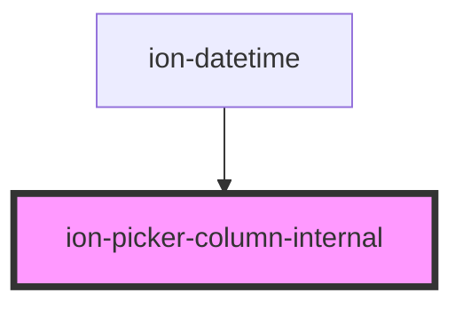

# ion-picker-column-internal

<!-- Auto Generated Below -->

## Properties

| Property | Attribute | Description                                                                                                                                                                                                                                                            | Type                            | Default     |
| -------- | --------- | ---------------------------------------------------------------------------------------------------------------------------------------------------------------------------------------------------------------------------------------------------------------------- | ------------------------------- | ----------- |
| `color`  | `color`   | The color to use from your application's color palette. Default options are: `"primary"`, `"secondary"`, `"tertiary"`, `"success"`, `"warning"`, `"danger"`, `"light"`, `"medium"`, and `"dark"`. For more information on colors, see [theming](/docs/theming/basics). | `string \| undefined`           | `undefined` |
| `items`  | --        | A list of options to be displayed in the picker                                                                                                                                                                                                                        | `PickerColumnItem[]`            | `[]`        |
| `mode`   | `mode`    | The mode determines which platform styles to use.                                                                                                                                                                                                                      | `"ios" \| "md"`                 | `undefined` |
| `value`  | `value`   | The selected option in the picker.                                                                                                                                                                                                                                     | `number \| string \| undefined` | `undefined` |

## Events

| Event       | Description                         | Type                            |
| ----------- | ----------------------------------- | ------------------------------- |
| `ionChange` | Emitted when the value has changed. | `CustomEvent<PickerColumnItem>` |

## Dependencies

### Used by

 - [ion-datetime](../datetime)

### Graph

----------------------------------------------

*Built with [StencilJS](https://stenciljs.com/)*
