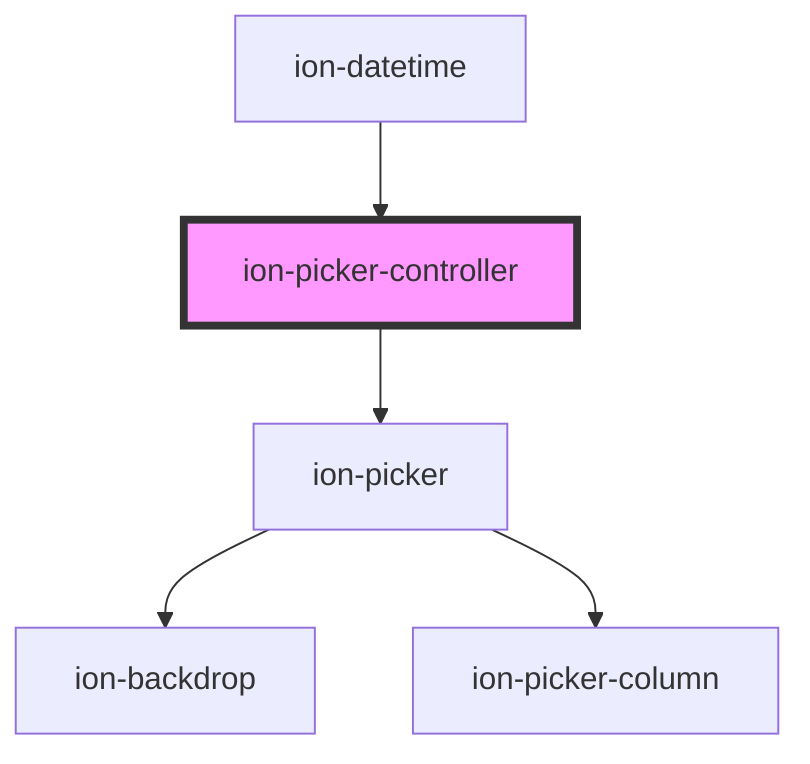

# ion-picker-controller

<!-- Auto Generated Below -->

## Methods

### `create(opts: PickerOptions) => Promise<HTMLIonPickerElement>`

Create a picker overlay with picker options.

#### Returns

Type: `Promise<HTMLIonPickerElement>`

### `dismiss(data?: any, role?: string | undefined, id?: string | undefined) => Promise<boolean>`

Dismiss the open picker overlay.

#### Returns

Type: `Promise<boolean>`

### `getTop() => Promise<HTMLIonPickerElement | undefined>`

Get the most recently opened picker overlay.

#### Returns

Type: `Promise<HTMLIonPickerElement | undefined>`

## Dependencies

**Used by:** [ion-datetime](../datetime)
**Depends on:** [ion-picker](../picker)

----------------------------------------------

*Built with [StencilJS](https://stenciljs.com/)*
