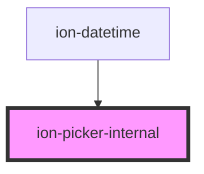

# ion-picker-internal

<!-- Auto Generated Below -->

## Properties

| Property | Attribute | Description                                       | Type            | Default     |
| -------- | --------- | ------------------------------------------------- | --------------- | ----------- |
| `mode`   | `mode`    | The mode determines which platform styles to use. | `"ios" \| "md"` | `undefined` |

## Dependencies

### Used by

 - [ion-datetime](../datetime)

### Graph

----------------------------------------------

*Built with [StencilJS](https://stenciljs.com/)*
