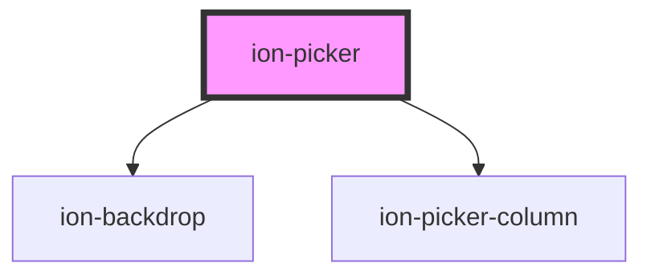

# ion-picker

A Picker is a dialog that displays a row of buttons and columns underneath. It appears on top of the app's content, and at the bottom of the viewport.

<!-- Auto Generated Below -->

## Properties

| Property          | Attribute          | Description                                                                                                      | Type                                                                                   | Default     |
| ----------------- | ------------------ | ---------------------------------------------------------------------------------------------------------------- | -------------------------------------------------------------------------------------- | ----------- |
| `animated`        | `animated`         | If `true`, the picker will animate.                                                                              | `boolean`                                                                              | `true`      |
| `backdropDismiss` | `backdrop-dismiss` | If `true`, the picker will be dismissed when the backdrop is clicked.                                            | `boolean`                                                                              | `true`      |
| `buttons`         | --                 | Array of buttons to be displayed at the top of the picker.                                                       | `PickerButton[]`                                                                       | `[]`        |
| `columns`         | --                 | Array of columns to be displayed in the picker.                                                                  | `PickerColumn[]`                                                                       | `[]`        |
| `cssClass`        | `css-class`        | Additional classes to apply for custom CSS. If multiple classes are provided they should be separated by spaces. | `string \| string[] \| undefined`                                                      | `undefined` |
| `duration`        | `duration`         | Number of milliseconds to wait before dismissing the picker.                                                     | `number`                                                                               | `0`         |
| `enterAnimation`  | --                 | Animation to use when the picker is presented.                                                                   | `((Animation: Animation, baseEl: any, opts?: any) => Promise<Animation>) \| undefined` | `undefined` |
| `keyboardClose`   | `keyboard-close`   | If `true`, the keyboard will be automatically dismissed when the overlay is presented.                           | `boolean`                                                                              | `true`      |
| `leaveAnimation`  | --                 | Animation to use when the picker is dismissed.                                                                   | `((Animation: Animation, baseEl: any, opts?: any) => Promise<Animation>) \| undefined` | `undefined` |
| `mode`            | `mode`             | The mode determines which platform styles to use.                                                                | `"ios" \| "md"`                                                                        | `undefined` |
| `showBackdrop`    | `show-backdrop`    | If `true`, a backdrop will be displayed behind the picker.                                                       | `boolean`                                                                              | `true`      |

## Events

| Event                  | Description                              | Type                                   |
| ---------------------- | ---------------------------------------- | -------------------------------------- |
| `ionPickerDidDismiss`  | Emitted after the picker has dismissed.  | `CustomEvent<OverlayEventDetail<any>>` |
| `ionPickerDidPresent`  | Emitted after the picker has presented.  | `CustomEvent<void>`                    |
| `ionPickerWillDismiss` | Emitted before the picker has dismissed. | `CustomEvent<OverlayEventDetail<any>>` |
| `ionPickerWillPresent` | Emitted before the picker has presented. | `CustomEvent<void>`                    |

## Methods

### `dismiss(data?: any, role?: string | undefined) => Promise<boolean>`

Dismiss the picker overlay after it has been presented.

#### Returns

Type: `Promise<boolean>`

### `getColumn(name: string) => Promise<PickerColumn | undefined>`

Get the column that matches the specified name.

#### Returns

Type: `Promise<PickerColumn | undefined>`

### `onDidDismiss() => Promise<OverlayEventDetail<any>>`

Returns a promise that resolves when the picker did dismiss.

#### Returns

Type: `Promise<OverlayEventDetail<any>>`

### `onWillDismiss() => Promise<OverlayEventDetail<any>>`

Returns a promise that resolves when the picker will dismiss.

#### Returns

Type: `Promise<OverlayEventDetail<any>>`

### `present() => Promise<void>`

Present the picker overlay after it has been created.

#### Returns

Type: `Promise<void>`

## CSS Custom Properties

| Name               | Description                            |
| ------------------ | -------------------------------------- |
| `--background`     | Background of the picker               |
| `--background-rgb` | Background of the picker in rgb format |
| `--border-color`   | Border color of the picker             |
| `--border-radius`  | Border radius of the picker            |
| `--border-style`   | Border style of the picker             |
| `--border-width`   | Border width of the picker             |
| `--height`         | Height of the picker                   |
| `--max-height`     | Maximum height of the picker           |
| `--max-width`      | Maximum width of the picker            |
| `--min-height`     | Minimum height of the picker           |
| `--min-width`      | Minimum width of the picker            |
| `--width`          | Width of the picker                    |

## Dependencies

### Depends on

- [ion-backdrop](../backdrop)
- ion-picker-column

### Graph

----------------------------------------------

*Built with [StencilJS](https://stenciljs.com/)*
