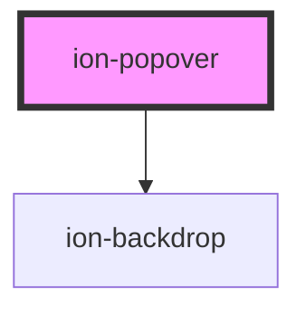

# ion-popover

A Popover is a dialog that appears on top of the current page. It can be used for anything, but generally it is used for overflow actions that don't fit in the navigation bar.

There are two ways to use `ion-popover`: inline or via the `popoverController`. Each method comes with different considerations, so be sure to use the approach that best fits your use case.

## Inline Popovers

`ion-popover` can be used by writing the component directly in your template. This reduces the number of handlers you need to wire up in order to present the popover. See [Usage](#usage) for an example of how to write a popover inline. 

When using `ion-popover` with Angular, React, or Vue, the component you pass in will be destroyed when the popover is dismissed. If you are not using a JavaScript Framework, you should use the `component` property to pass in the name of a Web Component. This Web Component will be destroyed when the popover is dismissed, and a new instance will be created if the popover is presented again.

### Angular 

Since the component you passed in needs to be created when the popover is presented and destroyed when the popover is dismissed, we are unable to project the content using `<ng-content>` internally. Instead, we use `<ng-container>` which expects an `<ng-template>` to be passed in. As a result, when passing in your component you will need to wrap it in an `<ng-template>`:

```html
<ion-popover [isOpen]="isPopoverOpen">
  <ng-template>
    <app-popover-content></app-popover-content>
  </ng-template>
</ion-popover>
```

Liam: Usage will be filled out via desktop popover PR.

### When to use

Liam: Will be filled out via desktop popover PR.

## Controller Popovers

`ion-popover` can also be presented programmatically by using the `popoverController` imported from Ionic Framework. This allows you to have complete control over when a popover is presented above and beyond the customization that inline popovers give you. See [Usage](#usage) for an example of how to use the `popoverController`.

Liam: Usage will be filled out via desktop popover PR.


### When to use

Liam: Will be filled out via desktop popover PR.

## Interfaces

Below you will find all of the options available to you when using the `popoverController`. These options should be supplied when calling `popoverController.create()`.

```typescript
interface PopoverOptions {
  component: any;
  componentProps?: { [key: string]: any };
  showBackdrop?: boolean;
  backdropDismiss?: boolean;
  translucent?: boolean;
  cssClass?: string | string[];
  event?: Event;
  animated?: boolean;

  mode?: 'ios' | 'md';
  keyboardClose?: boolean;
  id?: string;

  enterAnimation?: AnimationBuilder;
  leaveAnimation?: AnimationBuilder;
}
```

## Customization

Popover uses scoped encapsulation, which means it will automatically scope its CSS by appending each of the styles with an additional class at runtime. Overriding scoped selectors in CSS requires a [higher specificity](https://developer.mozilla.org/en-US/docs/Web/CSS/Specificity) selector.

We recommend passing a custom class to `cssClass` in the `create` method and using that to add custom styles to the host and inner elements. This property can also accept multiple classes separated by spaces. View the [Usage](#usage) section for an example of how to pass a class using `cssClass`.

```css
/* DOES NOT WORK - not specific enough */
.popover-content {
  background: #222;
}

/* Works - pass "my-custom-class" in cssClass to increase specificity */
.my-custom-class .popover-content {
  background: #222;
}
```

Any of the defined [CSS Custom Properties](#css-custom-properties) can be used to style the Popover without needing to target individual elements:

```css
.my-custom-class {
  --background: #222;
}
```

> If you are building an Ionic Angular app, the styles need to be added to a global stylesheet file. Read [Style Placement](#style-placement) in the Angular section below for more information.


<!-- Auto Generated Below -->


## Usage

### Angular

```typescript
import { Component } from '@angular/core';
import { PopoverController } from '@ionic/angular';
import { PopoverComponent } from '../../component/popover/popover.component';

@Component({
  selector: 'popover-example',
  templateUrl: 'popover-example.html',
  styleUrls: ['./popover-example.css']
})
export class PopoverExample {
  constructor(public popoverController: PopoverController) {}

  async presentPopover(ev: any) {
    const popover = await this.popoverController.create({
      component: PopoverComponent,
      cssClass: 'my-custom-class',
      event: ev,
      translucent: true
    });
    await popover.present();
  
    const { role } = await popover.onDidDismiss();
    console.log('onDidDismiss resolved with role', role);
  }
}
```


### Style Placement

In Angular, the CSS of a specific page is scoped only to elements of that page. Even though the Popover can be presented from within a page, the `ion-popover` element is appended outside of the current page. This means that any custom styles need to go in a global stylesheet file. In an Ionic Angular starter this can be the `src/global.scss` file or you can register a new global style file by [adding to the `styles` build option in `angular.json`](https://angular.io/guide/workspace-config#style-script-config).


### Javascript

```javascript
class PopoverExamplePage extends HTMLElement {
  constructor() {
    super();
  }

  connectedCallback() {
    this.innerHTML = `
      <ion-content>
        <ion-list>
          <ion-list-header><ion-label>Ionic</ion-label></ion-list-header>
          <ion-item button><ion-label>Item 0</ion-label></ion-item>
          <ion-item button><ion-label>Item 1</ion-label></ion-item>
          <ion-item button><ion-label>Item 2</ion-label></ion-item>
          <ion-item button><ion-label>Item 3</ion-label></ion-item>
        </ion-list>
      </ion-content>
    `;
  }
}

customElements.define('popover-example-page', PopoverExamplePage);

function presentPopover(ev) {
  const popover = Object.assign(document.createElement('ion-popover'), {
    component: 'popover-example-page',
    cssClass: 'my-custom-class',
    event: ev,
    translucent: true
  });
  document.body.appendChild(popover);

  await popover.present();
  
  const { role } = await popover.onDidDismiss();
  console.log('onDidDismiss resolved with role', role);
}
```


### React

```tsx
/* Using with useIonPopover Hook */

import React from 'react';
import {
  IonButton,
  IonContent,
  IonItem,
  IonList,
  IonListHeader,
  IonPage,
  useIonPopover,
} from '@ionic/react';

const PopoverList: React.FC<{
  onHide: () => void;
}> = ({ onHide }) => (
  <IonList>
    <IonListHeader>Ionic</IonListHeader>
    <IonItem button>Learn Ionic</IonItem>
    <IonItem button>Documentation</IonItem>
    <IonItem button>Showcase</IonItem>
    <IonItem button>GitHub Repo</IonItem>
    <IonItem lines="none" detail={false} button onClick={onHide}>
      Close
    </IonItem>
  </IonList>
);

const PopoverExample: React.FC = () => {
  const [present, dismiss] = useIonPopover(PopoverList, { onHide: () => dismiss() });
  
  return (
    <IonPage>
      <IonContent>
        <IonButton
          expand="block"
          onClick={(e) =>
            present({
              event: e.nativeEvent,
            })
          }
        >
          Show Popover
        </IonButton>
      </IonContent>
    </IonPage>
  );
};
```

```tsx
/* Using with IonPopover Component */

import React, { useState } from 'react';
import { IonPopover, IonButton } from '@ionic/react';

export const PopoverExample: React.FC = () => {
  const [popoverState, setShowPopover] = useState({ showPopover: false, event: undefined });

  return (
    <>
      <IonPopover
        cssClass='my-custom-class'
        event={popoverState.event}
        isOpen={popoverState.showPopover}
        onDidDismiss={() => setShowPopover({ showPopover: false, event: undefined })}
      >
        <p>This is popover content</p>
      </IonPopover>
      <IonButton onClick={
        (e: any) => {
          e.persist();
          setShowPopover({ showPopover: true, event: e })
        }}
      >
        Show Popover
      </IonButton>
    </>
  );
};
```


### Stencil

```tsx
import { Component, h } from '@stencil/core';

import { popoverController } from '@ionic/core';

@Component({
  tag: 'popover-example',
  styleUrl: 'popover-example.css'
})
export class PopoverExample {
  async presentPopover(ev: any) {
    const popover = await popoverController.create({
      component: 'page-popover',
      cssClass: 'my-custom-class',
      event: ev,
      translucent: true
    });
    await popover.present();
  
    const { role } = await popover.onDidDismiss();
    console.log('onDidDismiss resolved with role', role);
  }

  render() {
    return [
      <ion-content>
        <ion-button onClick={(ev) => this.presentPopover(ev)}>Present Popover</ion-button>
      </ion-content>
    ];
  }
}
```

```tsx
import { Component, h } from '@stencil/core';

@Component({
  tag: 'page-popover',
  styleUrl: 'page-popover.css',
})
export class PagePopover {
  render() {
    return [
      <ion-list>
        <ion-item>
          <ion-label>Documentation</ion-label>
        </ion-item>
        <ion-item>
          <ion-label>Feedback</ion-label>
        </ion-item>
        <ion-item>
          <ion-label>Settings</ion-label>
        </ion-item>
      </ion-list>
    ];
  }
}
```


### Vue

```html
<template>
  <ion-content class="ion-padding">
    Popover Content
  </ion-content>
</template>

<script>
import { IonContent } from '@ionic/vue';
import { defineComponent } from 'vue';

export default defineComponent({
  name: 'Popover',
  components: { IonContent }
});
</script>
```

```html
<template>
  <ion-page>
    <ion-content class="ion-padding">
      <ion-button @click="openPopover">Open Popover</ion-button>
    </ion-content>
  </ion-page>
</template>

<script>
import { IonButton, IonContent, IonPage, popoverController } from '@ionic/vue';
import Popver from './popover.vue'

export default {
  components: { IonButton, IonContent, IonPage },
  methods: {
    async openPopover(ev: Event) {
      const popover = await popoverController
        .create({
          component: Popover,
          cssClass: 'my-custom-class',
          event: ev,
          translucent: true
        })
      await popover.present();
  
      const { role } = await popover.onDidDismiss();
      console.log('onDidDismiss resolved with role', role);
    },
  },
}
</script>
```

Developers can also use this component directly in their template:

```html
<template>
  <ion-button @click="setOpen(true, $event)">Show Popover</ion-button>
  <ion-popover
    :is-open="isOpenRef"
    css-class="my-custom-class"
    :event="event"
    :translucent="true"
    @didDismiss="setOpen(false)"
  >
    <Popover></Popover>
  </ion-popover>
</template>

<script>
import { IonButton, IonPopover } from '@ionic/vue';
import { defineComponent, ref } from 'vue';
import Popver from './popover.vue'

export default defineComponent({
  components: { IonButton, IonPopover, Popover },
  setup() {
    const isOpenRef = ref(false);
    const event = ref();
    const setOpen = (state: boolean, event?: Event) => {
      event.value = event; 
      isOpenRef.value = state;
    }
    return { isOpenRef, setOpen, event }
  }
});
</script>
```


## Properties

| Property          | Attribute          | Description                                                                                                                                                                                                                                                                                                                             | Type                                                     | Default     |
| ----------------- | ------------------ | --------------------------------------------------------------------------------------------------------------------------------------------------------------------------------------------------------------------------------------------------------------------------------------------------------------------------------------- | -------------------------------------------------------- | ----------- |
| `animated`        | `animated`         | If `true`, the popover will animate.                                                                                                                                                                                                                                                                                                    | `boolean`                                                | `true`      |
| `backdropDismiss` | `backdrop-dismiss` | If `true`, the popover will be dismissed when the backdrop is clicked.                                                                                                                                                                                                                                                                  | `boolean`                                                | `true`      |
| `component`       | `component`        | The component to display inside of the popover. You only need to use this if you are not using a JavaScript framework. Otherwise, you can just slot your component inside of `ion-popover`.                                                                                                                                             | `Function \| HTMLElement \| null \| string \| undefined` | `undefined` |
| `componentProps`  | --                 | The data to pass to the popover component. You only need to use this if you are not using a JavaScript framework. Otherwise, you can just set the props directly on your component.                                                                                                                                                     | `undefined \| { [key: string]: any; }`                   | `undefined` |
| `enterAnimation`  | --                 | Animation to use when the popover is presented.                                                                                                                                                                                                                                                                                         | `((baseEl: any, opts?: any) => Animation) \| undefined`  | `undefined` |
| `event`           | `event`            | The event to pass to the popover animation.                                                                                                                                                                                                                                                                                             | `any`                                                    | `undefined` |
| `isOpen`          | `is-open`          | If `true`, the popover will open. If `false`, the popover will close. Use this if you need finer grained control over presentation, otherwise just use the popoverController or the `trigger` property. Note: `isOpen` will not automatically be set back to `false` when the popover dismisses. You will need to do that in your code. | `boolean`                                                | `false`     |
| `keyboardClose`   | `keyboard-close`   | If `true`, the keyboard will be automatically dismissed when the overlay is presented.                                                                                                                                                                                                                                                  | `boolean`                                                | `true`      |
| `leaveAnimation`  | --                 | Animation to use when the popover is dismissed.                                                                                                                                                                                                                                                                                         | `((baseEl: any, opts?: any) => Animation) \| undefined`  | `undefined` |
| `mode`            | `mode`             | The mode determines which platform styles to use.                                                                                                                                                                                                                                                                                       | `"ios" \| "md"`                                          | `undefined` |
| `showBackdrop`    | `show-backdrop`    | If `true`, a backdrop will be displayed behind the popover.                                                                                                                                                                                                                                                                             | `boolean`                                                | `true`      |
| `translucent`     | `translucent`      | If `true`, the popover will be translucent. Only applies when the mode is `"ios"` and the device supports [`backdrop-filter`](https://developer.mozilla.org/en-US/docs/Web/CSS/backdrop-filter#Browser_compatibility).                                                                                                                  | `boolean`                                                | `false`     |


## Events

| Event                   | Description                                                                    | Type                                   |
| ----------------------- | ------------------------------------------------------------------------------ | -------------------------------------- |
| `didDismiss`            | Emitted after the popover has dismissed. Shorthand for ionPopoverDidDismiss.   | `CustomEvent<OverlayEventDetail<any>>` |
| `didPresent`            | Emitted after the popover has presented. Shorthand for ionPopoverWillDismiss.  | `CustomEvent<void>`                    |
| `ionPopoverDidDismiss`  | Emitted after the popover has dismissed.                                       | `CustomEvent<OverlayEventDetail<any>>` |
| `ionPopoverDidPresent`  | Emitted after the popover has presented.                                       | `CustomEvent<void>`                    |
| `ionPopoverWillDismiss` | Emitted before the popover has dismissed.                                      | `CustomEvent<OverlayEventDetail<any>>` |
| `ionPopoverWillPresent` | Emitted before the popover has presented.                                      | `CustomEvent<void>`                    |
| `willDismiss`           | Emitted before the popover has dismissed. Shorthand for ionPopoverWillDismiss. | `CustomEvent<OverlayEventDetail<any>>` |
| `willPresent`           | Emitted before the popover has presented. Shorthand for ionPopoverWillPresent. | `CustomEvent<void>`                    |


## Methods

### `dismiss(data?: any, role?: string | undefined) => Promise<boolean>`

Dismiss the popover overlay after it has been presented.

#### Returns

Type: `Promise<boolean>`


### `onDidDismiss<T = any>() => Promise<OverlayEventDetail<T>>`

Returns a promise that resolves when the popover did dismiss.

#### Returns

Type: `Promise<OverlayEventDetail<T>>`


### `onWillDismiss<T = any>() => Promise<OverlayEventDetail<T>>`

Returns a promise that resolves when the popover will dismiss.

#### Returns

Type: `Promise<OverlayEventDetail<T>>`


### `present() => Promise<void>`

Present the popover overlay after it has been created.

#### Returns

Type: `Promise<void>`


## Slots

| Slot | Description                                                 |
| ---- | ----------------------------------------------------------- |
|      | Content is placed inside of the `.popover-content` element. |


## Shadow Parts

| Part         | Description                                                                 |
| ------------ | --------------------------------------------------------------------------- |
| `"arrow"`    | The arrow that points to the reference element. Only applies on `ios` mode. |
| `"backdrop"` | The `ion-backdrop` element.                                                 |
| `"content"`  | The wrapper element for the default slot.                                   |


## CSS Custom Properties

| Name                 | Description                   |
| -------------------- | ----------------------------- |
| `--backdrop-opacity` | Opacity of the backdrop       |
| `--background`       | Background of the popover     |
| `--box-shadow`       | Box shadow of the popover     |
| `--height`           | Height of the popover         |
| `--max-height`       | Maximum height of the popover |
| `--max-width`        | Maximum width of the popover  |
| `--min-height`       | Minimum height of the popover |
| `--min-width`        | Minimum width of the popover  |
| `--width`            | Width of the popover          |


## Dependencies

### Depends on

- [ion-backdrop](../backdrop)

### Graph


----------------------------------------------

*Built with [StencilJS](https://stenciljs.com/)*
