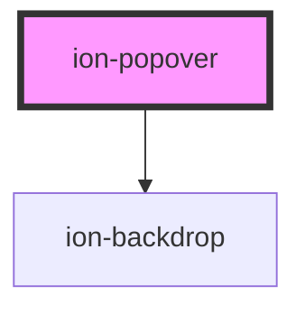

# ion-popover

A Popover is a dialog that appears on top of the current page. It can be used for anything, but generally it is used for overflow actions that don't fit in the navigation bar.

## Presenting

To present a popover, call the `present` method on a popover instance. In order to position the popover relative to the element clicked, a click event needs to be passed into the options of the the `present` method. If the event is not passed, the popover will be positioned in the center of the viewport.

## Customization

Popover uses scoped encapsulation, which means it will automatically scope its CSS by appending each of the styles with an additional class at runtime. Overriding scoped selectors in CSS requires a [higher specificity](https://developer.mozilla.org/en-US/docs/Web/CSS/Specificity) selector.

We recommend passing a custom class to `cssClass` in the `create` method and using that to add custom styles to the host and inner elements. This property can also accept multiple classes separated by spaces. View the [Usage](#usage) section for an example of how to pass a class using `cssClass`.

```css
/* DOES NOT WORK - not specific enough */
.popover-content {
  background: #222;
}

/* Works - pass "my-custom-class" in cssClass to increase specificity */
.my-custom-class .popover-content {
  background: #222;
}
```

Any of the defined [CSS Custom Properties](#css-custom-properties) can be used to style the Popover without needing to target individual elements:

```css
.my-custom-class {
  --background: #222;
}
```

> If you are building an Ionic Angular app, the styles need to be added to a global stylesheet file. Read [Style Placement](#style-placement) in the Angular section below for more information.


<!-- Auto Generated Below -->


## Usage

### Angular

```typescript
import { Component } from '@angular/core';
import { PopoverController } from '@ionic/angular';
import { PopoverComponent } from '../../component/popover/popover.component';

@Component({
  selector: 'popover-example',
  templateUrl: 'popover-example.html',
  styleUrls: ['./popover-example.css']
})
export class PopoverExample {
  constructor(public popoverController: PopoverController) {}

  async presentPopover(ev: any) {
    const popover = await this.popoverController.create({
      component: PopoverComponent,
      cssClass: 'my-custom-class',
      event: ev,
      translucent: true
    });
    return await popover.present();
  }
}
```


### Style Placement

In Angular, the CSS of a specific page is scoped only to elements of that page. Even though the Popover can be presented from within a page, the `ion-popover` element is appended outside of the current page. This means that any custom styles need to go in a global stylesheet file. In an Ionic Angular starter this can be the `src/global.scss` file or you can register a new global style file by [adding to the `styles` build option in `angular.json`](https://angular.io/guide/workspace-config#style-script-config).


### Javascript

```javascript
function presentPopover(ev) {
  const popover = Object.assign(document.createElement('ion-popover'), {
    component: 'popover-example-page',
    cssClass: 'my-custom-class',
    event: ev,
    translucent: true
  });
  document.body.appendChild(popover);
  return popover.present();
}
```


### React

```tsx
import React, { useState } from 'react';
import { IonPopover, IonButton } from '@ionic/react';

export const PopoverExample: React.FC = () => {
  const [showPopover, setShowPopover] = useState(false);

  return (
    <>
      <IonPopover
        isOpen={showPopover}
        cssClass='my-custom-class'
        onDidDismiss={e => setShowPopover(false)}
      >
        <p>This is popover content</p>
      </IonPopover>
      <IonButton onClick={() => setShowPopover(true)}>Show Popover</IonButton>
    </>
  );
};
```


### Stencil

```tsx
import { Component, h } from '@stencil/core';

import { popoverController } from '@ionic/core';

@Component({
  tag: 'popover-example',
  styleUrl: 'popover-example.css'
})
export class PopoverExample {
  async presentPopover(ev: any) {
    const popover = await popoverController.create({
      component: 'page-popover',
      cssClass: 'my-custom-class',
      event: ev,
      translucent: true
    });
    return await popover.present();
  }

  render() {
    return [
      <ion-content>
        <ion-button onClick={(ev) => this.presentPopover(ev)}>Present Popover</ion-button>
      </ion-content>
    ];
  }
}
```

```tsx
import { Component, h } from '@stencil/core';

@Component({
  tag: 'page-popover',
  styleUrl: 'page-popover.css',
})
export class PagePopover {
  render() {
    return [
      <ion-list>
        <ion-item>
          <ion-label>Documentation</ion-label>
        </ion-item>
        <ion-item>
          <ion-label>Feedback</ion-label>
        </ion-item>
        <ion-item>
          <ion-label>Settings</ion-label>
        </ion-item>
      </ion-list>
    ];
  }
}
```


## Properties

| Property                 | Attribute          | Description                                                                                                                                                                                                            | Type                                                    | Default     |
| ------------------------ | ------------------ | ---------------------------------------------------------------------------------------------------------------------------------------------------------------------------------------------------------------------- | ------------------------------------------------------- | ----------- |
| `animated`               | `animated`         | If `true`, the popover will animate.                                                                                                                                                                                   | `boolean`                                               | `true`      |
| `backdropDismiss`        | `backdrop-dismiss` | If `true`, the popover will be dismissed when the backdrop is clicked.                                                                                                                                                 | `boolean`                                               | `true`      |
| `component` _(required)_ | `component`        | The component to display inside of the popover.                                                                                                                                                                        | `Function \| HTMLElement \| null \| string`             | `undefined` |
| `componentProps`         | --                 | The data to pass to the popover component.                                                                                                                                                                             | `undefined \| { [key: string]: any; }`                  | `undefined` |
| `cssClass`               | `css-class`        | Additional classes to apply for custom CSS. If multiple classes are provided they should be separated by spaces.                                                                                                       | `string \| string[] \| undefined`                       | `undefined` |
| `enterAnimation`         | --                 | Animation to use when the popover is presented.                                                                                                                                                                        | `((baseEl: any, opts?: any) => Animation) \| undefined` | `undefined` |
| `event`                  | `event`            | The event to pass to the popover animation.                                                                                                                                                                            | `any`                                                   | `undefined` |
| `keyboardClose`          | `keyboard-close`   | If `true`, the keyboard will be automatically dismissed when the overlay is presented.                                                                                                                                 | `boolean`                                               | `true`      |
| `leaveAnimation`         | --                 | Animation to use when the popover is dismissed.                                                                                                                                                                        | `((baseEl: any, opts?: any) => Animation) \| undefined` | `undefined` |
| `mode`                   | `mode`             | The mode determines which platform styles to use.                                                                                                                                                                      | `"ios" \| "md"`                                         | `undefined` |
| `showBackdrop`           | `show-backdrop`    | If `true`, a backdrop will be displayed behind the popover.                                                                                                                                                            | `boolean`                                               | `true`      |
| `translucent`            | `translucent`      | If `true`, the popover will be translucent. Only applies when the mode is `"ios"` and the device supports [`backdrop-filter`](https://developer.mozilla.org/en-US/docs/Web/CSS/backdrop-filter#Browser_compatibility). | `boolean`                                               | `false`     |


## Events

| Event                   | Description                               | Type                                   |
| ----------------------- | ----------------------------------------- | -------------------------------------- |
| `ionPopoverDidDismiss`  | Emitted after the popover has dismissed.  | `CustomEvent<OverlayEventDetail<any>>` |
| `ionPopoverDidPresent`  | Emitted after the popover has presented.  | `CustomEvent<void>`                    |
| `ionPopoverWillDismiss` | Emitted before the popover has dismissed. | `CustomEvent<OverlayEventDetail<any>>` |
| `ionPopoverWillPresent` | Emitted before the popover has presented. | `CustomEvent<void>`                    |


## Methods

### `dismiss(data?: any, role?: string | undefined) => Promise<boolean>`

Dismiss the popover overlay after it has been presented.

#### Returns

Type: `Promise<boolean>`


### `onDidDismiss() => Promise<OverlayEventDetail<any>>`

Returns a promise that resolves when the popover did dismiss.

#### Returns

Type: `Promise<OverlayEventDetail<any>>`


### `onWillDismiss() => Promise<OverlayEventDetail<any>>`

Returns a promise that resolves when the popover will dismiss.

#### Returns

Type: `Promise<OverlayEventDetail<any>>`


### `present() => Promise<void>`

Present the popover overlay after it has been created.

#### Returns

Type: `Promise<void>`


## CSS Custom Properties

| Name                 | Description                   |
| -------------------- | ----------------------------- |
| `--backdrop-opacity` | Opacity of the backdrop       |
| `--background`       | Background of the popover     |
| `--box-shadow`       | Box shadow of the popover     |
| `--height`           | Height of the popover         |
| `--max-height`       | Maximum height of the popover |
| `--max-width`        | Maximum width of the popover  |
| `--min-height`       | Minimum height of the popover |
| `--min-width`        | Minimum width of the popover  |
| `--width`            | Width of the popover          |


## Dependencies

### Depends on

- [ion-backdrop](../backdrop)

### Graph


----------------------------------------------

*Built with [StencilJS](https://stenciljs.com/)*
