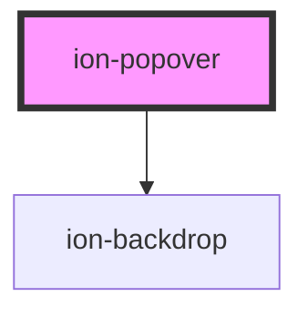

# ion-popover

A Popover is a dialog that appears on top of the current page. It can be used for anything, but generally it is used for overflow actions that don't fit in the navigation bar.

### Creating

Popovers can be created using a [Popover Controller](../popover-controller). They can be customized by passing popover options in the popover controller's create method.

### Presenting

To present a popover, call the `present` method on a popover instance. In order to position the popover relative to the element clicked, a click event needs to be passed into the options of the the `present` method. If the event is not passed, the popover will be positioned in the center of the viewport.


<!-- Auto Generated Below -->


## Usage

### Angular

```typescript
import { Component } from '@angular/core';
import { PopoverController } from '@ionic/angular';
import { PopoverComponent } from '../../component/popover/popover.component';

@Component({
  selector: 'popover-example',
  templateUrl: 'popover-example.html',
  styleUrls: ['./popover-example.css']
})
export class PopoverExample {
  constructor(public popoverController: PopoverController) {}

  async presentPopover(ev: any) {
    const popover = await this.popoverController.create({
      component: PopoverComponent,
      event: ev,
      translucent: true
    });
    return await popover.present();
  }
}
```


### Javascript

```javascript
async function presentPopover(ev) {
  const popoverController = document.querySelector('ion-popover-controller');
  await popoverController.componentOnReady();

  const popover = await popoverController.create({
    component: 'popover-example-page',
    event: ev,
    translucent: true
  });
  return await popover.present();
}
```


### React

```tsx
import React, { useState } from 'react';
import { IonPopover, IonButton } from '@ionic/react';

export const PopoverExample: React.FunctionComponent = () => {
  const [showPopover, setShowPopover] = useState(false);

  return (
    <>
      <IonPopover
        isOpen={showPopover}
        onDidDismiss={e => setShowPopover(false)}
      >
        <p>This is popover content</p>
      </IonPopover>
      <IonButton onClick={() => setShowPopover(true)}>Show Popover</IonButton>
    </>
  );
};
```


## Properties

| Property                 | Attribute          | Description                                                                                                      | Type                                                                                   | Default     |
| ------------------------ | ------------------ | ---------------------------------------------------------------------------------------------------------------- | -------------------------------------------------------------------------------------- | ----------- |
| `animated`               | `animated`         | If `true`, the popover will animate.                                                                             | `boolean`                                                                              | `true`      |
| `backdropDismiss`        | `backdrop-dismiss` | If `true`, the popover will be dismissed when the backdrop is clicked.                                           | `boolean`                                                                              | `true`      |
| `component` _(required)_ | `component`        | The component to display inside of the popover.                                                                  | `Function \| HTMLElement \| null \| string`                                            | `undefined` |
| `componentProps`         | --                 | The data to pass to the popover component.                                                                       | `undefined \| { [key: string]: any; }`                                                 | `undefined` |
| `cssClass`               | `css-class`        | Additional classes to apply for custom CSS. If multiple classes are provided they should be separated by spaces. | `string \| string[] \| undefined`                                                      | `undefined` |
| `enterAnimation`         | --                 | Animation to use when the popover is presented.                                                                  | `((Animation: Animation, baseEl: any, opts?: any) => Promise<Animation>) \| undefined` | `undefined` |
| `event`                  | `event`            | The event to pass to the popover animation.                                                                      | `any`                                                                                  | `undefined` |
| `keyboardClose`          | `keyboard-close`   | If `true`, the keyboard will be automatically dismissed when the overlay is presented.                           | `boolean`                                                                              | `true`      |
| `leaveAnimation`         | --                 | Animation to use when the popover is dismissed.                                                                  | `((Animation: Animation, baseEl: any, opts?: any) => Promise<Animation>) \| undefined` | `undefined` |
| `mode`                   | `mode`             | The mode determines which platform styles to use.                                                                | `"ios" \| "md"`                                                                        | `undefined` |
| `showBackdrop`           | `show-backdrop`    | If `true`, a backdrop will be displayed behind the popover.                                                      | `boolean`                                                                              | `true`      |
| `translucent`            | `translucent`      | If `true`, the popover will be translucent.                                                                      | `boolean`                                                                              | `false`     |


## Events

| Event                   | Description                               | Type                                   |
| ----------------------- | ----------------------------------------- | -------------------------------------- |
| `ionPopoverDidDismiss`  | Emitted after the popover has dismissed.  | `CustomEvent<OverlayEventDetail<any>>` |
| `ionPopoverDidPresent`  | Emitted after the popover has presented.  | `CustomEvent<void>`                    |
| `ionPopoverWillDismiss` | Emitted before the popover has dismissed. | `CustomEvent<OverlayEventDetail<any>>` |
| `ionPopoverWillPresent` | Emitted before the popover has presented. | `CustomEvent<void>`                    |


## Methods

### `dismiss(data?: any, role?: string | undefined) => Promise<boolean>`

Dismiss the popover overlay after it has been presented.

#### Returns

Type: `Promise<boolean>`


### `onDidDismiss() => Promise<OverlayEventDetail<any>>`

Returns a promise that resolves when the popover did dismiss.

#### Returns

Type: `Promise<OverlayEventDetail<any>>`


### `onWillDismiss() => Promise<OverlayEventDetail<any>>`

Returns a promise that resolves when the popover will dismiss.

#### Returns

Type: `Promise<OverlayEventDetail<any>>`


### `present() => Promise<void>`

Present the popover overlay after it has been created.

#### Returns

Type: `Promise<void>`


## CSS Custom Properties

| Name           | Description                   |
| -------------- | ----------------------------- |
| `--background` | Background of the popover     |
| `--box-shadow` | Box shadow of the popover     |
| `--height`     | Height of the popover         |
| `--max-height` | Maximum height of the popover |
| `--max-width`  | Maximum width of the popover  |
| `--min-height` | Minimum height of the popover |
| `--min-width`  | Minimum width of the popover  |
| `--width`      | Width of the popover          |


## Dependencies

### Depends on

- [ion-backdrop](../backdrop)

### Graph


----------------------------------------------

*Built with [StencilJS](https://stenciljs.com/)*
