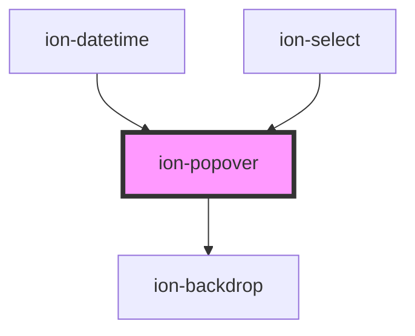

# ion-popover

A Popover is a dialog that appears on top of the current page. It can be used for anything, but generally it is used for overflow actions that don't fit in the navigation bar.

There are two ways to use `ion-popover`: inline or via the `popoverController`. Each method comes with different considerations, so be sure to use the approach that best fits your use case.

## Inline Popovers

`ion-popover` can be used by writing the component directly in your template. This reduces the number of handlers you need to wire up in order to present the popover. See [Usage](#usage) for an example of how to write a popover inline. 

When using `ion-popover` with Angular, React, or Vue, the component you pass in will be destroyed when the popover is dismissed. As this functionality is provided by the JavaScript framework, using `ion-popover` without a JavaScript framework will not destroy the component you passed in. If this is a needed functionality, we recommend using the `popoverController` instead.

### Angular 

Since the component you passed in needs to be created when the popover is presented and destroyed when the popover is dismissed, we are unable to project the content using `<ng-content>` internally. Instead, we use `<ng-container>` which expects an `<ng-template>` to be passed in. As a result, when passing in your component you will need to wrap it in an `<ng-template>`:

```html
<ion-popover [isOpen]="isPopoverOpen">
  <ng-template>
    <app-popover-content></app-popover-content>
  </ng-template>
</ion-popover>
```

### When to use

Using a popover inline is useful when you do not want to explicitly wire up click events to open the popover. For example, you can use the `trigger` property to designate a button that should present the popover when clicked. You can also use the `trigger-action` property to customize whether the popover should be presented when the trigger is left clicked, right clicked, or hovered over.

If you need fine grained control over when the popover is presented and dismissed, we recommend you use the `popoverController`. 

## Controller Popovers

`ion-popover` can also be presented programmatically by using the `popoverController` imported from Ionic Framework. This allows you to have complete control over when a popover is presented above and beyond the customization that inline popovers give you. See [Usage](#usage) for an example of how to use the `popoverController`.

### When to use

We typically recommend that you write your popovers inline as it streamlines the amount of code in your application. You should only use the `popoverController` for complex use cases where writing a popover inline is impractical. When using a controller, your popover is not created ahead of time, so properties such as `trigger` and `trigger-action` are not applicable here. In addition, nested popovers are not compatible with the controller approach because the popover is automatically added to the root of your application when the `create` method is called.


## Styling

Popovers are presented at the root of your application so they overlay your entire app. This behavior applies to both inline popovers and popovers presented from a controller. As a result, custom popover styles can not be scoped to a particular component as they will not apply to the popover. Instead, styles must be applied globally. For most developers, placing the custom styles in `global.css` is sufficient.

> If you are building an Ionic Angular app, the styles need to be added to a global stylesheet file. Read [Style Placement](#style-placement) in the Angular section below for more information.


## Triggers

A trigger for an `ion-popover` is the element that will open a popover when interacted with. The interaction behavior can be customized by setting the `trigger-action` property. Note that `trigger-action="context-menu"` will prevent your system's default context menu from opening. View the [Usage](#usage) section for an example of how to use triggers.

> Triggers are not applicable when using the `popoverController` because the `ion-popover` is not created ahead of time.

## Positioning

### Reference

When presenting a popover, Ionic Framework needs a reference point to present the popover relative to. With `reference="event"`, the popover will be presented relative to the x-y coordinates of the pointer event that was dispatched on your trigger element. With `reference="trigger"`, the popover will be presented relative to the bounding box of your trigger element.

### Side

Regardless of what you choose for your reference point, you can position a popover to the `top`, `right`, `left`, or `bottom` of your reference point by using the `side` property. You can also use the `start` or `end` values if you would like the side to switch based on LTR or RTL modes.

### Alignment

The `alignment` property allows you to line up an edge of your popover with a corresponding edge on your trigger element. The exact edge that is used depends on the value of the `side` property. 

### Offsets

If you need finer grained control over the positioning of your popover you can use the `--offset-x` and `--offset-y` CSS Variables. For example, `--offset-x: 10px` will move your popover content to the right by `10px`.

## Sizing

When making dropdown menus, you may want to have the width of the popover match the width of the trigger element. Doing this without knowing the trigger width ahead of time is tricky. You can set the `size` property to `'cover'` and Ionic Framework will ensure that the width of the popover matches the width of your trigger element. If you are using the `popoverController`, you must provide an event via the `event` option and Ionic Framework will use `event.target` as the reference element.

## Nested Popovers

When using `ion-popover` inline, you can nested popovers to create nested dropdown menus. When doing this, only the backdrop on the first popover will appear so that the screen does not get progressively darker as you open more popovers. See the [Usage](./#usage) section for an example on how to write a nested popover.

You can use the `dismissOnSelect` property to automatically close the popover when the popover content has been clicked. This behavior does not apply when clicking a trigger element for another popover.

> Nested popovers cannot be created when using the `popoverController` because the popover is automatically added to the root of your application when the `create` method is called.

## Interfaces

Below you will find all of the options available to you when using the `popoverController`. These options should be supplied when calling `popoverController.create()`.

```typescript
interface PopoverOptions {
  component: any;
  componentProps?: { [key: string]: any };
  showBackdrop?: boolean;
  backdropDismiss?: boolean;
  translucent?: boolean;
  cssClass?: string | string[];
  event?: Event;
  animated?: boolean;

  mode?: 'ios' | 'md';
  keyboardClose?: boolean;
  id?: string;
  htmlAttributes?: { [key: string]: any };

  enterAnimation?: AnimationBuilder;
  leaveAnimation?: AnimationBuilder;
  
  size?: PopoverSize;
  dismissOnSelect?: boolean;
  reference?: PositionReference;
  side?: PositionSide;
  alignment?: PositionAlign;
  arrow?: boolean;
}
```


## Types

Below you will find all of the custom types for `ion-popover`:

```typescript
type PopoverSize = 'cover' | 'auto';
type TriggerAction = 'click' | 'hover' | 'context-menu';
type PositionReference = 'trigger' | 'event';
type PositionSide = 'top' | 'right' | 'bottom' | 'left' | 'start' | 'end';
type PositionAlign = 'start' | 'center' | 'end';
```

## Accessibility

### Keyboard Navigation

`ion-popover` has basic keyboard support for navigating between focusable elements inside of the popover. The following table details what each key does:

| Key                | Function                                                     |
| ------------------ | ------------------------------------------------------------ |
| `Tab`              | Moves focus to the next focusable element.                   |
| `Shift` + `Tab`    | Moves focus to the previous focusable element.               |
| `Esc`              | Closes the popover. |
| `Space` or `Enter` | Clicks the focusable element. |


`ion-popover` has full arrow key support for navigating between `ion-item` elements with the `button` property. The most common use case for this is as a dropdown menu in a desktop-focused application. In addition to the basic keyboard support, the following table details arrow key support for dropdown menus:

| Key                | Function                                                       |
| ------------------ | -------------------------------------------------------------- |
| `ArrowUp`          | Moves focus to the previous focusable element.                 |
| `ArrowDown`        | Moves focus to the next focusable element.                     |
| `Home`             | Moves focus to the first focusable element.                    |
| `End`              | Moves focus to the last focusable element.                     |
| `ArrowLeft`        | When used in a child popover, closes the popover and returns focus to the parent popover. |
| `Space`, `Enter`, and `ArrowRight`       | When focusing a trigger element, opens the associated popover. |

<!-- Auto Generated Below -->


## Usage

### Angular

### Inline Popover

```html
<!-- Default -->
<ion-popover [isOpen]="true">
  <ng-template>
    <ion-content>Popover Content</ion-content>
  </ng-template>
</ion-popover>

<!-- No Arrow -->
<ion-popover [isOpen]="true" [arrow]="false">
  <ng-template>
    <ion-content>Popover Content</ion-content>
  </ng-template>
</ion-popover>

<!-- Use a trigger -->
<ion-button id="trigger-button">Click to open popover</ion-button>
<ion-popover trigger="trigger-button">
  <ng-template>
    <ion-content>Popover Content</ion-content>
  </ng-template>
</ion-popover>

<!-- Hover over trigger to open -->
<ion-button id="hover-button">Hover to open popover</ion-button>
<ion-popover trigger="hover-button" triggerAction="hover">
  <ng-template>
    <ion-content>Popover Content</ion-content>
  </ng-template>
</ion-popover>

<!-- Show popover above trigger -->
<ion-button id="side-button">Click to open popover</ion-button>
<ion-popover trigger="side-button" side="top">
  <ng-template>
    <ion-content>Popover Content</ion-content>
  </ng-template>
</ion-popover>

<!-- Align popover to end of trigger -->
<ion-button id="alignment-button">Click to open popover</ion-button>
<ion-popover trigger="alignment-button" side="top" alignment="end">
  <ng-template>
    <ion-content>Popover Content</ion-content>
  </ng-template>
</ion-popover>

<!-- Make popover the same size as the trigger -->
<ion-button id="size-button">Click to open popover</ion-button>
<ion-popover trigger="size-button" size="cover">
  <ng-template>
    <ion-content>Popover Content</ion-content>
  </ng-template>
</ion-popover>

<!-- Make popover show relative to click coordinates rather than trigger -->
<ion-button id="size-button">Click to open popover</ion-button>
<ion-popover trigger="size-button" reference="event">
  <ng-template>
    <ion-content>Popover Content</ion-content>
  </ng-template>
</ion-popover>

<!-- Nested Popover -->
<ion-button id="nested-button">Click to open popover</ion-button>
<ion-popover trigger="nested-button" [dismissOnSelect]="true">
  <ng-template>
    <ion-content>
      <ion-list>
        <ion-item [button]="true" [detail]="false">
          <ion-label>Option 1</ion-label>
        </ion-item>
        <ion-item [button]="true" [detail]="false">
          <ion-label>Option 2</ion-label>
        </ion-item>
        <ion-item [button]="true" [detail]="true" id="nested-trigger">
          <ion-label>Option 3</ion-label>
        </ion-item>
        
        <ion-popover trigger="nested-trigger" [dismissOnSelect]="true" side="end">
          <ng-template>
            <ion-content>
              <ion-item [button]="true">
                <ion-label>Nested Option</ion-label>
              </ion-item>
            </ion-content>
          </ng-template>
        </ion-popover>
      </ion-list>
    </ion-content>
  </ng-template>
</ion-popover>
```

### Popover Controller

```typescript
import { Component } from '@angular/core';
import { PopoverController } from '@ionic/angular';
import { PopoverComponent } from '../../component/popover/popover.component';

@Component({
  selector: 'popover-example',
  templateUrl: 'popover-example.html',
  styleUrls: ['./popover-example.css']
})
export class PopoverExample {
  constructor(public popoverController: PopoverController) {}

  async presentPopover(ev: any) {
    const popover = await this.popoverController.create({
      component: PopoverComponent,
      cssClass: 'my-custom-class',
      event: ev,
      translucent: true
    });
    await popover.present();
  
    const { role } = await popover.onDidDismiss();
    console.log('onDidDismiss resolved with role', role);
  }
}
```


### Style Placement

In Angular, the CSS of a specific page is scoped only to elements of that page. Even though the Popover can be presented from within a page, the `ion-popover` element is appended outside of the current page. This means that any custom styles need to go in a global stylesheet file. In an Ionic Angular starter this can be the `src/global.scss` file or you can register a new global style file by [adding to the `styles` build option in `angular.json`](https://angular.io/guide/workspace-config#style-script-config).


### Javascript

### Inline Popover

```html
<!-- Default -->
<ion-popover is-open="true">
  <ion-content>Popover Content</ion-content>
</ion-popover>

<!-- No Arrow -->
<ion-popover is-open="true" arrow="false">
  <ion-content>Popover Content</ion-content>
</ion-popover>

<!-- Use a trigger -->
<ion-button id="trigger-button">Click to open popover</ion-button>
<ion-popover trigger="trigger-button">
  <ion-content>Popover Content</ion-content>
</ion-popover>

<!-- Hover over trigger to open -->
<ion-button id="hover-button">Hover to open popover</ion-button>
<ion-popover trigger="hover-button" trigger-action="hover">
  <ion-content>Popover Content</ion-content>
</ion-popover>

<!-- Show popover above trigger -->
<ion-button id="side-button">Click to open popover</ion-button>
<ion-popover trigger="side-button" side="top">
  <ion-content>Popover Content</ion-content>
</ion-popover>

<!-- Align popover to end of trigger -->
<ion-button id="alignment-button">Click to open popover</ion-button>
<ion-popover trigger="alignment-button" side="top" alignment="end">
  <ion-content>Popover Content</ion-content>
</ion-popover>

<!-- Make popover the same size as the trigger -->
<ion-button id="size-button">Click to open popover</ion-button>
<ion-popover trigger="size-button" size="cover">
  <ion-content>Popover Content</ion-content>
</ion-popover>

<!-- Make popover show relative to click coordinates rather than trigger -->
<ion-button id="size-button">Click to open popover</ion-button>
<ion-popover trigger="size-button" reference="event">
  <ion-content>Popover Content</ion-content>
</ion-popover>

<!-- Nested Popover -->
<ion-button id="nested-button">Click to open popover</ion-button>
<ion-popover trigger="nested-button" dismiss-on-select="true">
  <ion-content>
    <ion-list>
      <ion-item button="true" detail="false">
        <ion-label>Option 1</ion-label>
      </ion-item>
      <ion-item button="true" detail="false">
        <ion-label>Option 2</ion-label>
      </ion-item>
      <ion-item button="true" detail="true" id="nested-trigger">
        <ion-label>Option 3</ion-label>
      </ion-item>
      
      <ion-popover trigger="nested-trigger" dismiss-on-select="true" side="end">
        <ion-content>
          <ion-item button="true">
            <ion-label>Nested Option</ion-label>
          </ion-item>
        </ion-content>
      </ion-popover>
    </ion-list>
  </ion-content>
</ion-popover>
```

### Using JavaScript

```javascript
class PopoverExamplePage extends HTMLElement {
  constructor() {
    super();
  }

  connectedCallback() {
    this.innerHTML = `
      <ion-content>
        <ion-list>
          <ion-list-header><ion-label>Ionic</ion-label></ion-list-header>
          <ion-item button><ion-label>Item 0</ion-label></ion-item>
          <ion-item button><ion-label>Item 1</ion-label></ion-item>
          <ion-item button><ion-label>Item 2</ion-label></ion-item>
          <ion-item button><ion-label>Item 3</ion-label></ion-item>
        </ion-list>
      </ion-content>
    `;
  }
}

customElements.define('popover-example-page', PopoverExamplePage);

async function presentPopover(ev) {
  const popover = Object.assign(document.createElement('ion-popover'), {
    component: 'popover-example-page',
    cssClass: 'my-custom-class',
    event: ev,
    translucent: true
  });
  document.body.appendChild(popover);

  await popover.present();

  const { role } = await popover.onDidDismiss();
  console.log('onDidDismiss resolved with role', role);
}
```


### React

### Inline Popover

```tsx
import React, { useState } from 'react';
import { IonPopover, IonContent, IonItem, IonLabel, IonButton } from '@ionic/react';

export const PopoverExample: React.FC = () => {
  return (
    <>
      {/* Default */}
      <IonPopover isOpen={true}>
        <IonContent>Popover Content</IonContent>
      </IonPopover>
      
      {/* No Arrow */}
      <IonPopover isOpen={true} arrow={false}>
        <IonContent>Popover Content</IonContent>
      </IonPopover>
      
      {/* Use a trigger */}
      <IonButton id="trigger-button">Click to open popover</IonButton>
      <IonPopover trigger="trigger-button">
        <IonContent>Popover Content</IonContent>
      </IonPopover>
      
      {/* Hover over trigger to open */}
      <IonButton id="hover-button">Hover to open popover</IonButton>
      <IonPopover trigger="hover-button" triggerAction="hover">
        <IonContent>Popover Content</IonContent>
      </IonPopover>
      
      {/* Show popover above trigger */}
      <IonButton id="side-button">Click to open popover</IonButton>
      <IonPopover trigger="side-button" side="top">
        <IonContent>Popover Content</IonContent>
      </IonPopover>
      
      {/* Align popover to end of trigger */}
      <IonButton id="alignment-button">Click to open popover</IonButton>
      <IonPopover trigger="alignment-button" side="top" alignment="end">
        <IonContent>Popover Content</IonContent>
      </IonPopover>
      
      {/* Make popover the same size as the trigger */}
      <IonButton id="size-button">Click to open popover</IonButton>
      <IonPopover trigger="size-button" size="cover">
        <IonContent>Popover Content</IonContent>
      </IonPopover>
      
      {/* Make popover show relative to click coordinates rather than trigger */}
      <IonButton id="size-button">Click to open popover</IonButton>
      <IonPopover trigger="size-button" reference="event">
        <IonContent>Popover Content</IonContent>
      </IonPopover>
      
      {/* Nested Popover */}
      <IonButton id="nested-button">Click to open popover</IonButton>
      <IonPopover trigger="nested-button" dismissOnSelect={true}>
        <IonContent>
          <ion-list>
            <IonItem button={true} detail={false}>
              <IonLabel>Option 1</IonLabel>
            </IonItem>
            <IonItem button={true} detail={false}>
              <IonLabel>Option 2</IonLabel>
            </IonItem>
            <IonItem button={true} detail={true} id="nested-trigger">
              <IonLabel>Option 3</IonLabel>
            </IonItem>
            
            <IonPopover trigger="nested-trigger" dismissOnSelect={true} side="end">
              <IonContent>
                <IonItem button={true}>
                  <IonLabel>Nested Option</IonLabel>
                </IonItem>
              </IonContent>
            </IonPopover>
          </ion-list>
        </IonContent>
      </IonPopover>
    </>
  );
};
```

### Inline Popover with State

```tsx
import React, { useState } from 'react';
import { IonPopover, IonButton } from '@ionic/react';

export const PopoverExample: React.FC = () => {
  const [popoverState, setShowPopover] = useState({ showPopover: false, event: undefined });

  return (
    <>
      <IonPopover
        cssClass='my-custom-class'
        event={popoverState.event}
        isOpen={popoverState.showPopover}
        onDidDismiss={() => setShowPopover({ showPopover: false, event: undefined })}
      >
        <p>This is popover content</p>
      </IonPopover>
      <IonButton onClick={
        (e: any) => {
          e.persist();
          setShowPopover({ showPopover: true, event: e })
        }}
      >
        Show Popover
      </IonButton>
    </>
  );
};
```

### useIonPopover Hook

> `useIonPopover` requires being a descendant of `<IonApp>`. If you need to use a popover outside of an `<IonApp>`, consider using the component method instead.

```tsx
import React from 'react';
import {
  IonButton,
  IonContent,
  IonItem,
  IonList,
  IonListHeader,
  IonPage,
  useIonPopover,
} from '@ionic/react';

const PopoverList: React.FC<{
  onHide: () => void;
}> = ({ onHide }) => (
  <IonList>
    <IonListHeader>Ionic</IonListHeader>
    <IonItem button>Learn Ionic</IonItem>
    <IonItem button>Documentation</IonItem>
    <IonItem button>Showcase</IonItem>
    <IonItem button>GitHub Repo</IonItem>
    <IonItem lines="none" detail={false} button onClick={onHide}>
      Close
    </IonItem>
  </IonList>
);

const PopoverExample: React.FC = () => {
  const [present, dismiss] = useIonPopover(PopoverList, { onHide: () => dismiss() });
  
  return (
    <IonPage>
      <IonContent>
        <IonButton
          expand="block"
          onClick={(e) =>
            present({
              event: e.nativeEvent,
            })
          }
        >
          Show Popover
        </IonButton>
      </IonContent>
    </IonPage>
  );
};
```


### Stencil

### Inline Popover

```tsx
import { Component, h } from '@stencil/core';

@Component({
  tag: 'popover-example',
  styleUrl: 'popover-example.css'
})
export class PopoverExample {
  render() {
    return [
      <ion-content>
        {/* Default */}
        <ion-popover isOpen={true}>
          <ion-content>Popover Content</ion-content>
        </ion-popover>
        
        {/* No Arrow */}
        <ion-popover isOpen={true} arrow={false}>
          <ion-content>Popover Content</ion-content>
        </ion-popover>
        
        {/* Use a trigger */}
        <ion-button id="trigger-button">Click to open popover</ion-button>
        <ion-popover trigger="trigger-button">
          <ion-content>Popover Content</ion-content>
        </ion-popover>
        
        {/* Hover over trigger to open */}
        <ion-button id="hover-button">Hover to open popover</ion-button>
        <ion-popover trigger="hover-button" triggerAction="hover">
          <ion-content>Popover Content</ion-content>
        </ion-popover>
        
        {/* Show popover above trigger */}
        <ion-button id="side-button">Click to open popover</ion-button>
        <ion-popover trigger="side-button" side="top">
          <ion-content>Popover Content</ion-content>
        </ion-popover>
        
        {/* Align popover to end of trigger */}
        <ion-button id="alignment-button">Click to open popover</ion-button>
        <ion-popover trigger="alignment-button" side="top" alignment="end">
          <ion-content>Popover Content</ion-content>
        </ion-popover>
        
        {/* Make popover the same size as the trigger */}
        <ion-button id="size-button">Click to open popover</ion-button>
        <ion-popover trigger="size-button" size="cover">
          <ion-content>Popover Content</ion-content>
        </ion-popover>
        
        {/* Make popover show relative to click coordinates rather than trigger */}
        <ion-button id="size-button">Click to open popover</ion-button>
        <ion-popover trigger="size-button" reference="event">
          <ion-content>Popover Content</ion-content>
        </ion-popover>
        
        {/* Nested Popover */}
        <ion-button id="nested-button">Click to open popover</ion-button>
        <ion-popover trigger="nested-button" dismissOnSelect={true}>
          <ion-content>
            <ion-list>
              <ion-item button={true} detail={false}>
                <ion-label>Option 1</ion-label>
              </ion-item>
              <ion-item button={true} detail={false}>
                <ion-label>Option 2</ion-label>
              </ion-item>
              <ion-item button={true} detail={true} id="nested-trigger">
                <ion-label>Option 3</ion-label>
              </ion-item>
              
              <ion-popover trigger="nested-trigger" dismissOnSelect={true} side="end">
                <ion-content>
                  <ion-item button={true}>
                    <ion-label>Nested Option</ion-label>
                  </ion-item>
                </ion-content>
              </ion-popover>
            </ion-list>
          </ion-content>
        </ion-popover>
      </ion-content>
    ];
  }
}
```

```tsx
import { Component, h } from '@stencil/core';

@Component({
  tag: 'page-popover',
  styleUrl: 'page-popover.css',
})
export class PagePopover {
  render() {
    return [
      <ion-list>
        <ion-item>
          <ion-label>Documentation</ion-label>
        </ion-item>
        <ion-item>
          <ion-label>Feedback</ion-label>
        </ion-item>
        <ion-item>
          <ion-label>Settings</ion-label>
        </ion-item>
      </ion-list>
    ];
  }
}
```

### Popover Controller

```tsx
import { Component, h } from '@stencil/core';

import { popoverController } from '@ionic/core';

@Component({
  tag: 'popover-example',
  styleUrl: 'popover-example.css'
})
export class PopoverExample {
  async presentPopover(ev: any) {
    const popover = await popoverController.create({
      component: 'page-popover',
      cssClass: 'my-custom-class',
      event: ev,
      translucent: true
    });
    await popover.present();
  
    const { role } = await popover.onDidDismiss();
    console.log('onDidDismiss resolved with role', role);
  }

  render() {
    return [
      <ion-content>
        <ion-button onClick={(ev) => this.presentPopover(ev)}>Present Popover</ion-button>
      </ion-content>
    ];
  }
}
```

```tsx
import { Component, h } from '@stencil/core';

@Component({
  tag: 'page-popover',
  styleUrl: 'page-popover.css',
})
export class PagePopover {
  render() {
    return [
      <ion-list>
        <ion-item>
          <ion-label>Documentation</ion-label>
        </ion-item>
        <ion-item>
          <ion-label>Feedback</ion-label>
        </ion-item>
        <ion-item>
          <ion-label>Settings</ion-label>
        </ion-item>
      </ion-list>
    ];
  }
}
```


### Vue

### Inline Popover

```html
<template>
  <!-- Default -->
  <ion-popover :is-open="true">
    <ion-content>Popover Content</ion-content>
  </ion-popover>
  
  <!-- No Arrow -->
  <ion-popover :is-open="true" :arrow="false">
    <ion-content>Popover Content</ion-content>
  </ion-popover>
  
  <!-- Use a trigger -->
  <ion-button id="trigger-button">Click to open popover</ion-button>
  <ion-popover trigger="trigger-button">
    <ion-content>Popover Content</ion-content>
  </ion-popover>
  
  <!-- Hover over trigger to open -->
  <ion-button id="hover-button">Hover to open popover</ion-button>
  <ion-popover trigger="hover-button" trigger-action="hover">
    <ion-content>Popover Content</ion-content>
  </ion-popover>
  
  <!-- Show popover above trigger -->
  <ion-button id="side-button">Click to open popover</ion-button>
  <ion-popover trigger="side-button" side="top">
    <ion-content>Popover Content</ion-content>
  </ion-popover>
  
  <!-- Align popover to end of trigger -->
  <ion-button id="alignment-button">Click to open popover</ion-button>
  <ion-popover trigger="alignment-button" side="top" alignment="end">
    <ion-content>Popover Content</ion-content>
  </ion-popover>
  
  <!-- Make popover the same size as the trigger -->
  <ion-button id="size-button">Click to open popover</ion-button>
  <ion-popover trigger="size-button" size="cover">
    <ion-content>Popover Content</ion-content>
  </ion-popover>
  
  <!-- Make popover show relative to click coordinates rather than trigger -->
  <ion-button id="size-button">Click to open popover</ion-button>
  <ion-popover trigger="size-button" reference="event">
    <ion-content>Popover Content</ion-content>
  </ion-popover>
  
  <!-- Nested Popover -->
  <ion-button id="nested-button">Click to open popover</ion-button>
  <ion-popover trigger="nested-button" :dismiss-on-select="true">
    <ion-content>
      <ion-list>
        <ion-item :button="true" :detail="false">
          <ion-label>Option 1</ion-label>
        </ion-item>
        <ion-item :button="true" :detail="false">
          <ion-label>Option 2</ion-label>
        </ion-item>
        <ion-item :button="true" :detail="true" id="nested-trigger">
          <ion-label>Option 3</ion-label>
        </ion-item>
        
        <ion-popover trigger="nested-trigger" :dismiss-on-select="true" side="end">
          <ion-content>
            <ion-item :button="true">
              <ion-label>Nested Option</ion-label>
            </ion-item>
          </ion-content>
        </ion-popover>
      </ion-list>
    </ion-content>
  </ion-popover>
</template>

<script>
import { IonButton, IonContent, IonItem, IonLabel, IonPopover } from '@ionic/vue';
import { defineComponent } from 'vue';

export default defineComponent({
  components: { IonButton, IonContent, IonItem, IonLabel, IonPopover }
});
</script>
```


### Inline Popover with State

```html
<template>
  <ion-button @click="setOpen(true, $event)">Show Popover</ion-button>
  <ion-popover
    :is-open="isOpenRef"
    css-class="my-custom-class"
    :event="event"
    :translucent="true"
    @didDismiss="setOpen(false)"
  >
    <Popover></Popover>
  </ion-popover>
</template>

<script>
import { IonButton, IonPopover } from '@ionic/vue';
import { defineComponent, ref } from 'vue';
import Popover from './popover.vue';

export default defineComponent({
  components: { IonButton, IonPopover, Popover },
  setup() {
    const isOpenRef = ref(false);
    const event = ref();
    const setOpen = (state: boolean, ev?: Event) => {
      event.value = ev; 
      isOpenRef.value = state;
    }
    return { isOpenRef, setOpen, event }
  }
});
</script>
```

### Popover Controller

```html
<template>
  <ion-content class="ion-padding">
    Popover Content
  </ion-content>
</template>

<script>
import { IonContent } from '@ionic/vue';
import { defineComponent } from 'vue';

export default defineComponent({
  name: 'Popover',
  components: { IonContent }
});
</script>
```

```html
<template>
  <ion-page>
    <ion-content class="ion-padding">
      <ion-button @click="openPopover">Open Popover</ion-button>
    </ion-content>
  </ion-page>
</template>

<script>
import { IonButton, IonContent, IonPage, popoverController } from '@ionic/vue';
import Popover from './popover.vue';

export default {
  components: { IonButton, IonContent, IonPage },
  methods: {
    async openPopover(ev: Event) {
      const popover = await popoverController
        .create({
          component: Popover,
          cssClass: 'my-custom-class',
          event: ev,
          translucent: true
        })
      await popover.present();

      const { role } = await popover.onDidDismiss();
      console.log('onDidDismiss resolved with role', role);
    },
  },
}
</script>
```


## Properties

| Property          | Attribute           | Description                                                                                                                                                                                                                                                                                                                                                                                                                                                                                                                  | Type                                                         | Default     |
| ----------------- | ------------------- | ---------------------------------------------------------------------------------------------------------------------------------------------------------------------------------------------------------------------------------------------------------------------------------------------------------------------------------------------------------------------------------------------------------------------------------------------------------------------------------------------------------------------------- | ------------------------------------------------------------ | ----------- |
| `alignment`       | `alignment`         | Describes how to align the popover content with the `reference` point. Defaults to `'center'` for `ios` mode, and `'start'` for `md` mode.                                                                                                                                                                                                                                                                                                                                                                                   | `"center" \| "end" \| "start" \| undefined`                  | `undefined` |
| `animated`        | `animated`          | If `true`, the popover will animate.                                                                                                                                                                                                                                                                                                                                                                                                                                                                                         | `boolean`                                                    | `true`      |
| `arrow`           | `arrow`             | If `true`, the popover will display an arrow that points at the `reference` when running in `ios` mode. Does not apply in `md` mode.                                                                                                                                                                                                                                                                                                                                                                                         | `boolean`                                                    | `true`      |
| `backdropDismiss` | `backdrop-dismiss`  | If `true`, the popover will be dismissed when the backdrop is clicked.                                                                                                                                                                                                                                                                                                                                                                                                                                                       | `boolean`                                                    | `true`      |
| `component`       | `component`         | The component to display inside of the popover. You only need to use this if you are not using a JavaScript framework. Otherwise, you can just slot your component inside of `ion-popover`.                                                                                                                                                                                                                                                                                                                                  | `Function \| HTMLElement \| null \| string \| undefined`     | `undefined` |
| `componentProps`  | --                  | The data to pass to the popover component. You only need to use this if you are not using a JavaScript framework. Otherwise, you can just set the props directly on your component.                                                                                                                                                                                                                                                                                                                                          | `undefined \| { [key: string]: any; }`                       | `undefined` |
| `dismissOnSelect` | `dismiss-on-select` | If `true`, the popover will be automatically dismissed when the content has been clicked.                                                                                                                                                                                                                                                                                                                                                                                                                                    | `boolean`                                                    | `false`     |
| `enterAnimation`  | --                  | Animation to use when the popover is presented.                                                                                                                                                                                                                                                                                                                                                                                                                                                                              | `((baseEl: any, opts?: any) => Animation) \| undefined`      | `undefined` |
| `event`           | `event`             | The event to pass to the popover animation.                                                                                                                                                                                                                                                                                                                                                                                                                                                                                  | `any`                                                        | `undefined` |
| `htmlAttributes`  | --                  | Additional attributes to pass to the popover.                                                                                                                                                                                                                                                                                                                                                                                                                                                                                | `undefined \| { [key: string]: any; }`                       | `undefined` |
| `isOpen`          | `is-open`           | If `true`, the popover will open. If `false`, the popover will close. Use this if you need finer grained control over presentation, otherwise just use the popoverController or the `trigger` property. Note: `isOpen` will not automatically be set back to `false` when the popover dismisses. You will need to do that in your code.                                                                                                                                                                                      | `boolean`                                                    | `false`     |
| `keyboardClose`   | `keyboard-close`    | If `true`, the keyboard will be automatically dismissed when the overlay is presented.                                                                                                                                                                                                                                                                                                                                                                                                                                       | `boolean`                                                    | `true`      |
| `leaveAnimation`  | --                  | Animation to use when the popover is dismissed.                                                                                                                                                                                                                                                                                                                                                                                                                                                                              | `((baseEl: any, opts?: any) => Animation) \| undefined`      | `undefined` |
| `mode`            | `mode`              | The mode determines which platform styles to use.                                                                                                                                                                                                                                                                                                                                                                                                                                                                            | `"ios" \| "md"`                                              | `undefined` |
| `reference`       | `reference`         | Describes what to position the popover relative to. If `'trigger'`, the popover will be positioned relative to the trigger button. If passing in an event, this is determined via event.target. If `'event'`, the popover will be positioned relative to the x/y coordinates of the trigger action. If passing in an event, this is determined via event.clientX and event.clientY.                                                                                                                                          | `"event" \| "trigger"`                                       | `'trigger'` |
| `showBackdrop`    | `show-backdrop`     | If `true`, a backdrop will be displayed behind the popover.                                                                                                                                                                                                                                                                                                                                                                                                                                                                  | `boolean`                                                    | `true`      |
| `side`            | `side`              | Describes which side of the `reference` point to position the popover on. The `'start'` and `'end'` values are RTL-aware, and the `'left'` and `'right'` values are not.                                                                                                                                                                                                                                                                                                                                                     | `"bottom" \| "end" \| "left" \| "right" \| "start" \| "top"` | `'bottom'`  |
| `size`            | `size`              | Describes how to calculate the popover width. If `'cover'`, the popover width will match the width of the trigger. If `'auto'`, the popover width will be determined by the content in the popover.                                                                                                                                                                                                                                                                                                                          | `"auto" \| "cover"`                                          | `'auto'`    |
| `translucent`     | `translucent`       | If `true`, the popover will be translucent. Only applies when the mode is `"ios"` and the device supports [`backdrop-filter`](https://developer.mozilla.org/en-US/docs/Web/CSS/backdrop-filter#Browser_compatibility).                                                                                                                                                                                                                                                                                                       | `boolean`                                                    | `false`     |
| `trigger`         | `trigger`           | An ID corresponding to the trigger element that causes the popover to open. Use the `trigger-action` property to customize the interaction that results in the popover opening.                                                                                                                                                                                                                                                                                                                                              | `string \| undefined`                                        | `undefined` |
| `triggerAction`   | `trigger-action`    | Describes what kind of interaction with the trigger that should cause the popover to open. Does not apply when the `trigger` property is `undefined`. If `'click'`, the popover will be presented when the trigger is left clicked. If `'hover'`, the popover will be presented when a pointer hovers over the trigger. If `'context-menu'`, the popover will be presented when the trigger is right clicked on desktop and long pressed on mobile. This will also prevent your device's normal context menu from appearing. | `"click" \| "context-menu" \| "hover"`                       | `'click'`   |


## Events

| Event                   | Description                                                                    | Type                                   |
| ----------------------- | ------------------------------------------------------------------------------ | -------------------------------------- |
| `didDismiss`            | Emitted after the popover has dismissed. Shorthand for ionPopoverDidDismiss.   | `CustomEvent<OverlayEventDetail<any>>` |
| `didPresent`            | Emitted after the popover has presented. Shorthand for ionPopoverWillDismiss.  | `CustomEvent<void>`                    |
| `ionPopoverDidDismiss`  | Emitted after the popover has dismissed.                                       | `CustomEvent<OverlayEventDetail<any>>` |
| `ionPopoverDidPresent`  | Emitted after the popover has presented.                                       | `CustomEvent<void>`                    |
| `ionPopoverWillDismiss` | Emitted before the popover has dismissed.                                      | `CustomEvent<OverlayEventDetail<any>>` |
| `ionPopoverWillPresent` | Emitted before the popover has presented.                                      | `CustomEvent<void>`                    |
| `willDismiss`           | Emitted before the popover has dismissed. Shorthand for ionPopoverWillDismiss. | `CustomEvent<OverlayEventDetail<any>>` |
| `willPresent`           | Emitted before the popover has presented. Shorthand for ionPopoverWillPresent. | `CustomEvent<void>`                    |


## Methods

### `dismiss(data?: any, role?: string | undefined, dismissParentPopover?: boolean) => Promise<boolean>`

Dismiss the popover overlay after it has been presented.

#### Returns

Type: `Promise<boolean>`


### `onDidDismiss<T = any>() => Promise<OverlayEventDetail<T>>`

Returns a promise that resolves when the popover did dismiss.

#### Returns

Type: `Promise<OverlayEventDetail<T>>`


### `onWillDismiss<T = any>() => Promise<OverlayEventDetail<T>>`

Returns a promise that resolves when the popover will dismiss.

#### Returns

Type: `Promise<OverlayEventDetail<T>>`


### `present(event?: MouseEvent | TouchEvent | PointerEvent | CustomEvent<any> | undefined) => Promise<void>`

Present the popover overlay after it has been created.
Developers can pass a mouse, touch, or pointer event
to position the popover relative to where that event
was dispatched.

#### Returns

Type: `Promise<void>`


## Slots

| Slot | Description                                                 |
| ---- | ----------------------------------------------------------- |
|      | Content is placed inside of the `.popover-content` element. |


## Shadow Parts

| Part         | Description                                                                 |
| ------------ | --------------------------------------------------------------------------- |
| `"arrow"`    | The arrow that points to the reference element. Only applies on `ios` mode. |
| `"backdrop"` | The `ion-backdrop` element.                                                 |
| `"content"`  | The wrapper element for the default slot.                                   |


## CSS Custom Properties

| Name                 | Description                                     |
| -------------------- | ----------------------------------------------- |
| `--backdrop-opacity` | Opacity of the backdrop                         |
| `--background`       | Background of the popover                       |
| `--box-shadow`       | Box shadow of the popover                       |
| `--height`           | Height of the popover                           |
| `--max-height`       | Maximum height of the popover                   |
| `--max-width`        | Maximum width of the popover                    |
| `--min-height`       | Minimum height of the popover                   |
| `--min-width`        | Minimum width of the popover                    |
| `--offset-x`         | The amount to move the popover by on the x-axis |
| `--offset-y`         | The amount to move the popover by on the y-axis |
| `--width`            | Width of the popover                            |


## Dependencies

### Used by

 - [ion-datetime](../datetime)
 - [ion-select](../select)

### Depends on

- [ion-backdrop](../backdrop)

### Graph


----------------------------------------------

*Built with [StencilJS](https://stenciljs.com/)*
