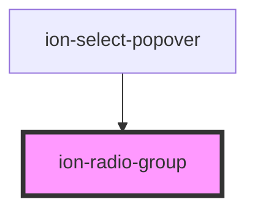

# ion-radio-group

A radio group is a group of [radio buttons](../radio). It allows
a user to select at most one radio button from a set. Checking one radio
button that belongs to a radio group unchecks any previous checked
radio button within the same group.


<!-- Auto Generated Below -->


## Usage

### Angular / javascript

```html
<ion-list>
  <ion-radio-group>
    <ion-list-header>
      Auto Manufacturers
    </ion-list-header>

    <ion-item>
      <ion-label>Cord</ion-label>
      <ion-radio value="cord"></ion-radio>
    </ion-item>

    <ion-item>
      <ion-label>Duesenberg</ion-label>
      <ion-radio value="duesenberg"></ion-radio>
    </ion-item>

    <ion-item>
      <ion-label>Hudson</ion-label>
      <ion-radio value="hudson"></ion-radio>
    </ion-item>

    <ion-item>
      <ion-label>Packard</ion-label>
      <ion-radio value="packard"></ion-radio>
    </ion-item>

    <ion-item>
      <ion-label>Studebaker</ion-label>
      <ion-radio value="studebaker"></ion-radio>
    </ion-item>
  </ion-radio-group>
</ion-list>
```


### React

```tsx
import React from 'react';
import { IonList, IonRadioGroup, IonListHeader, IonLabel, IonRadio, IonItem, IonContent } from '@ionic/react';

export const RadioGroupExample: React.FunctionComponent = () => (
  <IonContent>
    <IonList>
      <IonRadioGroup>
        <IonListHeader>Auto Manufacturers</IonListHeader>

        <IonItem>
          <IonLabel>Cord</IonLabel>
          <IonRadio value="cord" />
        </IonItem>

        <IonItem>
          <IonLabel>Duesenberg</IonLabel>
          <IonRadio value="duesenberg" />
        </IonItem>

        <IonItem>
          <IonLabel>Hudson</IonLabel>
          <IonRadio value="hudson" />
        </IonItem>

        <IonItem>
          <IonLabel>Packard</IonLabel>
          <IonRadio value="packard" />
        </IonItem>

        <IonItem>
          <IonLabel>Studebaker</IonLabel>
          <IonRadio value="studebaker" />
        </IonItem>
      </IonRadioGroup>
    </IonList>
  </IonContent>
);
```


### Vue

```html
<template>
  <ion-list>
    <ion-radio-group>
      <ion-list-header>
        Auto Manufacturers
      </ion-list-header>

      <ion-item>
        <ion-label>Cord</ion-label>
        <ion-radio value="cord"></ion-radio>
      </ion-item>

      <ion-item>
        <ion-label>Duesenberg</ion-label>
        <ion-radio value="duesenberg"></ion-radio>
      </ion-item>

      <ion-item>
        <ion-label>Hudson</ion-label>
        <ion-radio value="hudson"></ion-radio>
      </ion-item>

      <ion-item>
        <ion-label>Packard</ion-label>
        <ion-radio value="packard"></ion-radio>
      </ion-item>

      <ion-item>
        <ion-label>Studebaker</ion-label>
        <ion-radio value="studebaker"></ion-radio>
      </ion-item>
    </ion-radio-group>
  </ion-list>
</template>
```


## Properties

| Property              | Attribute               | Description                                                     | Type      | Default        |
| --------------------- | ----------------------- | --------------------------------------------------------------- | --------- | -------------- |
| `allowEmptySelection` | `allow-empty-selection` | If `true`, the radios can be deselected.                        | `boolean` | `false`        |
| `name`                | `name`                  | The name of the control, which is submitted with the form data. | `string`  | `this.inputId` |
| `value`               | `value`                 | the value of the radio group.                                   | `any`     | `undefined`    |


## Events

| Event       | Description                         | Type                                       |
| ----------- | ----------------------------------- | ------------------------------------------ |
| `ionChange` | Emitted when the value has changed. | `CustomEvent<RadioGroupChangeEventDetail>` |


## Dependencies

### Used by

 - ion-select-popover

### Graph


----------------------------------------------

*Built with [StencilJS](https://stenciljs.com/)*
