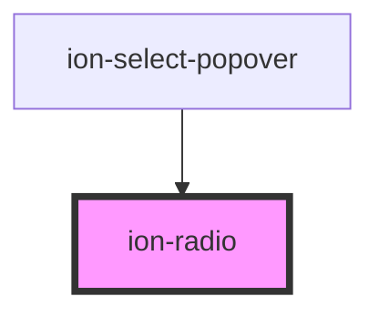

# ion-radio

Radios are generally used as a set of related options inside of a group, but they can also be used alone. Pressing on a radio will check it. They can also be checked programmatically by setting the `checked` property.

An `ion-radio-group` can be used to group a set of radios. When radios are inside of a [radio group](../radio-group), only one radio in the group will be checked at any time. Pressing a radio will check it and uncheck the previously selected radio, if there is one. If a radio is not in a group with another radio, then both radios will have the ability to be checked at the same time.


<!-- Auto Generated Below -->


## Usage

### Angular / javascript

```html
<ion-list>
  <ion-radio-group>
    <ion-list-header>
      <ion-label>Name</ion-label>
    </ion-list-header>

    <ion-item>
      <ion-label>Biff</ion-label>
      <ion-radio slot="start" value="biff" checked></ion-radio>
    </ion-item>

    <ion-item>
      <ion-label>Griff</ion-label>
      <ion-radio slot="start" value="griff"></ion-radio>
    </ion-item>

    <ion-item>
      <ion-label>Buford</ion-label>
      <ion-radio slot="start" value="buford"></ion-radio>
    </ion-item>
  </ion-radio-group>
</ion-list>
```


### React

```tsx
import React from 'react';
import { IonList, IonRadioGroup, IonListHeader, IonLabel, IonItem, IonRadio, IonContent } from '@ionic/react';

export const RadioExample: React.FunctionComponent = () => (
  <IonContent>
    <IonList>
      <IonRadioGroup>
        <IonListHeader>
          <IonLabel>Name</IonLabel>
        </IonListHeader>

        <IonItem>
          <IonLabel>Biff</IonLabel>
          <IonRadio slot="start" value="biff" checked />
        </IonItem>

        <IonItem>
          <IonLabel>Griff</IonLabel>
          <IonRadio slot="start" value="griff" />
        </IonItem>

        <IonItem>
          <IonLabel>Buford</IonLabel>
          <IonRadio slot="start" value="buford" />
        </IonItem>
      </IonRadioGroup>
    </IonList>
  </IonContent>
);
```


### Vue

```html
<template>
  <ion-list>
    <ion-radio-group>
      <ion-list-header>
        <ion-label>Name</ion-label>
      </ion-list-header>

      <ion-item>
        <ion-label>Biff</ion-label>
        <ion-radio slot="start" value="biff" checked></ion-radio>
      </ion-item>

      <ion-item>
        <ion-label>Griff</ion-label>
        <ion-radio slot="start" value="griff"></ion-radio>
      </ion-item>

      <ion-item>
        <ion-label>Buford</ion-label>
        <ion-radio slot="start" value="buford"></ion-radio>
      </ion-item>
    </ion-radio-group>
  </ion-list>
</template>
```


## Properties

| Property   | Attribute  | Description                                                                                                                                                                                                                                                            | Type                  | Default        |
| ---------- | ---------- | ---------------------------------------------------------------------------------------------------------------------------------------------------------------------------------------------------------------------------------------------------------------------- | --------------------- | -------------- |
| `checked`  | `checked`  | If `true`, the radio is selected.                                                                                                                                                                                                                                      | `boolean`             | `false`        |
| `color`    | `color`    | The color to use from your application's color palette. Default options are: `"primary"`, `"secondary"`, `"tertiary"`, `"success"`, `"warning"`, `"danger"`, `"light"`, `"medium"`, and `"dark"`. For more information on colors, see [theming](/docs/theming/basics). | `string \| undefined` | `undefined`    |
| `disabled` | `disabled` | If `true`, the user cannot interact with the radio.                                                                                                                                                                                                                    | `boolean`             | `false`        |
| `mode`     | `mode`     | The mode determines which platform styles to use.                                                                                                                                                                                                                      | `"ios" \| "md"`       | `undefined`    |
| `name`     | `name`     | The name of the control, which is submitted with the form data.                                                                                                                                                                                                        | `string`              | `this.inputId` |
| `value`    | `value`    | the value of the radio.                                                                                                                                                                                                                                                | `any`                 | `undefined`    |


## Events

| Event       | Description                                | Type                                  |
| ----------- | ------------------------------------------ | ------------------------------------- |
| `ionBlur`   | Emitted when the radio button loses focus. | `CustomEvent<void>`                   |
| `ionFocus`  | Emitted when the radio button has focus.   | `CustomEvent<void>`                   |
| `ionSelect` | Emitted when the radio button is selected. | `CustomEvent<RadioChangeEventDetail>` |


## CSS Custom Properties

| Name              | Description                |
| ----------------- | -------------------------- |
| `--color`         | Color of the radio         |
| `--color-checked` | Color of the checked radio |


## Dependencies

### Used by

 - ion-select-popover

### Graph


----------------------------------------------

*Built with [StencilJS](https://stenciljs.com/)*
