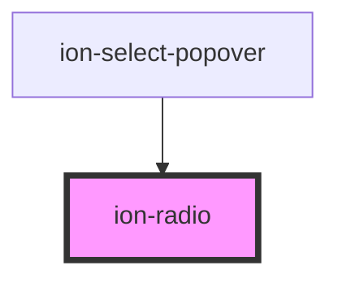

# ion-radio

Radios should be used inside of an [`ion-radio-group`](../radio-group). Pressing on a radio will check it. They can also be checked programmatically by setting the value property of the parent `ion-radio-group` to the value of the radio.

When radios are inside of a radio group, only one radio in the group will be checked at any time. Pressing a radio will check it and uncheck the previously selected radio, if there is one. If a radio is not in a group with another radio, then both radios will have the ability to be checked at the same time.


<!-- Auto Generated Below -->


## Usage

### Angular / javascript

```html
<ion-list>
  <ion-radio-group value="biff">
    <ion-list-header>
      <ion-label>Name</ion-label>
    </ion-list-header>

    <ion-item>
      <ion-label>Biff</ion-label>
      <ion-radio slot="start" value="biff"></ion-radio>
    </ion-item>

    <ion-item>
      <ion-label>Griff</ion-label>
      <ion-radio slot="start" value="griff"></ion-radio>
    </ion-item>

    <ion-item>
      <ion-label>Buford</ion-label>
      <ion-radio slot="start" value="buford"></ion-radio>
    </ion-item>
  </ion-radio-group>
</ion-list>
```


### React

```tsx
import React, { useState } from 'react';
import { IonContent, IonHeader, IonPage, IonTitle, IonToolbar, IonList, IonRadioGroup, IonListHeader, IonLabel, IonItem, IonRadio, IonItemDivider } from '@ionic/react';

export const RadioExamples: React.FC = () => {
  const [selected, setSelected] = useState<string>('biff');
  return (
    <IonPage>
      <IonHeader>
        <IonToolbar>
          <IonTitle>Radio Examples</IonTitle>
        </IonToolbar>
      </IonHeader>
      <IonContent>
        <IonList>
          <IonRadioGroup value={selected} onIonChange={e => setSelected(e.detail.value)}>
            <IonListHeader>
              <IonLabel>Name</IonLabel>
            </IonListHeader>

            <IonItem>
              <IonLabel>Biff</IonLabel>
              <IonRadio slot="start" value="biff" />
            </IonItem>

            <IonItem>
              <IonLabel>Griff</IonLabel>
              <IonRadio slot="start" value="griff" />
            </IonItem>

            <IonItem>
              <IonLabel>Buford</IonLabel>
              <IonRadio slot="start" value="buford" />
            </IonItem>
          </IonRadioGroup>
          <IonItemDivider>Your Selection</IonItemDivider>
          <IonItem>{selected ?? '(none selected'}</IonItem>
        </IonList>
      </IonContent>
    </IonPage>
  );
};
```


### Stencil

```tsx
import { Component, h } from '@stencil/core';

@Component({
  tag: 'radio-example',
  styleUrl: 'radio-example.css'
})
export class RadioExample {
  render() {
    return [
      <ion-list>
        <ion-radio-group value="biff">
          <ion-list-header>
            <ion-label>Name</ion-label>
          </ion-list-header>

          <ion-item>
            <ion-label>Biff</ion-label>
            <ion-radio slot="start" value="biff"></ion-radio>
          </ion-item>

          <ion-item>
            <ion-label>Griff</ion-label>
            <ion-radio slot="start" value="griff"></ion-radio>
          </ion-item>

          <ion-item>
            <ion-label>Buford</ion-label>
            <ion-radio slot="start" value="buford"></ion-radio>
          </ion-item>
        </ion-radio-group>
      </ion-list>
    ];
  }
}
```


### Vue

```html
<template>
  <ion-list>
    <ion-radio-group value="biff">
      <ion-list-header>
        <ion-label>Name</ion-label>
      </ion-list-header>

      <ion-item>
        <ion-label>Biff</ion-label>
        <ion-radio slot="start" value="biff"></ion-radio>
      </ion-item>

      <ion-item>
        <ion-label>Griff</ion-label>
        <ion-radio slot="start" value="griff"></ion-radio>
      </ion-item>

      <ion-item>
        <ion-label>Buford</ion-label>
        <ion-radio slot="start" value="buford"></ion-radio>
      </ion-item>
    </ion-radio-group>
  </ion-list>
</template>
```


## Properties

| Property   | Attribute  | Description                                                                                                                                                                                                                                                            | Type                  | Default        |
| ---------- | ---------- | ---------------------------------------------------------------------------------------------------------------------------------------------------------------------------------------------------------------------------------------------------------------------- | --------------------- | -------------- |
| `color`    | `color`    | The color to use from your application's color palette. Default options are: `"primary"`, `"secondary"`, `"tertiary"`, `"success"`, `"warning"`, `"danger"`, `"light"`, `"medium"`, and `"dark"`. For more information on colors, see [theming](/docs/theming/basics). | `string \| undefined` | `undefined`    |
| `disabled` | `disabled` | If `true`, the user cannot interact with the radio.                                                                                                                                                                                                                    | `boolean`             | `false`        |
| `mode`     | `mode`     | The mode determines which platform styles to use.                                                                                                                                                                                                                      | `"ios" \| "md"`       | `undefined`    |
| `name`     | `name`     | The name of the control, which is submitted with the form data.                                                                                                                                                                                                        | `string`              | `this.inputId` |
| `value`    | `value`    | the value of the radio.                                                                                                                                                                                                                                                | `any`                 | `undefined`    |


## Events

| Event      | Description                                | Type                |
| ---------- | ------------------------------------------ | ------------------- |
| `ionBlur`  | Emitted when the radio button loses focus. | `CustomEvent<void>` |
| `ionFocus` | Emitted when the radio button has focus.   | `CustomEvent<void>` |


## Shadow Parts

| Part          | Description                                              |
| ------------- | -------------------------------------------------------- |
| `"container"` | The container for the radio mark.                        |
| `"mark"`      | The checkmark or dot used to indicate the checked state. |


## CSS Custom Properties

| Name                    | Description                              |
| ----------------------- | ---------------------------------------- |
| `--border-radius`       | Border radius of the radio               |
| `--color`               | Color of the radio                       |
| `--color-checked`       | Color of the checked radio               |
| `--inner-border-radius` | Border radius of the inner checked radio |


## Dependencies

### Used by

 - ion-select-popover

### Graph


----------------------------------------------

*Built with [StencilJS](https://stenciljs.com/)*
