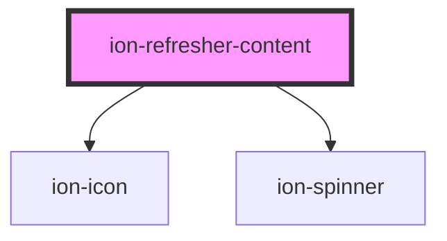

# ion-refresher-content

The refresher content contains the text, icon and spinner to display during a pull-to-refresh. Ionic provides the pulling icon and refreshing spinner based on the platform. However, the default icon, spinner, and text can be customized based on the state of the refresher.

<!-- Auto Generated Below -->

## Properties

| Property            | Attribute            | Description                                                                                                                                                                                                                                                                                                                                        | Type                                                                                              | Default     |
| ------------------- | -------------------- | -------------------------------------------------------------------------------------------------------------------------------------------------------------------------------------------------------------------------------------------------------------------------------------------------------------------------------------------------- | ------------------------------------------------------------------------------------------------- | ----------- |
| `pullingIcon`       | `pulling-icon`       | A static icon to display when you begin to pull down                                                                                                                                                                                                                                                                                               | `null \| string \| undefined`                                                                     | `undefined` |
| `pullingText`       | `pulling-text`       | The text you want to display when you begin to pull down. `pullingText` can accept either plaintext or HTML as a string. To display characters normally reserved for HTML, they must be escaped. For example `<Ionic>` would become `&lt;Ionic&gt;`  For more information: [Security Documentation](https://ionicframework.com/docs/faq/security)  | `string \| undefined`                                                                             | `undefined` |
| `refreshingSpinner` | `refreshing-spinner` | An animated SVG spinner that shows when refreshing begins                                                                                                                                                                                                                                                                                          | `"bubbles" \| "circles" \| "crescent" \| "dots" \| "lines" \| "lines-small" \| null \| undefined` | `undefined` |
| `refreshingText`    | `refreshing-text`    | The text you want to display when performing a refresh. `refreshingText` can accept either plaintext or HTML as a string. To display characters normally reserved for HTML, they must be escaped. For example `<Ionic>` would become `&lt;Ionic&gt;`  For more information: [Security Documentation](https://ionicframework.com/docs/faq/security) | `string \| undefined`                                                                             | `undefined` |

## Dependencies

### Depends on

- ion-icon
- [ion-spinner](../spinner)

### Graph

----------------------------------------------

*Built with [StencilJS](https://stenciljs.com/)*
