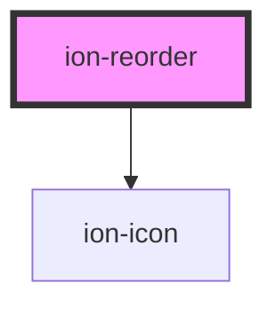

# ion-reorder

Reorder is a component that allows an item in a group of items to be dragged to change its order within that group. It must be used within an `ion-reorder-group` to provide a visual drag and drop interface.

`ion-reorder` is the anchor used to drag and drop the items inside of the `ion-reorder-group`. See the [Reorder Group](../reorder-group) for more information on how to complete the reorder operation.


<!-- Auto Generated Below -->


## Usage

### Angular / javascript

```html
<!-- Default reorder icon, end aligned items -->
<ion-item>
  <ion-label>
    Item 1
  </ion-label>
  <ion-reorder slot="end"></ion-reorder>
</ion-item>

<ion-item>
  <ion-label>
    Item 2
  </ion-label>
  <ion-reorder slot="end"></ion-reorder>
</ion-item>

<!-- Default reorder icon, start aligned items -->
<ion-item>
  <ion-reorder slot="start"></ion-reorder>
  <ion-label>
    Item 3
  </ion-label>
</ion-item>

<ion-item>
  <ion-reorder slot="start"></ion-reorder>
  <ion-label>
    Item 4
  </ion-label>
</ion-item>

<!-- Custom reorder icon end items -->
<ion-item>
  <ion-label>
    Item 5
  </ion-label>
  <ion-reorder slot="end">
    <ion-icon name="pizza"></ion-icon>
  </ion-reorder>
</ion-item>

<ion-item>
  <ion-label>
    Item 6
  </ion-label>
  <ion-reorder slot="end">
    <ion-icon name="pizza"></ion-icon>
  </ion-reorder>
</ion-item>

<!-- Items wrapped in a reorder, entire item can be dragged -->
<ion-reorder>
  <ion-item>
    <ion-label>
      Item 7
    </ion-label>
  </ion-item>
</ion-reorder>

<ion-reorder>
  <ion-item>
    <ion-label>
      Item 8
    </ion-label>
  </ion-item>
</ion-reorder>
```


### React

```tsx
import React from 'react';
import { IonIcon, IonItem, IonLabel, IonReorder, IonContent } from '@ionic/react';

export const ReorderExample: React.FunctionComponent = () => (
  <IonContent>
    {/*-- Default reorder icon, end aligned items --*/}
    <IonItem>
      <IonLabel>Item 1</IonLabel>
      <IonReorder slot="end" />
    </IonItem>

    <IonItem>
      <IonLabel>Item 2</IonLabel>
      <IonReorder slot="end" />
    </IonItem>

    {/*-- Default reorder icon, start aligned items --*/}
    <IonItem>
      <IonReorder slot="start" />
      <IonLabel>Item 3</IonLabel>
    </IonItem>

    <IonItem>
      <IonReorder slot="start" />
      <IonLabel>Item 4</IonLabel>
    </IonItem>

    {/*-- Custom reorder icon end items --*/}
    <IonItem>
      <IonLabel>Item 5</IonLabel>
      <IonReorder slot="end">
        <IonIcon name="pizza" />
      </IonReorder>
    </IonItem>

    <IonItem>
      <IonLabel>Item 6</IonLabel>
      <IonReorder slot="end">
        <IonIcon name="pizza" />
      </IonReorder>
    </IonItem>

    {/*-- Items wrapped in a reorder, entire item can be dragged --*/}
    <IonReorder>
      <IonItem>
        <IonLabel>Item 7</IonLabel>
      </IonItem>
    </IonReorder>

    <IonReorder>
      <IonItem>
        <IonLabel>Item 8</IonLabel>
      </IonItem>
    </IonReorder>
  </IonContent>
);
```


### Vue

```html
<template>
  <!-- Default reorder icon, end aligned items -->
  <ion-item>
    <ion-label>
      Item 1
    </ion-label>
    <ion-reorder slot="end"></ion-reorder>
  </ion-item>

  <ion-item>
    <ion-label>
      Item 2
    </ion-label>
    <ion-reorder slot="end"></ion-reorder>
  </ion-item>

  <!-- Default reorder icon, start aligned items -->
  <ion-item>
    <ion-reorder slot="start"></ion-reorder>
    <ion-label>
      Item 3
    </ion-label>
  </ion-item>

  <ion-item>
    <ion-reorder slot="start"></ion-reorder>
    <ion-label>
      Item 4
    </ion-label>
  </ion-item>

  <!-- Custom reorder icon end items -->
  <ion-item>
    <ion-label>
      Item 5
    </ion-label>
    <ion-reorder slot="end">
      <ion-icon name="pizza"></ion-icon>
    </ion-reorder>
  </ion-item>

  <ion-item>
    <ion-label>
      Item 6
    </ion-label>
    <ion-reorder slot="end">
      <ion-icon name="pizza"></ion-icon>
    </ion-reorder>
  </ion-item>

  <!-- Items wrapped in a reorder, entire item can be dragged -->
  <ion-reorder>
    <ion-item>
      <ion-label>
        Item 7
      </ion-label>
    </ion-item>
  </ion-reorder>

  <ion-reorder>
    <ion-item>
      <ion-label>
        Item 8
      </ion-label>
    </ion-item>
  </ion-reorder>
</template>
```


## Dependencies

### Depends on

- ion-icon

### Graph


----------------------------------------------

*Built with [StencilJS](https://stenciljs.com/)*
