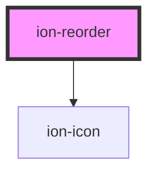

# ion-reorder

Reorder is a component that allows an item to be dragged to change its order. It must be used within an `ion-reorder-group` to provide a visual drag and drop interface.

`ion-reorder` is the anchor users will use to drag and drop items inside the `ion-reorder-group`.

```html
<ion-item>
  <ion-label>
    Item
  </ion-label>
  <ion-reorder slot="end"></ion-reorder>
</ion-item>
```

<!-- Auto Generated Below -->


## Dependencies

#### Depends on
 - ion-icon

#### Graph


----------------------------------------------

*Built with [StencilJS](https://stenciljs.com/)*
