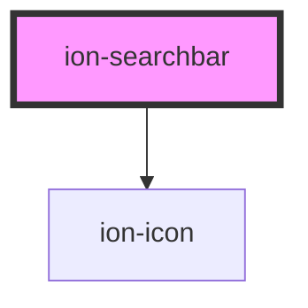

# ion-searchbar

Searchbars represent a text field that can be used to search through a collection. They can be displayed inside of a toolbar or the main content.

A Searchbar should be used instead of an input to search lists. A clear button is displayed upon entering input in the searchbar's text field. Clicking on the clear button will erase the text field and the input will remain focused. A cancel button can be enabled which will clear the input and lose the focus upon click.


<!-- Auto Generated Below -->


## Usage

### Angular

```html
<!-- Default Searchbar -->
<ion-searchbar></ion-searchbar>

<!-- Searchbar with cancel button always shown -->
<ion-searchbar showCancelButton="always"></ion-searchbar>

<!-- Searchbar with cancel button never shown -->
<ion-searchbar showCancelButton="never"></ion-searchbar>

<!-- Searchbar with cancel button shown on focus -->
<ion-searchbar showCancelButton="focus"></ion-searchbar>

<!-- Searchbar with danger color -->
<ion-searchbar color="danger"></ion-searchbar>

<!-- Searchbar with value -->
<ion-searchbar value="Ionic"></ion-searchbar>

<!-- Searchbar with telephone type -->
<ion-searchbar type="tel"></ion-searchbar>

<!-- Searchbar disabled -->
<ion-searchbar disabled="true"></ion-searchbar>

<!-- Searchbar with a cancel button and custom cancel button text -->
<ion-searchbar showCancelButton="focus" cancelButtonText="Custom Cancel"></ion-searchbar>

<!-- Searchbar with a custom debounce -->
<ion-searchbar debounce="500"></ion-searchbar>

<!-- Animated Searchbar -->
<ion-searchbar animated></ion-searchbar>

<!-- Searchbar with a placeholder -->
<ion-searchbar placeholder="Filter Schedules"></ion-searchbar>

<!-- Searchbar in a Toolbar -->
<ion-toolbar>
  <ion-searchbar></ion-searchbar>
</ion-toolbar>
```


### Javascript

```html
<!-- Default Searchbar -->
<ion-searchbar></ion-searchbar>

<!-- Searchbar with cancel button always shown -->
<ion-searchbar show-cancel-button="always"></ion-searchbar>

<!-- Searchbar with cancel button never shown -->
<ion-searchbar show-cancel-button="never"></ion-searchbar>

<!-- Searchbar with cancel button shown on focus -->
<ion-searchbar show-cancel-button="focus"></ion-searchbar>

<!-- Searchbar with danger color -->
<ion-searchbar color="danger"></ion-searchbar>

<!-- Searchbar with value -->
<ion-searchbar value="Ionic"></ion-searchbar>

<!-- Searchbar with telephone type -->
<ion-searchbar type="tel"></ion-searchbar>

<!-- Searchbar disabled -->
<ion-searchbar disabled="true"></ion-searchbar>

<!-- Searchbar with a cancel button and custom cancel button text -->
<ion-searchbar show-cancel-button="focus" cancel-button-text="Custom Cancel"></ion-searchbar>

<!-- Searchbar with a custom debounce -->
<ion-searchbar debounce="500"></ion-searchbar>

<!-- Animated Searchbar -->
<ion-searchbar animated></ion-searchbar>

<!-- Searchbar with a placeholder -->
<ion-searchbar placeholder="Filter Schedules"></ion-searchbar>

<!-- Searchbar in a Toolbar -->
<ion-toolbar>
  <ion-searchbar></ion-searchbar>
</ion-toolbar>
```


### React

```tsx
import React from 'react';
import { IonSearchbar, IonToolbar, IonContent } from '@ionic/react';

export const SearchbarExample: React.FunctionComponent = () => (
  <IonContent>
    {/*-- Default Searchbar --*/}
    <IonSearchbar></IonSearchbar>
    
    {/*-- Searchbar with cancel button always shown --*/}
    <IonSearchbar showCancelButton="always"></IonSearchbar>
    
    {/*-- Searchbar with cancel button never shown --*/}
    <IonSearchbar showCancelButton="never"></IonSearchbar>
    
    {/*-- Searchbar with cancel button shown on focus --*/}
    <IonSearchbar showCancelButton="focus"></IonSearchbar>

    {/*-- Searchbar with danger color --*/}
    <IonSearchbar color="danger"></IonSearchbar>

    {/*-- Searchbar with value --*/}
    <IonSearchbar value="Ionic"></IonSearchbar>

    {/*-- Searchbar with telephone type --*/}
    <IonSearchbar type="tel"></IonSearchbar>

    {/*-- Searchbar disabled  --*/}
    <IonSearchbar disabled={true}></IonSearchbar>

    {/*-- Searchbar with a cancel button and custom cancel button text --*/}
    <IonSearchbar showCancelButton="focus" cancelButtonText="Custom Cancel"></IonSearchbar>

    {/*-- Searchbar with a custom debounce --*/}
    <IonSearchbar debounce={500}></IonSearchbar>

    {/*-- Animated Searchbar --*/}
    <IonSearchbar animated></IonSearchbar>

    {/*-- Searchbar with a placeholder --*/}
    <IonSearchbar placeholder="Filter Schedules"></IonSearchbar>

    {/*-- Searchbar in a Toolbar --*/}
    <IonToolbar>
      <IonSearchbar></IonSearchbar>
    </IonToolbar>
  </IonContent>
);
```


### Vue

```html
<template>
  <!-- Default Searchbar -->
  <ion-searchbar></ion-searchbar>
  
  <!-- Searchbar with cancel button always shown -->
  <ion-searchbar showCancelButton="always"></ion-searchbar>
  
  <!-- Searchbar with cancel button never shown -->
  <ion-searchbar showCancelButton="never"></ion-searchbar>
  
  <!-- Searchbar with cancel button shown on focus -->
  <ion-searchbar showCancelButton="focus"></ion-searchbar>

  <!-- Searchbar with danger color -->
  <ion-searchbar color="danger"></ion-searchbar>

  <!-- Searchbar with value -->
  <ion-searchbar value="Ionic"></ion-searchbar>

  <!-- Searchbar with telephone type -->
  <ion-searchbar type="tel"></ion-searchbar>

  <!-- Searchbar disabled -->
  <ion-searchbar disabled="true"></ion-searchbar>

  <!-- Searchbar with a cancel button and custom cancel button text -->
  <ion-searchbar showCancelButton="focus" cancelButtonText="Custom Cancel"></ion-searchbar>

  <!-- Searchbar with a custom debounce -->
  <ion-searchbar debounce="500"></ion-searchbar>

  <!-- Animated Searchbar -->
  <ion-searchbar animated></ion-searchbar>

  <!-- Searchbar with a placeholder -->
  <ion-searchbar placeholder="Filter Schedules"></ion-searchbar>

  <!-- Searchbar in a Toolbar -->
  <ion-toolbar>
    <ion-searchbar></ion-searchbar>
  </ion-toolbar>
</template>
```


## Properties

| Property           | Attribute            | Description                                                                                                                                                                                                                                                                                                          | Type                                                                        | Default           |
| ------------------ | -------------------- | -------------------------------------------------------------------------------------------------------------------------------------------------------------------------------------------------------------------------------------------------------------------------------------------------------------------- | --------------------------------------------------------------------------- | ----------------- |
| `animated`         | `animated`           | If `true`, enable searchbar animation.                                                                                                                                                                                                                                                                               | `boolean`                                                                   | `false`           |
| `autocomplete`     | `autocomplete`       | Set the input's autocomplete property.                                                                                                                                                                                                                                                                               | `"off" \| "on"`                                                             | `'off'`           |
| `autocorrect`      | `autocorrect`        | Set the input's autocorrect property.                                                                                                                                                                                                                                                                                | `"off" \| "on"`                                                             | `'off'`           |
| `cancelButtonIcon` | `cancel-button-icon` | Set the cancel button icon. Only applies to `md` mode.                                                                                                                                                                                                                                                               | `string`                                                                    | `'md-arrow-back'` |
| `cancelButtonText` | `cancel-button-text` | Set the the cancel button text. Only applies to `ios` mode.                                                                                                                                                                                                                                                          | `string`                                                                    | `'Cancel'`        |
| `clearIcon`        | `clear-icon`         | Set the clear icon. Defaults to `"close-circle"` for `ios` and `"close"` for `md`.                                                                                                                                                                                                                                   | `string \| undefined`                                                       | `undefined`       |
| `color`            | `color`              | The color to use from your application's color palette. Default options are: `"primary"`, `"secondary"`, `"tertiary"`, `"success"`, `"warning"`, `"danger"`, `"light"`, `"medium"`, and `"dark"`. For more information on colors, see [theming](/docs/theming/basics).                                               | `string \| undefined`                                                       | `undefined`       |
| `debounce`         | `debounce`           | Set the amount of time, in milliseconds, to wait to trigger the `ionChange` event after each keystroke.                                                                                                                                                                                                              | `number`                                                                    | `250`             |
| `disabled`         | `disabled`           | If `true`, the user cannot interact with the input.                                                                                                                                                                                                                                                                  | `boolean`                                                                   | `false`           |
| `mode`             | `mode`               | The mode determines which platform styles to use.                                                                                                                                                                                                                                                                    | `"ios" \| "md"`                                                             | `undefined`       |
| `placeholder`      | `placeholder`        | Set the input's placeholder. `placeholder` can accept either plaintext or HTML as a string. To display characters normally reserved for HTML, they must be escaped. For example `<Ionic>` would become `&lt;Ionic&gt;`  For more information: [Security Documentation](https://ionicframework.com/docs/faq/security) | `string`                                                                    | `'Search'`        |
| `searchIcon`       | `search-icon`        | The icon to use as the search icon.                                                                                                                                                                                                                                                                                  | `string`                                                                    | `'search'`        |
| `showCancelButton` | `show-cancel-button` | Sets the behavior for the cancel button. Defaults to `"never"`. Setting to `"focus"` shows the cancel button on focus. Setting to `"never"` hides the cancel button. Setting to `"always"` shows the cancel button regardless of focus state.                                                                        | `boolean \| string`                                                         | `'never'`         |
| `spellcheck`       | `spellcheck`         | If `true`, enable spellcheck on the input.                                                                                                                                                                                                                                                                           | `boolean`                                                                   | `false`           |
| `type`             | `type`               | Set the type of the input.                                                                                                                                                                                                                                                                                           | `"email" \| "number" \| "password" \| "search" \| "tel" \| "text" \| "url"` | `'search'`        |
| `value`            | `value`              | the value of the searchbar.                                                                                                                                                                                                                                                                                          | `null \| string \| undefined`                                               | `''`              |


## Events

| Event       | Description                                     | Type                                      |
| ----------- | ----------------------------------------------- | ----------------------------------------- |
| `ionBlur`   | Emitted when the input loses focus.             | `CustomEvent<void>`                       |
| `ionCancel` | Emitted when the cancel button is clicked.      | `CustomEvent<void>`                       |
| `ionChange` | Emitted when the value has changed.             | `CustomEvent<SearchbarChangeEventDetail>` |
| `ionClear`  | Emitted when the clear input button is clicked. | `CustomEvent<void>`                       |
| `ionFocus`  | Emitted when the input has focus.               | `CustomEvent<void>`                       |
| `ionInput`  | Emitted when a keyboard input ocurred.          | `CustomEvent<KeyboardEvent>`              |


## Methods

### `getInputElement() => Promise<HTMLInputElement>`

Returns the native `<input>` element used under the hood.

#### Returns

Type: `Promise<HTMLInputElement>`


### `setFocus() => Promise<void>`

Sets focus on the specified `ion-searchbar`. Use this method instead of the global
`input.focus()`.

#### Returns

Type: `Promise<void>`


## CSS Custom Properties

| Name                        | Description                              |
| --------------------------- | ---------------------------------------- |
| `--background`              | Background of the searchbar              |
| `--cancel-button-color`     | Color of the searchbar cancel button     |
| `--clear-button-color`      | Color of the searchbar clear button      |
| `--color`                   | Color of the searchbar text              |
| `--icon-color`              | Color of the searchbar icon              |
| `--placeholder-color`       | Color of the searchbar placeholder       |
| `--placeholder-font-style`  | Font style of the searchbar placeholder  |
| `--placeholder-font-weight` | Font weight of the searchbar placeholder |
| `--placeholder-opacity`     | Opacity of the searchbar placeholder     |


## Dependencies

### Depends on

- ion-icon

### Graph


----------------------------------------------

*Built with [StencilJS](https://stenciljs.com/)*
