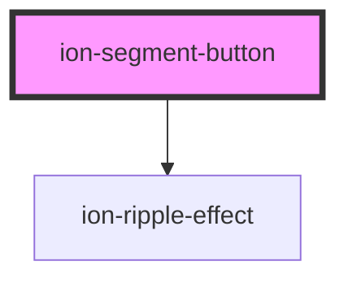

# ion-segment-button

Segment buttons are groups of related buttons inside of a [Segment](../segment). They are displayed in a horizontal row. A segment button can be checked by default by setting the `value` of the segment to the `value` of the segment button. Only one segment button can be selected at a time.


<!-- Auto Generated Below -->


## Usage

### Angular

```html
<!-- Segment buttons with text and click listener -->
<ion-segment (ionChange)="segmentChanged($event)">
  <ion-segment-button>
    <ion-label>Friends</ion-label>
  </ion-segment-button>
  <ion-segment-button>
    <ion-label>Enemies</ion-label>
  </ion-segment-button>
</ion-segment>

<!-- Segment buttons with the first checked and the last disabled -->
<ion-segment value="paid">
  <ion-segment-button value="paid">
    <ion-label>Paid</ion-label>
  </ion-segment-button>
  <ion-segment-button value="free">
    <ion-label>Free</ion-label>
  </ion-segment-button>
  <ion-segment-button disabled value="top">
    <ion-label>Top</ion-label>
  </ion-segment-button>
</ion-segment>

<!-- Segment buttons with values and icons -->
<ion-segment>
  <ion-segment-button value="camera">
    <ion-icon name="camera"></ion-icon>
  </ion-segment-button>
  <ion-segment-button value="bookmark">
    <ion-icon name="bookmark"></ion-icon>
  </ion-segment-button>
</ion-segment>

<!-- Segment with a value that checks the last button -->
<ion-segment value="shared">
  <ion-segment-button value="bookmarks">
    <ion-label>Bookmarks</ion-label>
  </ion-segment-button>
  <ion-segment-button value="reading">
    <ion-label>Reading List</ion-label>
  </ion-segment-button>
  <ion-segment-button value="shared">
    <ion-label>Shared Links</ion-label>
  </ion-segment-button>
</ion-segment>

<!-- Label only -->
<ion-segment value="1">
  <ion-segment-button value="1">
    <ion-label>Item One</ion-label>
  </ion-segment-button>
  <ion-segment-button value="2">
    <ion-label>Item Two</ion-label>
  </ion-segment-button>
  <ion-segment-button value="3">
    <ion-label>Item Three</ion-label>
  </ion-segment-button>
</ion-segment>

<!-- Icon only -->
<ion-segment value="heart">
  <ion-segment-button value="call">
    <ion-icon name="call"></ion-icon>
  </ion-segment-button>
  <ion-segment-button value="heart">
    <ion-icon name="heart"></ion-icon>
  </ion-segment-button>
  <ion-segment-button value="pin">
    <ion-icon name="pin"></ion-icon>
  </ion-segment-button>
</ion-segment>

<!-- Icon top -->
<ion-segment value="2">
  <ion-segment-button value="1">
    <ion-label>Item One</ion-label>
    <ion-icon name="call"></ion-icon>
  </ion-segment-button>
  <ion-segment-button value="2">
    <ion-label>Item Two</ion-label>
    <ion-icon name="heart"></ion-icon>
  </ion-segment-button>
  <ion-segment-button value="3">
    <ion-label>Item Three</ion-label>
    <ion-icon name="pin"></ion-icon>
  </ion-segment-button>
</ion-segment>

<!-- Icon bottom -->
<ion-segment value="1">
  <ion-segment-button value="1" layout="icon-bottom">
    <ion-icon name="call"></ion-icon>
    <ion-label>Item One</ion-label>
  </ion-segment-button>
  <ion-segment-button value="2" layout="icon-bottom">
    <ion-icon name="heart"></ion-icon>
    <ion-label>Item Two</ion-label>
  </ion-segment-button>
  <ion-segment-button value="3" layout="icon-bottom">
    <ion-icon name="pin"></ion-icon>
    <ion-label>Item Three</ion-label>
  </ion-segment-button>
</ion-segment>

<!-- Icon start -->
<ion-segment value="1">
  <ion-segment-button value="1" layout="icon-start">
    <ion-label>Item One</ion-label>
    <ion-icon name="call"></ion-icon>
  </ion-segment-button>
  <ion-segment-button value="2" layout="icon-start">
    <ion-label>Item Two</ion-label>
    <ion-icon name="heart"></ion-icon>
  </ion-segment-button>
  <ion-segment-button value="3" layout="icon-start">
    <ion-label>Item Three</ion-label>
    <ion-icon name="pin"></ion-icon>
  </ion-segment-button>
</ion-segment>

<!-- Icon end -->
<ion-segment value="1">
  <ion-segment-button value="1" layout="icon-end">
    <ion-icon name="call"></ion-icon>
    <ion-label>Item One</ion-label>
  </ion-segment-button>
  <ion-segment-button value="2" disabled layout="icon-end">
    <ion-icon name="heart"></ion-icon>
    <ion-label>Item Two</ion-label>
  </ion-segment-button>
  <ion-segment-button value="3" layout="icon-end">
    <ion-icon name="pin"></ion-icon>
    <ion-label>Item Three</ion-label>
  </ion-segment-button>
</ion-segment>
```

```typescript
import { Component } from '@angular/core';

@Component({
  selector: 'segment-button-example',
  templateUrl: 'segment-button-example.html',
  styleUrls: ['./segment-button-example.css'],
})
export class SegmentButtonExample {
  segmentChanged(ev: any) {
    console.log('Segment changed', ev);
  }
}
```


### Javascript

```html
<!-- Segment buttons with text -->
<ion-segment>
  <ion-segment-button>
    <ion-label>Friends</ion-label>
  </ion-segment-button>
  <ion-segment-button>
    <ion-label>Enemies</ion-label>
  </ion-segment-button>
</ion-segment>

<!-- Segment buttons with the first checked and the last disabled -->
<ion-segment value="paid">
  <ion-segment-button value="paid">
    <ion-label>Paid</ion-label>
  </ion-segment-button>
  <ion-segment-button value="free">
    <ion-label>Free</ion-label>
  </ion-segment-button>
  <ion-segment-button disabled value="top">
    <ion-label>Top</ion-label>
  </ion-segment-button>
</ion-segment>

<!-- Segment buttons with values and icons -->
<ion-segment>
  <ion-segment-button value="camera">
    <ion-icon name="camera"></ion-icon>
  </ion-segment-button>
  <ion-segment-button value="bookmark">
    <ion-icon name="bookmark"></ion-icon>
  </ion-segment-button>
</ion-segment>

<!-- Segment with a value that checks the last button -->
<ion-segment value="shared">
  <ion-segment-button value="bookmarks">
    <ion-label>Bookmarks</ion-label>
  </ion-segment-button>
  <ion-segment-button value="reading">
    <ion-label>Reading List</ion-label>
  </ion-segment-button>
  <ion-segment-button value="shared">
    <ion-label>Shared Links</ion-label>
  </ion-segment-button>
</ion-segment>

<!-- Label only -->
<ion-segment value="1">
  <ion-segment-button value="1">
    <ion-label>Item One</ion-label>
  </ion-segment-button>
  <ion-segment-button value="2">
    <ion-label>Item Two</ion-label>
  </ion-segment-button>
  <ion-segment-button value="3">
    <ion-label>Item Three</ion-label>
  </ion-segment-button>
</ion-segment>

<!-- Icon only -->
<ion-segment value="heart">
  <ion-segment-button value="call">
    <ion-icon name="call"></ion-icon>
  </ion-segment-button>
  <ion-segment-button value="heart">
    <ion-icon name="heart"></ion-icon>
  </ion-segment-button>
  <ion-segment-button value="pin">
    <ion-icon name="pin"></ion-icon>
  </ion-segment-button>
</ion-segment>

<!-- Icon top -->
<ion-segment value="2">
  <ion-segment-button value="1">
    <ion-label>Item One</ion-label>
    <ion-icon name="call"></ion-icon>
  </ion-segment-button>
  <ion-segment-button value="2">
    <ion-label>Item Two</ion-label>
    <ion-icon name="heart"></ion-icon>
  </ion-segment-button>
  <ion-segment-button value="3">
    <ion-label>Item Three</ion-label>
    <ion-icon name="pin"></ion-icon>
  </ion-segment-button>
</ion-segment>

<!-- Icon bottom -->
<ion-segment value="1">
  <ion-segment-button value="1" layout="icon-bottom">
    <ion-icon name="call"></ion-icon>
    <ion-label>Item One</ion-label>
  </ion-segment-button>
  <ion-segment-button value="2" layout="icon-bottom">
    <ion-icon name="heart"></ion-icon>
    <ion-label>Item Two</ion-label>
  </ion-segment-button>
  <ion-segment-button value="3" layout="icon-bottom">
    <ion-icon name="pin"></ion-icon>
    <ion-label>Item Three</ion-label>
  </ion-segment-button>
</ion-segment>

<!-- Icon start -->
<ion-segment value="1">
  <ion-segment-button value="1" layout="icon-start">
    <ion-label>Item One</ion-label>
    <ion-icon name="call"></ion-icon>
  </ion-segment-button>
  <ion-segment-button value="2" layout="icon-start">
    <ion-label>Item Two</ion-label>
    <ion-icon name="heart"></ion-icon>
  </ion-segment-button>
  <ion-segment-button value="3" layout="icon-start">
    <ion-label>Item Three</ion-label>
    <ion-icon name="pin"></ion-icon>
  </ion-segment-button>
</ion-segment>

<!-- Icon end -->
<ion-segment value="1">
  <ion-segment-button value="1" layout="icon-end">
    <ion-icon name="call"></ion-icon>
    <ion-label>Item One</ion-label>
  </ion-segment-button>
  <ion-segment-button value="2" disabled layout="icon-end">
    <ion-icon name="heart"></ion-icon>
    <ion-label>Item Two</ion-label>
  </ion-segment-button>
  <ion-segment-button value="3" layout="icon-end">
    <ion-icon name="pin"></ion-icon>
    <ion-label>Item Three</ion-label>
  </ion-segment-button>
</ion-segment>
```

```javascript
// Listen for ionChange on segment
const segment = document.querySelector('ion-segment');
segment.addEventListener('ionChange', (ev) => {
  console.log('Segment changed', ev);
})
```


### React

```tsx
import React from 'react';
import { IonContent, IonHeader, IonPage, IonTitle, IonToolbar, IonSegment, IonSegmentButton, IonLabel, IonIcon } from '@ionic/react';
import { call, camera, bookmark, heart, pin } from 'ionicons/icons';

export const SegmentButtonExamples: React.FC = () => {
  return (
    <IonPage>
      <IonHeader>
        <IonToolbar>
          <IonTitle>SegmentButton</IonTitle>
        </IonToolbar>
      </IonHeader>
      <IonContent>
        {/*-- Segment buttons with text and click listener --*/}
        <IonSegment onIonChange={(e) => console.log(`${e.detail.value} segment selected`)}>
          <IonSegmentButton value="Friends">
            <IonLabel>Friends</IonLabel>
          </IonSegmentButton>
          <IonSegmentButton value="Enemies">
            <IonLabel>Enemies</IonLabel>
          </IonSegmentButton>
        </IonSegment>

        {/*-- Segment buttons with the first checked and the last disabled --*/}
        <IonSegment value="paid">
          <IonSegmentButton value="paid">
            <IonLabel>Paid</IonLabel>
          </IonSegmentButton>
          <IonSegmentButton value="free">
            <IonLabel>Free</IonLabel>
          </IonSegmentButton>
          <IonSegmentButton disabled value="top">
            <IonLabel>Top</IonLabel>
          </IonSegmentButton>
        </IonSegment>

        {/*-- Segment buttons with values and icons --*/}
        <IonSegment>
          <IonSegmentButton value="camera">
            <IonIcon icon={camera} />
          </IonSegmentButton>
          <IonSegmentButton value="bookmark">
            <IonIcon icon={bookmark} />
          </IonSegmentButton>
        </IonSegment>

        {/*-- Segment with a value that checks the last button --*/}
        <IonSegment value="shared">
          <IonSegmentButton value="bookmarks">
            <IonLabel>Bookmarks</IonLabel>
          </IonSegmentButton>
          <IonSegmentButton value="reading">
            <IonLabel>Reading List</IonLabel>
          </IonSegmentButton>
          <IonSegmentButton value="shared">
            <IonLabel>Shared Links</IonLabel>
          </IonSegmentButton>
        </IonSegment>

        {/*-- Label only --*/}
        <IonSegment value="1">
          <IonSegmentButton value="1">
            <IonLabel>Item One</IonLabel>
          </IonSegmentButton>
          <IonSegmentButton value="2">
            <IonLabel>Item Two</IonLabel>
          </IonSegmentButton>
          <IonSegmentButton value="3">
            <IonLabel>Item Three</IonLabel>
          </IonSegmentButton>
        </IonSegment>

        {/*-- Icon only --*/}
        <IonSegment value="heart">
          <IonSegmentButton value="call">
            <IonIcon icon={call} />
          </IonSegmentButton>
          <IonSegmentButton value="heart">
            <IonIcon icon={heart} />
          </IonSegmentButton>
          <IonSegmentButton value="pin">
            <IonIcon icon={pin} />
          </IonSegmentButton>
        </IonSegment>

        {/*-- Icon top --*/}
        <IonSegment value="2">
          <IonSegmentButton value="1">
            <IonLabel>Item One</IonLabel>
            <IonIcon icon={call} />
          </IonSegmentButton>
          <IonSegmentButton value="2">
            <IonLabel>Item Two</IonLabel>
            <IonIcon icon={heart} />
          </IonSegmentButton>
          <IonSegmentButton value="3">
            <IonLabel>Item Three</IonLabel>
            <IonIcon icon={pin} />
          </IonSegmentButton>
        </IonSegment>

        {/*-- Icon bottom --*/}
        <IonSegment value="1">
          <IonSegmentButton value="1" layout="icon-bottom">
            <IonIcon icon={call} />
            <IonLabel>Item One</IonLabel>
          </IonSegmentButton>
          <IonSegmentButton value="2" layout="icon-bottom">
            <IonIcon icon={heart} />
            <IonLabel>Item Two</IonLabel>
          </IonSegmentButton>
          <IonSegmentButton value="3" layout="icon-bottom">
            <IonIcon icon={pin} />
            <IonLabel>Item Three</IonLabel>
          </IonSegmentButton>
        </IonSegment>

        {/*-- Icon start --*/}
        <IonSegment value="1">
          <IonSegmentButton value="1" layout="icon-start">
            <IonLabel>Item One</IonLabel>
            <IonIcon icon={call} />
          </IonSegmentButton>
          <IonSegmentButton value="2" layout="icon-start">
            <IonLabel>Item Two</IonLabel>
            <IonIcon icon={heart} />
          </IonSegmentButton>
          <IonSegmentButton value="3" layout="icon-start">
            <IonLabel>Item Three</IonLabel>
            <IonIcon icon={pin} />
          </IonSegmentButton>
        </IonSegment>

        {/*-- Icon end --*/}
        <IonSegment value="1">
          <IonSegmentButton value="1" layout="icon-end">
            <IonIcon icon={call} />
            <IonLabel>Item One</IonLabel>
          </IonSegmentButton>
          <IonSegmentButton value="2" disabled layout="icon-end">
            <IonIcon icon={heart} />
            <IonLabel>Item Two</IonLabel>
          </IonSegmentButton>
          <IonSegmentButton value="3" layout="icon-end">
            <IonIcon icon={pin} />
            <IonLabel>Item Three</IonLabel>
          </IonSegmentButton>
        </IonSegment>
      </IonContent>
    </IonPage>
  );
};
```


### Stencil

```tsx
import { Component, h } from '@stencil/core';

@Component({
  tag: 'segment-button-example',
  styleUrl: 'segment-button-example.css'
})
export class SegmentButtonExample {
  segmentChanged(ev: any) {
    console.log('Segment changed', ev);
  }

  render() {
    return [
      // Segment buttons with text and click listener
      <ion-segment onIonChange={(ev) => this.segmentChanged(ev)}>
        <ion-segment-button>
          <ion-label>Friends</ion-label>
        </ion-segment-button>
        <ion-segment-button>
          <ion-label>Enemies</ion-label>
        </ion-segment-button>
      </ion-segment>,

      // Segment buttons with the first checked and the last disabled
      <ion-segment value="paid">
        <ion-segment-button value="paid">
          <ion-label>Paid</ion-label>
        </ion-segment-button>
        <ion-segment-button value="free">
          <ion-label>Free</ion-label>
        </ion-segment-button>
        <ion-segment-button disabled value="top">
          <ion-label>Top</ion-label>
        </ion-segment-button>
      </ion-segment>,

      // Segment buttons with values and icons
      <ion-segment>
        <ion-segment-button value="camera">
          <ion-icon name="camera"></ion-icon>
        </ion-segment-button>
        <ion-segment-button value="bookmark">
          <ion-icon name="bookmark"></ion-icon>
        </ion-segment-button>
      </ion-segment>,

      // Segment with a value that checks the last button
      <ion-segment value="shared">
        <ion-segment-button value="bookmarks">
          <ion-label>Bookmarks</ion-label>
        </ion-segment-button>
        <ion-segment-button value="reading">
          <ion-label>Reading List</ion-label>
        </ion-segment-button>
        <ion-segment-button value="shared">
          <ion-label>Shared Links</ion-label>
        </ion-segment-button>
      </ion-segment>,

      // Label only
      <ion-segment value="1">
        <ion-segment-button value="1">
          <ion-label>Item One</ion-label>
        </ion-segment-button>
        <ion-segment-button value="2">
          <ion-label>Item Two</ion-label>
        </ion-segment-button>
        <ion-segment-button value="3">
          <ion-label>Item Three</ion-label>
        </ion-segment-button>
      </ion-segment>,

      // Icon only
      <ion-segment value="heart">
        <ion-segment-button value="call">
          <ion-icon name="call"></ion-icon>
        </ion-segment-button>
        <ion-segment-button value="heart">
          <ion-icon name="heart"></ion-icon>
        </ion-segment-button>
        <ion-segment-button value="pin">
          <ion-icon name="pin"></ion-icon>
        </ion-segment-button>
      </ion-segment>,

      // Icon top
      <ion-segment value="2">
        <ion-segment-button value="1">
          <ion-label>Item One</ion-label>
          <ion-icon name="call"></ion-icon>
        </ion-segment-button>
        <ion-segment-button value="2">
          <ion-label>Item Two</ion-label>
          <ion-icon name="heart"></ion-icon>
        </ion-segment-button>
        <ion-segment-button value="3">
          <ion-label>Item Three</ion-label>
          <ion-icon name="pin"></ion-icon>
        </ion-segment-button>
      </ion-segment>,

      // Icon bottom
      <ion-segment value="1">
        <ion-segment-button value="1" layout="icon-bottom">
          <ion-icon name="call"></ion-icon>
          <ion-label>Item One</ion-label>
        </ion-segment-button>
        <ion-segment-button value="2" layout="icon-bottom">
          <ion-icon name="heart"></ion-icon>
          <ion-label>Item Two</ion-label>
        </ion-segment-button>
        <ion-segment-button value="3" layout="icon-bottom">
          <ion-icon name="pin"></ion-icon>
          <ion-label>Item Three</ion-label>
        </ion-segment-button>
      </ion-segment>,

      // Icon start
      <ion-segment value="1">
        <ion-segment-button value="1" layout="icon-start">
          <ion-label>Item One</ion-label>
          <ion-icon name="call"></ion-icon>
        </ion-segment-button>
        <ion-segment-button value="2" layout="icon-start">
          <ion-label>Item Two</ion-label>
          <ion-icon name="heart"></ion-icon>
        </ion-segment-button>
        <ion-segment-button value="3" layout="icon-start">
          <ion-label>Item Three</ion-label>
          <ion-icon name="pin"></ion-icon>
        </ion-segment-button>
      </ion-segment>,

      // Icon end
      <ion-segment value="1">
        <ion-segment-button value="1" layout="icon-end">
          <ion-icon name="call"></ion-icon>
          <ion-label>Item One</ion-label>
        </ion-segment-button>
        <ion-segment-button value="2" disabled layout="icon-end">
          <ion-icon name="heart"></ion-icon>
          <ion-label>Item Two</ion-label>
        </ion-segment-button>
        <ion-segment-button value="3" layout="icon-end">
          <ion-icon name="pin"></ion-icon>
          <ion-label>Item Three</ion-label>
        </ion-segment-button>
      </ion-segment>
    ];
  }
}
```


### Vue

```html
<template>
  <!-- Segment buttons with text and click listener -->
  <ion-segment @ionChange="segmentChanged($event)">
    <ion-segment-button>
      <ion-label>Friends</ion-label>
    </ion-segment-button>
    <ion-segment-button>
      <ion-label>Enemies</ion-label>
    </ion-segment-button>
  </ion-segment>

  <!-- Segment buttons with the first checked and the last disabled -->
  <ion-segment value="paid">
    <ion-segment-button value="paid">
      <ion-label>Paid</ion-label>
    </ion-segment-button>
    <ion-segment-button value="free">
      <ion-label>Free</ion-label>
    </ion-segment-button>
    <ion-segment-button disabled value="top">
      <ion-label>Top</ion-label>
    </ion-segment-button>
  </ion-segment>

  <!-- Segment buttons with values and icons -->
  <ion-segment>
    <ion-segment-button value="camera">
      <ion-icon :icon="camera"></ion-icon>
    </ion-segment-button>
    <ion-segment-button value="bookmark">
      <ion-icon :icon="bookmark"></ion-icon>
    </ion-segment-button>
  </ion-segment>

  <!-- Segment with a value that checks the last button -->
  <ion-segment value="shared">
    <ion-segment-button value="bookmarks">
      <ion-label>Bookmarks</ion-label>
    </ion-segment-button>
    <ion-segment-button value="reading">
      <ion-label>Reading List</ion-label>
    </ion-segment-button>
    <ion-segment-button value="shared">
      <ion-label>Shared Links</ion-label>
    </ion-segment-button>
  </ion-segment>
  
  <!-- Label only -->
  <ion-segment value="1">
    <ion-segment-button value="1">
      <ion-label>Item One</ion-label>
    </ion-segment-button>
    <ion-segment-button value="2">
      <ion-label>Item Two</ion-label>
    </ion-segment-button>
    <ion-segment-button value="3">
      <ion-label>Item Three</ion-label>
    </ion-segment-button>
  </ion-segment>
  
  <!-- Icon only -->
  <ion-segment value="heart">
    <ion-segment-button value="call">
      <ion-icon :icon="call"></ion-icon>
    </ion-segment-button>
    <ion-segment-button value="heart">
      <ion-icon :icon="heart"></ion-icon>
    </ion-segment-button>
    <ion-segment-button value="pin">
      <ion-icon :icon="pin"></ion-icon>
    </ion-segment-button>
  </ion-segment>
  
  <!-- Icon top -->
  <ion-segment value="2">
    <ion-segment-button value="1">
      <ion-label>Item One</ion-label>
      <ion-icon :icon="call"></ion-icon>
    </ion-segment-button>
    <ion-segment-button value="2">
      <ion-label>Item Two</ion-label>
      <ion-icon :icon="heart"></ion-icon>
    </ion-segment-button>
    <ion-segment-button value="3">
      <ion-label>Item Three</ion-label>
      <ion-icon :icon="pin"></ion-icon>
    </ion-segment-button>
  </ion-segment>
  
  <!-- Icon bottom -->
  <ion-segment value="1">
    <ion-segment-button value="1" layout="icon-bottom">
      <ion-icon :icon="call"></ion-icon>
      <ion-label>Item One</ion-label>
    </ion-segment-button>
    <ion-segment-button value="2" layout="icon-bottom">
      <ion-icon :icon="heart"></ion-icon>
      <ion-label>Item Two</ion-label>
    </ion-segment-button>
    <ion-segment-button value="3" layout="icon-bottom">
      <ion-icon :icon="pin"></ion-icon>
      <ion-label>Item Three</ion-label>
    </ion-segment-button>
  </ion-segment>
  
  <!-- Icon start -->
  <ion-segment value="1">
    <ion-segment-button value="1" layout="icon-start">
      <ion-label>Item One</ion-label>
      <ion-icon :icon="call"></ion-icon>
    </ion-segment-button>
    <ion-segment-button value="2" layout="icon-start">
      <ion-label>Item Two</ion-label>
      <ion-icon :icon="heart"></ion-icon>
    </ion-segment-button>
    <ion-segment-button value="3" layout="icon-start">
      <ion-label>Item Three</ion-label>
      <ion-icon :icon="pin"></ion-icon>
    </ion-segment-button>
  </ion-segment>
  
  <!-- Icon end -->
  <ion-segment value="1">
    <ion-segment-button value="1" layout="icon-end">
      <ion-icon :icon="call"></ion-icon>
      <ion-label>Item One</ion-label>
    </ion-segment-button>
    <ion-segment-button value="2" disabled layout="icon-end">
      <ion-icon :icon="heart"></ion-icon>
      <ion-label>Item Two</ion-label>
    </ion-segment-button>
    <ion-segment-button value="3" layout="icon-end">
      <ion-icon :icon="pin"></ion-icon>
      <ion-label>Item Three</ion-label>
    </ion-segment-button>
  </ion-segment>
</template>

<script lang="ts">
import { IonIcon, IonLabel, IonSegment, IonSegmentButton } from '@ionic/vue';
import { bookmark, call, camera, heart, pin } from 'ionicons/icons';
import { defineComponent } from 'vue';

export default defineComponent({
  components: { IonIcon, IonLabel, IonSegment, IonSegmentButtonr },
  methods: {
    segmentChanged(ev: CustomEvent) {
      console.log('Segment changed', ev);
    }
  }
  setup() {
    return { 
      bookmark, 
      call, 
      camera, 
      heart, 
      pin
    }
  }
});
</script>
```


## Properties

| Property   | Attribute  | Description                                                  | Type                                                                                                    | Default             |
| ---------- | ---------- | ------------------------------------------------------------ | ------------------------------------------------------------------------------------------------------- | ------------------- |
| `disabled` | `disabled` | If `true`, the user cannot interact with the segment button. | `boolean`                                                                                               | `false`             |
| `layout`   | `layout`   | Set the layout of the text and icon in the segment.          | `"icon-bottom" \| "icon-end" \| "icon-hide" \| "icon-start" \| "icon-top" \| "label-hide" \| undefined` | `'icon-top'`        |
| `mode`     | `mode`     | The mode determines which platform styles to use.            | `"ios" \| "md"`                                                                                         | `undefined`         |
| `type`     | `type`     | The type of the button.                                      | `"button" \| "reset" \| "submit"`                                                                       | `'button'`          |
| `value`    | `value`    | The value of the segment button.                             | `string`                                                                                                | `'ion-sb-' + ids++` |


## Shadow Parts

| Part                     | Description                                                                       |
| ------------------------ | --------------------------------------------------------------------------------- |
| `"indicator"`            | The indicator displayed on the checked segment button.                            |
| `"indicator-background"` | The background element for the indicator displayed on the checked segment button. |
| `"native"`               | The native HTML button element that wraps all child elements.                     |


## CSS Custom Properties

| Name                           | Description                                                                                                       |
| ------------------------------ | ----------------------------------------------------------------------------------------------------------------- |
| `--background`                 | Background of the segment button                                                                                  |
| `--background-checked`         | Background of the checked segment button                                                                          |
| `--background-focused`         | Background of the segment button when focused with the tab key                                                    |
| `--background-focused-opacity` | Opacity of the segment button background when focused with the tab key                                            |
| `--background-hover`           | Background of the segment button on hover                                                                         |
| `--background-hover-opacity`   | Opacity of the segment button background on hover                                                                 |
| `--border-color`               | Color of the segment button border                                                                                |
| `--border-radius`              | Radius of the segment button border                                                                               |
| `--border-style`               | Style of the segment button border                                                                                |
| `--border-width`               | Width of the segment button border                                                                                |
| `--color`                      | Color of the segment button                                                                                       |
| `--color-checked`              | Color of the checked segment button                                                                               |
| `--color-focused`              | Color of the segment button when focused with the tab key                                                         |
| `--color-hover`                | Color of the segment button on hover                                                                              |
| `--indicator-box-shadow`       | Box shadow on the indicator for the checked segment button                                                        |
| `--indicator-color`            | Color of the indicator for the checked segment button                                                             |
| `--indicator-height`           | Height of the indicator for the checked segment button                                                            |
| `--indicator-transform`        | Transform of the indicator for the checked segment button                                                         |
| `--indicator-transition`       | Transition of the indicator for the checked segment button                                                        |
| `--margin-bottom`              | Bottom margin of the segment button                                                                               |
| `--margin-end`                 | Right margin if direction is left-to-right, and left margin if direction is right-to-left of the segment button   |
| `--margin-start`               | Left margin if direction is left-to-right, and right margin if direction is right-to-left of the segment button   |
| `--margin-top`                 | Top margin of the segment button                                                                                  |
| `--padding-bottom`             | Bottom padding of the segment button                                                                              |
| `--padding-end`                | Right padding if direction is left-to-right, and left padding if direction is right-to-left of the segment button |
| `--padding-start`              | Left padding if direction is left-to-right, and right padding if direction is right-to-left of the segment button |
| `--padding-top`                | Top padding of the segment button                                                                                 |
| `--transition`                 | Transition of the segment button                                                                                  |


## Dependencies

### Depends on

- [ion-ripple-effect](../ripple-effect)

### Graph


----------------------------------------------

*Built with [StencilJS](https://stenciljs.com/)*
