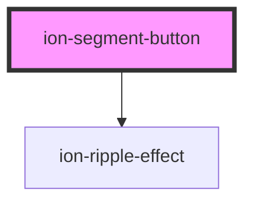

# ion-segment-button

Segment buttons are groups of related buttons inside of a [Segment](../segment). They are displayed in a horizontal row. A segment button can be checked by default by adding the `checked` attribute or by setting the `value` of the segment to the `value` of the segment button. Only one segment button should be selected at a time.


<!-- Auto Generated Below -->


## Usage

### Angular

```html
<!-- Segment buttons with text and click listeners -->
<ion-segment>
  <ion-segment-button (ionSelect)="segmentButtonClicked($event)">
    <ion-label>Friends</ion-label>
  </ion-segment-button>
  <ion-segment-button (ionSelect)="segmentButtonClicked($event)">
    <ion-label>Enemies</ion-label>
  </ion-segment-button>
</ion-segment>

<!-- Segment buttons with the first checked and the last disabled -->
<ion-segment>
  <ion-segment-button checked>
    <ion-label>Paid</ion-label>
  </ion-segment-button>
  <ion-segment-button>
    <ion-label>Free</ion-label>
  </ion-segment-button>
  <ion-segment-button disabled>
    <ion-label>Top</ion-label>
  </ion-segment-button>
</ion-segment>

<!-- Segment buttons with values and icons -->
<ion-segment>
  <ion-segment-button value="camera">
    <ion-icon name="camera"></ion-icon>
  </ion-segment-button>
  <ion-segment-button value="bookmark">
    <ion-icon name="bookmark"></ion-icon>
  </ion-segment-button>
</ion-segment>

<!-- Segment with a value that checks the last button -->
<ion-segment value="shared">
  <ion-segment-button value="bookmarks">
    <ion-label>Bookmarks</ion-label>
  </ion-segment-button>
  <ion-segment-button value="reading">
    <ion-label>Reading List</ion-label>
  </ion-segment-button>
  <ion-segment-button value="shared">
    <ion-label>Shared Links</ion-label>
  </ion-segment-button>
</ion-segment>

<!-- Label only -->
<ion-segment>
  <ion-segment-button checked>
    <ion-label>Item One</ion-label>
  </ion-segment-button>
  <ion-segment-button>
    <ion-label>Item Two</ion-label>
  </ion-segment-button>
  <ion-segment-button>
    <ion-label>Item Three</ion-label>
  </ion-segment-button>
</ion-segment>

<!-- Icon only -->
<ion-segment>
  <ion-segment-button>
    <ion-icon name="call"></ion-icon>
  </ion-segment-button>
  <ion-segment-button checked>
    <ion-icon name="heart"></ion-icon>
  </ion-segment-button>
  <ion-segment-button>
    <ion-icon name="pin"></ion-icon>
  </ion-segment-button>
</ion-segment>

<!-- Icon top -->
<ion-segment>
  <ion-segment-button>
    <ion-label>Item One</ion-label>
    <ion-icon name="call"></ion-icon>
  </ion-segment-button>
  <ion-segment-button checked>
    <ion-label>Item Two</ion-label>
    <ion-icon name="heart"></ion-icon>
  </ion-segment-button>
  <ion-segment-button>
    <ion-label>Item Three</ion-label>
    <ion-icon name="pin"></ion-icon>
  </ion-segment-button>
</ion-segment>

<!-- Icon bottom -->
<ion-segment>
  <ion-segment-button checked layout="icon-bottom">
    <ion-icon name="call"></ion-icon>
    <ion-label>Item One</ion-label>
  </ion-segment-button>
  <ion-segment-button layout="icon-bottom">
    <ion-icon name="heart"></ion-icon>
    <ion-label>Item Two</ion-label>
  </ion-segment-button>
  <ion-segment-button layout="icon-bottom">
    <ion-icon name="pin"></ion-icon>
    <ion-label>Item Three</ion-label>
  </ion-segment-button>
</ion-segment>

<!-- Icon start -->
<ion-segment>
  <ion-segment-button checked layout="icon-start">
    <ion-label>Item One</ion-label>
    <ion-icon name="call"></ion-icon>
  </ion-segment-button>
  <ion-segment-button layout="icon-start">
    <ion-label>Item Two</ion-label>
    <ion-icon name="heart"></ion-icon>
  </ion-segment-button>
  <ion-segment-button layout="icon-start">
    <ion-label>Item Three</ion-label>
    <ion-icon name="pin"></ion-icon>
  </ion-segment-button>
</ion-segment>

<!-- Icon end -->
<ion-segment>
  <ion-segment-button checked layout="icon-end">
    <ion-icon name="call"></ion-icon>
    <ion-label>Item One</ion-label>
  </ion-segment-button>
  <ion-segment-button disabled layout="icon-end">
    <ion-icon name="heart"></ion-icon>
    <ion-label>Item Two</ion-label>
  </ion-segment-button>
  <ion-segment-button layout="icon-end">
    <ion-icon name="pin"></ion-icon>
    <ion-label>Item Three</ion-label>
  </ion-segment-button>
</ion-segment>
```

```typescript
import { Component } from '@angular/core';

@Component({
  selector: 'segment-button-example',
  templateUrl: 'segment-button-example.html',
  styleUrls: ['./segment-button-example.css'],
})
export class SegmentButtonExample {
  segmentButtonClicked(ev: any) {
    console.log('Segment button clicked', ev);
  }
}
```


### Javascript

```html
<!-- Segment buttons with text -->
<ion-segment>
  <ion-segment-button>
    <ion-label>Friends</ion-label>
  </ion-segment-button>
  <ion-segment-button>
    <ion-label>Enemies</ion-label>
  </ion-segment-button>
</ion-segment>

<!-- Segment buttons with the first checked and the last disabled -->
<ion-segment>
  <ion-segment-button checked>
    <ion-label>Paid</ion-label>
  </ion-segment-button>
  <ion-segment-button>
    <ion-label>Free</ion-label>
  </ion-segment-button>
  <ion-segment-button disabled>
    <ion-label>Top</ion-label>
  </ion-segment-button>
</ion-segment>

<!-- Segment buttons with values and icons -->
<ion-segment>
  <ion-segment-button value="camera">
    <ion-icon name="camera"></ion-icon>
  </ion-segment-button>
  <ion-segment-button value="bookmark">
    <ion-icon name="bookmark"></ion-icon>
  </ion-segment-button>
</ion-segment>

<!-- Segment with a value that checks the last button -->
<ion-segment value="shared">
  <ion-segment-button value="bookmarks">
    <ion-label>Bookmarks</ion-label>
  </ion-segment-button>
  <ion-segment-button value="reading">
    <ion-label>Reading List</ion-label>
  </ion-segment-button>
  <ion-segment-button value="shared">
    <ion-label>Shared Links</ion-label>
  </ion-segment-button>
</ion-segment>

<!-- Label only -->
<ion-segment>
  <ion-segment-button checked>
    <ion-label>Item One</ion-label>
  </ion-segment-button>
  <ion-segment-button>
    <ion-label>Item Two</ion-label>
  </ion-segment-button>
  <ion-segment-button>
    <ion-label>Item Three</ion-label>
  </ion-segment-button>
</ion-segment>

<!-- Icon only -->
<ion-segment>
  <ion-segment-button>
    <ion-icon name="call"></ion-icon>
  </ion-segment-button>
  <ion-segment-button checked>
    <ion-icon name="heart"></ion-icon>
  </ion-segment-button>
  <ion-segment-button>
    <ion-icon name="pin"></ion-icon>
  </ion-segment-button>
</ion-segment>

<!-- Icon top -->
<ion-segment>
  <ion-segment-button>
    <ion-label>Item One</ion-label>
    <ion-icon name="call"></ion-icon>
  </ion-segment-button>
  <ion-segment-button checked>
    <ion-label>Item Two</ion-label>
    <ion-icon name="heart"></ion-icon>
  </ion-segment-button>
  <ion-segment-button>
    <ion-label>Item Three</ion-label>
    <ion-icon name="pin"></ion-icon>
  </ion-segment-button>
</ion-segment>

<!-- Icon bottom -->
<ion-segment>
  <ion-segment-button checked layout="icon-bottom">
    <ion-icon name="call"></ion-icon>
    <ion-label>Item One</ion-label>
  </ion-segment-button>
  <ion-segment-button layout="icon-bottom">
    <ion-icon name="heart"></ion-icon>
    <ion-label>Item Two</ion-label>
  </ion-segment-button>
  <ion-segment-button layout="icon-bottom">
    <ion-icon name="pin"></ion-icon>
    <ion-label>Item Three</ion-label>
  </ion-segment-button>
</ion-segment>

<!-- Icon start -->
<ion-segment>
  <ion-segment-button checked layout="icon-start">
    <ion-label>Item One</ion-label>
    <ion-icon name="call"></ion-icon>
  </ion-segment-button>
  <ion-segment-button layout="icon-start">
    <ion-label>Item Two</ion-label>
    <ion-icon name="heart"></ion-icon>
  </ion-segment-button>
  <ion-segment-button layout="icon-start">
    <ion-label>Item Three</ion-label>
    <ion-icon name="pin"></ion-icon>
  </ion-segment-button>
</ion-segment>

<!-- Icon end -->
<ion-segment>
  <ion-segment-button checked layout="icon-end">
    <ion-icon name="call"></ion-icon>
    <ion-label>Item One</ion-label>
  </ion-segment-button>
  <ion-segment-button disabled layout="icon-end">
    <ion-icon name="heart"></ion-icon>
    <ion-label>Item Two</ion-label>
  </ion-segment-button>
  <ion-segment-button layout="icon-end">
    <ion-icon name="pin"></ion-icon>
    <ion-label>Item Three</ion-label>
  </ion-segment-button>
</ion-segment>
```

```javascript
// Listen for ionClick on all segment buttons
const segmentButtons = document.querySelectorAll('ion-segment-button')
for (let i = 0; i < segmentButtons.length; i++) {
  segmentButtons[i].addEventListener('ionSelect', (ev) => {
    console.log('Segment button clicked', ev);
  })
}
```


### React

```tsx
import React from 'react';
import { IonSegment, IonSegmentButton, IonLabel, IonIcon, IonContent } from '@ionic/react';

export const SegmentButtonExample: React.FunctionComponent = () => (
  <IonContent>
    {/*-- Segment buttons with text and click listeners --*/}
    <IonSegment>
      <IonSegmentButton onIonSelect={() => console.log('Friends segment selected')}>
        <IonLabel>Friends</IonLabel>
      </IonSegmentButton>
      <IonSegmentButton onIonSelect={() => console.log('Enemies segment selected')}>
        <IonLabel>Enemies</IonLabel>
      </IonSegmentButton>
    </IonSegment>

    {/*-- Segment buttons with the first checked and the last disabled --*/}
    <IonSegment>
      <IonSegmentButton checked>
        <IonLabel>Paid</IonLabel>
      </IonSegmentButton>
      <IonSegmentButton>
        <IonLabel>Free</IonLabel>
      </IonSegmentButton>
      <IonSegmentButton disabled>
        <IonLabel>Top</IonLabel>
      </IonSegmentButton>
    </IonSegment>

    {/*-- Segment buttons with values and icons --*/}
    <IonSegment>
      <IonSegmentButton value="camera">
        <IonIcon name="camera" />
      </IonSegmentButton>
      <IonSegmentButton value="bookmark">
        <IonIcon name="bookmark" />
      </IonSegmentButton>
    </IonSegment>

    {/*-- Segment with a value that checks the last button --*/}
    <IonSegment value="shared">
      <IonSegmentButton value="bookmarks">
        <IonLabel>Bookmarks</IonLabel>
      </IonSegmentButton>
      <IonSegmentButton value="reading">
        <IonLabel>Reading List</IonLabel>
      </IonSegmentButton>
      <IonSegmentButton value="shared">
        <IonLabel>Shared Links</IonLabel>
      </IonSegmentButton>
    </IonSegment>

    {/*-- Label only --*/}
    <IonSegment>
      <IonSegmentButton checked>
        <IonLabel>Item One</IonLabel>
      </IonSegmentButton>
      <IonSegmentButton>
        <IonLabel>Item Two</IonLabel>
      </IonSegmentButton>
      <IonSegmentButton>
        <IonLabel>Item Three</IonLabel>
      </IonSegmentButton>
    </IonSegment>

    {/*-- Icon only --*/}
    <IonSegment>
      <IonSegmentButton>
        <IonIcon name="call" />
      </IonSegmentButton>
      <IonSegmentButton checked>
        <IonIcon name="heart" />
      </IonSegmentButton>
      <IonSegmentButton>
        <IonIcon name="pin" />
      </IonSegmentButton>
    </IonSegment>

    {/*-- Icon top --*/}
    <IonSegment>
      <IonSegmentButton>
        <IonLabel>Item One</IonLabel>
        <IonIcon name="call" />
      </IonSegmentButton>
      <IonSegmentButton checked>
        <IonLabel>Item Two</IonLabel>
        <IonIcon name="heart" />
      </IonSegmentButton>
      <IonSegmentButton>
        <IonLabel>Item Three</IonLabel>
        <IonIcon name="pin" />
      </IonSegmentButton>
    </IonSegment>

    {/*-- Icon bottom --*/}
    <IonSegment>
      <IonSegmentButton checked layout="icon-bottom">
        <IonIcon name="call" />
        <IonLabel>Item One</IonLabel>
      </IonSegmentButton>
      <IonSegmentButton layout="icon-bottom">
        <IonIcon name="heart" />
        <IonLabel>Item Two</IonLabel>
      </IonSegmentButton>
      <IonSegmentButton layout="icon-bottom">
        <IonIcon name="pin" />
        <IonLabel>Item Three</IonLabel>
      </IonSegmentButton>
    </IonSegment>

    {/*-- Icon start --*/}
    <IonSegment>
      <IonSegmentButton checked layout="icon-start">
        <IonLabel>Item One</IonLabel>
        <IonIcon name="call" />
      </IonSegmentButton>
      <IonSegmentButton layout="icon-start">
        <IonLabel>Item Two</IonLabel>
        <IonIcon name="heart" />
      </IonSegmentButton>
      <IonSegmentButton layout="icon-start">
        <IonLabel>Item Three</IonLabel>
        <IonIcon name="pin" />
      </IonSegmentButton>
    </IonSegment>

    {/*-- Icon end --*/}
    <IonSegment>
      <IonSegmentButton checked layout="icon-end">
        <IonIcon name="call" />
        <IonLabel>Item One</IonLabel>
      </IonSegmentButton>
      <IonSegmentButton disabled layout="icon-end">
        <IonIcon name="heart" />
        <IonLabel>Item Two</IonLabel>
      </IonSegmentButton>
      <IonSegmentButton layout="icon-end">
        <IonIcon name="pin" />
        <IonLabel>Item Three</IonLabel>
      </IonSegmentButton>
    </IonSegment>
  </IonContent>
);
```


### Vue

```html
<template>
  <!-- Segment buttons with text and click listeners -->
  <ion-segment>
    <ion-segment-button @ionSelect="segmentButtonClicked($event)">
      <ion-label>Friends</ion-label>
    </ion-segment-button>
    <ion-segment-button @ionSelect="segmentButtonClicked($event)">
      <ion-label>Enemies</ion-label>
    </ion-segment-button>
  </ion-segment>

  <!-- Segment buttons with the first checked and the last disabled -->
  <ion-segment>
    <ion-segment-button checked>
      <ion-label>Paid</ion-label>
    </ion-segment-button>
    <ion-segment-button>
      <ion-label>Free</ion-label>
    </ion-segment-button>
    <ion-segment-button disabled>
      <ion-label>Top</ion-label>
    </ion-segment-button>
  </ion-segment>

  <!-- Segment buttons with values and icons -->
  <ion-segment>
    <ion-segment-button value="camera">
      <ion-icon name="camera"></ion-icon>
    </ion-segment-button>
    <ion-segment-button value="bookmark">
      <ion-icon name="bookmark"></ion-icon>
    </ion-segment-button>
  </ion-segment>

  <!-- Segment with a value that checks the last button -->
  <ion-segment value="shared">
    <ion-segment-button value="bookmarks">
      <ion-label>Bookmarks</ion-label>
    </ion-segment-button>
    <ion-segment-button value="reading">
      <ion-label>Reading List</ion-label>
    </ion-segment-button>
    <ion-segment-button value="shared">
      <ion-label>Shared Links</ion-label>
    </ion-segment-button>
  </ion-segment>

  <!-- Label only -->
  <ion-segment>
    <ion-segment-button checked>
      <ion-label>Item One</ion-label>
    </ion-segment-button>
    <ion-segment-button>
      <ion-label>Item Two</ion-label>
    </ion-segment-button>
    <ion-segment-button>
      <ion-label>Item Three</ion-label>
    </ion-segment-button>
  </ion-segment>

  <!-- Icon only -->
  <ion-segment>
    <ion-segment-button>
      <ion-icon name="call"></ion-icon>
    </ion-segment-button>
    <ion-segment-button checked>
      <ion-icon name="heart"></ion-icon>
    </ion-segment-button>
    <ion-segment-button>
      <ion-icon name="pin"></ion-icon>
    </ion-segment-button>
  </ion-segment>

  <!-- Icon top -->
  <ion-segment>
    <ion-segment-button>
      <ion-label>Item One</ion-label>
      <ion-icon name="call"></ion-icon>
    </ion-segment-button>
    <ion-segment-button checked>
      <ion-label>Item Two</ion-label>
      <ion-icon name="heart"></ion-icon>
    </ion-segment-button>
    <ion-segment-button>
      <ion-label>Item Three</ion-label>
      <ion-icon name="pin"></ion-icon>
    </ion-segment-button>
  </ion-segment>

  <!-- Icon bottom -->
  <ion-segment>
    <ion-segment-button checked layout="icon-bottom">
      <ion-icon name="call"></ion-icon>
      <ion-label>Item One</ion-label>
    </ion-segment-button>
    <ion-segment-button layout="icon-bottom">
      <ion-icon name="heart"></ion-icon>
      <ion-label>Item Two</ion-label>
    </ion-segment-button>
    <ion-segment-button layout="icon-bottom">
      <ion-icon name="pin"></ion-icon>
      <ion-label>Item Three</ion-label>
    </ion-segment-button>
  </ion-segment>

  <!-- Icon start -->
  <ion-segment>
    <ion-segment-button checked layout="icon-start">
      <ion-label>Item One</ion-label>
      <ion-icon name="call"></ion-icon>
    </ion-segment-button>
    <ion-segment-button layout="icon-start">
      <ion-label>Item Two</ion-label>
      <ion-icon name="heart"></ion-icon>
    </ion-segment-button>
    <ion-segment-button layout="icon-start">
      <ion-label>Item Three</ion-label>
      <ion-icon name="pin"></ion-icon>
    </ion-segment-button>
  </ion-segment>

  <!-- Icon end -->
  <ion-segment>
    <ion-segment-button checked layout="icon-end">
      <ion-icon name="call"></ion-icon>
      <ion-label>Item One</ion-label>
    </ion-segment-button>
    <ion-segment-button disabled layout="icon-end">
      <ion-icon name="heart"></ion-icon>
      <ion-label>Item Two</ion-label>
    </ion-segment-button>
    <ion-segment-button layout="icon-end">
      <ion-icon name="pin"></ion-icon>
      <ion-label>Item Three</ion-label>
    </ion-segment-button>
  </ion-segment>
</template>

<script lang="ts">
  import { Component, Vue } from 'vue-property-decorator';

  @Component()
  export default class Example extends Vue {
    segmentButtonClicked(ev: any) {
      console.log('Segment button clicked', ev);
    }
  }
</script>
```


## Properties

| Property   | Attribute  | Description                                                  | Type                                                                                                    | Default               |
| ---------- | ---------- | ------------------------------------------------------------ | ------------------------------------------------------------------------------------------------------- | --------------------- |
| `checked`  | `checked`  | If `true`, the segment button is selected.                   | `boolean`                                                                                               | `false`               |
| `disabled` | `disabled` | If `true`, the user cannot interact with the segment button. | `boolean`                                                                                               | `false`               |
| `layout`   | `layout`   | Set the layout of the text and icon in the segment.          | `"icon-bottom" \| "icon-end" \| "icon-hide" \| "icon-start" \| "icon-top" \| "label-hide" \| undefined` | `'icon-top'`          |
| `mode`     | `mode`     | The mode determines which platform styles to use.            | `"ios" \| "md"`                                                                                         | `undefined`           |
| `type`     | `type`     | The type of the button.                                      | `"button" \| "reset" \| "submit"`                                                                       | `'button'`            |
| `value`    | `value`    | The value of the segment button.                             | `string`                                                                                                | `'ion-sb-' + (ids++)` |


## Events

| Event       | Description                                 | Type                |
| ----------- | ------------------------------------------- | ------------------- |
| `ionSelect` | Emitted when the segment button is clicked. | `CustomEvent<void>` |


## CSS Custom Properties

| Name                        | Description                                                                                                       |
| --------------------------- | ----------------------------------------------------------------------------------------------------------------- |
| `--background`              | Background of the segment button                                                                                  |
| `--background-activated`    | Background of the segment button when pressed                                                                     |
| `--background-checked`      | Background of the checked segment button                                                                          |
| `--background-hover`        | Background of the segment button on hover                                                                         |
| `--border-color`            | Color of the segment button border                                                                                |
| `--border-radius`           | Radius of the segment button border                                                                               |
| `--border-style`            | Style of the segment button border                                                                                |
| `--border-width`            | Width of the segment button border                                                                                |
| `--color`                   | Color of the segment button                                                                                       |
| `--color-activated`         | Color of the segment button when pressed                                                                          |
| `--color-checked`           | Color of the checked segment button                                                                               |
| `--color-checked-disabled`  | Color of the checked & disabled segment button                                                                    |
| `--color-disabled`          | Color of the disabled segment button                                                                              |
| `--indicator-color`         | Color of the indicator (highlight) under the segment button                                                       |
| `--indicator-color-checked` | Color of the indicator (highlight) under the checked segment button                                               |
| `--margin-bottom`           | Bottom margin of the segment button                                                                               |
| `--margin-end`              | Right margin if direction is left-to-right, and left margin if direction is right-to-left of the segment button   |
| `--margin-start`            | Left margin if direction is left-to-right, and right margin if direction is right-to-left of the segment button   |
| `--margin-top`              | Top margin of the segment button                                                                                  |
| `--padding-bottom`          | Bottom padding of the segment button                                                                              |
| `--padding-end`             | Right padding if direction is left-to-right, and left padding if direction is right-to-left of the segment button |
| `--padding-start`           | Left padding if direction is left-to-right, and right padding if direction is right-to-left of the segment button |
| `--padding-top`             | Top padding of the segment button                                                                                 |
| `--transition`              | Transition of the segment button                                                                                  |


## Dependencies

### Depends on

- [ion-ripple-effect](../ripple-effect)

### Graph


----------------------------------------------

*Built with [StencilJS](https://stenciljs.com/)*
