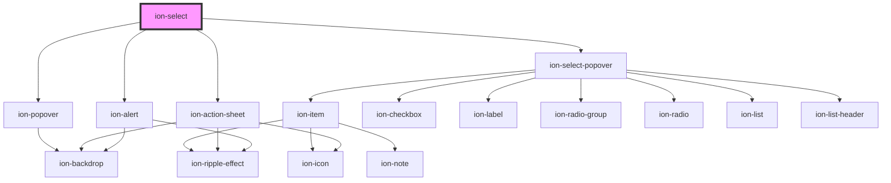

# ion-select

Selects are form controls to select an option, or options, from a set of options, similar to a native `<select>` element. When a user taps the select, a dialog appears with all of the options in a large, easy to select list.

A select should be used with child `<ion-select-option>` elements. If the child option is not given a `value` attribute then its text will be used as the value.

If `value` is set on the `<ion-select>`, the selected option will be chosen based on that value.

## Interfaces

By default, select uses [ion-alert](../alert) to open up the overlay of options in an alert. The interface can be changed to use [ion-action-sheet](../action-sheet) or [ion-popover](../popover) by passing `action-sheet` or `popover`, respectively, to the `interface` property. Read on to the other sections for the limitations of the different interfaces.


## Single Selection

By default, the select allows the user to select only one option. The alert interface presents users with a radio button styled list of options. The action sheet interface can only be used with a single value select. The select component's value receives the value of the selected option's value.


## Multiple Selection

By adding the `multiple` attribute to select, users are able to select multiple options. When multiple options can be selected, the alert overlay presents users with a checkbox styled list of options. The select component's value receives an array of all of the selected option values.

Note: the `action-sheet` and `popover` interfaces will not work with multiple selection.

## Object Value References

When using objects for select values, it is possible for the identities of these objects to change if they are coming from a server or database, while the selected value's identity remains the same. For example, this can occur when an existing record with the desired object value is loaded into the select, but the newly retrieved select options now have different identities. This will result in the select appearing to have no value at all, even though the original selection in still intact.

By default, the select uses object equality (`===`) to determine if an option is selected. This can be overridden by providing a property name or a function to the `compareWith` property.

## Select Buttons

The alert supports two buttons: `Cancel` and `OK`. Each button's text can be customized using the `cancelText` and `okText` properties.

The `action-sheet` and `popover` interfaces do not have an `OK` button, clicking on any of the options will automatically close the overlay and select that value. The `popover` interface does not have a `Cancel` button, clicking on the backdrop will close the overlay.


## Interface Options

Since select uses the alert, action sheet and popover interfaces, options can be passed to these components through the `interfaceOptions` property. This can be used to pass a custom header, subheader, css class, and more.

See the [ion-alert docs](../alert), [ion-action-sheet docs](../action-sheet), and [ion-popover docs](../popover) for the properties that each interface accepts.

Note: `interfaceOptions` will not override `inputs` or `buttons` with the `alert` interface.

## Customization

There are two units that make up the Select component and each need to be styled separately. The `ion-select` element is represented on the view by the selected value(s), or placeholder if there is none, and dropdown icon. The interface, which is defined in the [Interfaces](#interfaces) section above, is the dialog that opens when clicking on the `ion-select`. The interface contains all of the options defined by adding `ion-select-option` elements. The following sections will go over the differences between styling these.

### Styling Select Element

As mentioned, the `ion-select` element consists only of the value(s), or placeholder, and icon that is displayed on the view. To customize this, style using a combination of CSS and any of the [CSS custom properties](#css-custom-properties):

```css
ion-select {
  /* Applies to the value and placeholder color */
  color: #545ca7;

  /* Set a different placeholder color */
  --placeholder-color: #971e49;

  /* Set full opacity on the placeholder */
  --placeholder-opacity: 1;
}
```

Alternatively, depending on the [browser support](https://caniuse.com/#feat=mdn-css_selectors_part) needed, CSS shadow parts can be used to style the select:

```css
/* Set the width to the full container and center the content */
ion-select {
  width: 100%;

  justify-content: center;
}

/* Set the flex in order to size the text width to its content */
ion-select::part(placeholder),
ion-select::part(text) {
  flex: 0 0 auto;
}

/* Set the placeholder color and opacity */
ion-select::part(placeholder) {
  color: #20a08a;
  opacity: 1;
}

/*
 * Set the font of the first letter of the placeholder
 * Shadow parts work with pseudo-elements, too!
 * https://developer.mozilla.org/en-US/docs/Web/CSS/Pseudo-elements
 */
ion-select::part(placeholder)::first-letter {
  font-size: 24px;
  font-weight: 500;
}

/* Set the text color */
ion-select::part(text) {
  color: #545ca7;
}

/* Set the icon color and opacity */
ion-select::part(icon) {
  color: #971e49;
  opacity: 1;
}
```

Notice that by using `::part`, any CSS property on the element can be targeted.

### Styling Select Interface

Customizing the interface dialog should be done by following the Customization section in that interface's documentation:

- [Alert Customization](../alert#customization)
- [Action Sheet Customization](../action-sheet#customization)
- [Popover Customization](../popover#customization)

However, the Select Option does set a class for easier styling and allows for the ability to pass a class to the overlay option, see the [Select Options documentation](../select-option) for usage examples of customizing options.

## Interfaces

### SelectChangeEventDetail

```typescript
interface SelectChangeEventDetail<T = any> {
  value: T;
}
```

### SelectCustomEvent

While not required, this interface can be used in place of the `CustomEvent` interface for stronger typing with Ionic events emitted from this component.

```typescript
interface SelectCustomEvent<T = any> extends CustomEvent {
  detail: SelectChangeEventDetail<T>;
  target: HTMLIonSelectElement;
}
```

<!-- Auto Generated Below -->


## Usage

### Angular

### Single Selection

```html
<ion-list>
  <ion-list-header>
    <ion-label>
      Single Selection
    </ion-label>
  </ion-list-header>

  <ion-item>
    <ion-label>Gender</ion-label>
    <ion-select placeholder="Select One">
      <ion-select-option value="f">Female</ion-select-option>
      <ion-select-option value="m">Male</ion-select-option>
    </ion-select>
  </ion-item>

  <ion-item>
    <ion-label>Hair Color</ion-label>
    <ion-select value="brown" okText="Okay" cancelText="Dismiss">
      <ion-select-option value="brown">Brown</ion-select-option>
      <ion-select-option value="blonde">Blonde</ion-select-option>
      <ion-select-option value="black">Black</ion-select-option>
      <ion-select-option value="red">Red</ion-select-option>
    </ion-select>
  </ion-item>

</ion-list>
```

### Multiple Selection

```html
<ion-list>
  <ion-list-header>
    <ion-label>
      Multiple Selection
    </ion-label>
  </ion-list-header>

  <ion-item>
    <ion-label>Toppings</ion-label>
    <ion-select multiple="true" cancelText="Nah" okText="Okay!">
      <ion-select-option value="bacon">Bacon</ion-select-option>
      <ion-select-option value="olives">Black Olives</ion-select-option>
      <ion-select-option value="xcheese">Extra Cheese</ion-select-option>
      <ion-select-option value="peppers">Green Peppers</ion-select-option>
      <ion-select-option value="mushrooms">Mushrooms</ion-select-option>
      <ion-select-option value="onions">Onions</ion-select-option>
      <ion-select-option value="pepperoni">Pepperoni</ion-select-option>
      <ion-select-option value="pineapple">Pineapple</ion-select-option>
      <ion-select-option value="sausage">Sausage</ion-select-option>
      <ion-select-option value="Spinach">Spinach</ion-select-option>
    </ion-select>
  </ion-item>

  <ion-item>
    <ion-label>Pets</ion-label>
    <ion-select multiple="true" [value]="['bird', 'dog']">
      <ion-select-option value="bird">Bird</ion-select-option>
      <ion-select-option value="cat">Cat</ion-select-option>
      <ion-select-option value="dog">Dog</ion-select-option>
      <ion-select-option value="honeybadger">Honey Badger</ion-select-option>
    </ion-select>
  </ion-item>
</ion-list>
```

### Objects as Values

```html
<ion-list>
  <ion-list-header>
    <ion-label>
      Objects as Values (compareWith)
    </ion-label>
  </ion-list-header>

  <ion-item>
    <ion-label>Users</ion-label>
    <ion-select [compareWith]="compareWith">
      <ion-select-option *ngFor="let user of users" [value]="user">{{user.first + ' ' + user.last}}</ion-select-option>
    </ion-select>
  </ion-item>
</ion-list>
```

```typescript
import { Component } from '@angular/core';

interface User {
  id: number;
  first: string;
  last: string;
}

@Component({
  selector: 'select-example',
  templateUrl: 'select-example.html',
  styleUrls: ['./select-example.css'],
})
export class SelectExample {
  users: User[] = [
    {
      id: 1,
      first: 'Alice',
      last: 'Smith',
    },
    {
      id: 2,
      first: 'Bob',
      last: 'Davis',
    },
    {
      id: 3,
      first: 'Charlie',
      last: 'Rosenburg',
    }
  ];

  compareWith(o1: User, o2: User) {
    return o1 && o2 ? o1.id === o2.id : o1 === o2;
  }
}
```

### Objects as Values with Multiple Selection

```html
<ion-list>
  <ion-list-header>
    <ion-label>
      Objects as Values (compareWith)
    </ion-label>
  </ion-list-header>

  <ion-item>
    <ion-label>Users</ion-label>
    <ion-select [compareWith]="compareWith" multiple="true">
      <ion-select-option *ngFor="let user of users" [value]="user">{{user.first + ' ' + user.last}}</ion-select-option>
    </ion-select>
  </ion-item>
</ion-list>
```

```typescript
import { Component } from '@angular/core';

interface User {
  id: number;
  first: string;
  last: string;
}

@Component({
  selector: 'select-example',
  templateUrl: 'select-example.html',
  styleUrls: ['./select-example.css'],
})
export class SelectExample {
  users: User[] = [
    {
      id: 1,
      first: 'Alice',
      last: 'Smith',
    },
    {
      id: 2,
      first: 'Bob',
      last: 'Davis',
    },
    {
      id: 3,
      first: 'Charlie',
      last: 'Rosenburg',
    }
  ];

  compareWith(o1: User, o2: User | User[]) {
    if (!o1 || !o2) {
      return o1 === o2;
    }

    if (Array.isArray(o2)) {
      return o2.some((u: User) => u.id === o1.id);
    }

    return o1.id === o2.id;
  }
}
```

### Interface Options

```html
<ion-list>
  <ion-list-header>
    <ion-label>
      Interface Options
    </ion-label>
  </ion-list-header>

  <ion-item>
    <ion-label>Alert</ion-label>
    <ion-select [interfaceOptions]="customAlertOptions" interface="alert" multiple="true" placeholder="Select One">
      <ion-select-option value="bacon">Bacon</ion-select-option>
      <ion-select-option value="olives">Black Olives</ion-select-option>
      <ion-select-option value="xcheese">Extra Cheese</ion-select-option>
      <ion-select-option value="peppers">Green Peppers</ion-select-option>
      <ion-select-option value="mushrooms">Mushrooms</ion-select-option>
      <ion-select-option value="onions">Onions</ion-select-option>
      <ion-select-option value="pepperoni">Pepperoni</ion-select-option>
      <ion-select-option value="pineapple">Pineapple</ion-select-option>
      <ion-select-option value="sausage">Sausage</ion-select-option>
      <ion-select-option value="Spinach">Spinach</ion-select-option>
    </ion-select>
  </ion-item>

  <ion-item>
    <ion-label>Popover</ion-label>
    <ion-select [interfaceOptions]="customPopoverOptions" interface="popover" placeholder="Select One">
      <ion-select-option value="brown">Brown</ion-select-option>
      <ion-select-option value="blonde">Blonde</ion-select-option>
      <ion-select-option value="black">Black</ion-select-option>
      <ion-select-option value="red">Red</ion-select-option>
    </ion-select>
  </ion-item>

  <ion-item>
    <ion-label>Action Sheet</ion-label>
    <ion-select [interfaceOptions]="customActionSheetOptions" interface="action-sheet" placeholder="Select One">
      <ion-select-option value="red">Red</ion-select-option>
      <ion-select-option value="purple">Purple</ion-select-option>
      <ion-select-option value="yellow">Yellow</ion-select-option>
      <ion-select-option value="orange">Orange</ion-select-option>
      <ion-select-option value="green">Green</ion-select-option>
    </ion-select>
  </ion-item>

</ion-list>
```

```typescript
import { Component } from '@angular/core';

@Component({
  selector: 'select-example',
  templateUrl: 'select-example.html',
  styleUrls: ['./select-example.css'],
})
export class SelectExample {
  customAlertOptions: any = {
    header: 'Pizza Toppings',
    subHeader: 'Select your toppings',
    message: '$1.00 per topping',
    translucent: true
  };

  customPopoverOptions: any = {
    header: 'Hair Color',
    subHeader: 'Select your hair color',
    message: 'Only select your dominant hair color'
  };

  customActionSheetOptions: any = {
    header: 'Colors',
    subHeader: 'Select your favorite color'
  };
}
```


### Javascript

### Single Selection

```html
<ion-list>
  <ion-list-header>
    <ion-label>
      Single Selection
    </ion-label>
  </ion-list-header>

  <ion-item>
    <ion-label>Gender</ion-label>
    <ion-select placeholder="Select One">
      <ion-select-option value="f">Female</ion-select-option>
      <ion-select-option value="m">Male</ion-select-option>
    </ion-select>
  </ion-item>

  <ion-item>
    <ion-label>Hair Color</ion-label>
    <ion-select value="brown" ok-text="Okay" cancel-text="Dismiss">
      <ion-select-option value="brown">Brown</ion-select-option>
      <ion-select-option value="blonde">Blonde</ion-select-option>
      <ion-select-option value="black">Black</ion-select-option>
      <ion-select-option value="red">Red</ion-select-option>
    </ion-select>
  </ion-item>

</ion-list>
```

### Multiple Selection

```html
<ion-list>
  <ion-list-header>
    <ion-label>
      Multiple Selection
    </ion-label>
  </ion-list-header>

  <ion-item>
    <ion-label>Toppings</ion-label>
    <ion-select multiple="true" cancel-text="Nah" ok-text="Okay!">
      <ion-select-option value="bacon">Bacon</ion-select-option>
      <ion-select-option value="olives">Black Olives</ion-select-option>
      <ion-select-option value="xcheese">Extra Cheese</ion-select-option>
      <ion-select-option value="peppers">Green Peppers</ion-select-option>
      <ion-select-option value="mushrooms">Mushrooms</ion-select-option>
      <ion-select-option value="onions">Onions</ion-select-option>
      <ion-select-option value="pepperoni">Pepperoni</ion-select-option>
      <ion-select-option value="pineapple">Pineapple</ion-select-option>
      <ion-select-option value="sausage">Sausage</ion-select-option>
      <ion-select-option value="Spinach">Spinach</ion-select-option>
    </ion-select>
  </ion-item>

  <ion-item>
    <ion-label>Pets</ion-label>
    <ion-select id="multiple" multiple="true">
      <ion-select-option value="bird">Bird</ion-select-option>
      <ion-select-option value="cat">Cat</ion-select-option>
      <ion-select-option value="dog">Dog</ion-select-option>
      <ion-select-option value="honeybadger">Honey Badger</ion-select-option>
    </ion-select>
  </ion-item>
</ion-list>
```

```javascript
const select = document.querySelector('multiple');
select.value = ['bird', 'dog'];
```

### Objects as Values

```html
<ion-list>
  <ion-list-header>
    <ion-label>
      Objects as Values (compareWith)
    </ion-label>
  </ion-list-header>

  <ion-item>
    <ion-label>Users</ion-label>
    <ion-select id="objectSelectCompareWith"></ion-select>
  </ion-item>
</ion-list>
```

```javascript
  let objectOptions = [
    {
      id: 1,
      first: 'Alice',
      last: 'Smith',
    },
    {
      id: 2,
      first: 'Bob',
      last: 'Davis',
    },
    {
      id: 3,
      first: 'Charlie',
      last: 'Rosenburg',
    }
  ];

  let compareWithFn = (o1, o2) => {
    return o1 && o2 ? o1.id === o2.id : o1 === o2;
  };

  let objectSelectElement = document.getElementById('objectSelectCompareWith');
  objectSelectElement.compareWith = compareWithFn;

  objectOptions.forEach((option, i) => {
    let selectOption = document.createElement('ion-select-option');
    selectOption.value = option;
    selectOption.textContent = option.first + ' ' + option.last;

    objectSelectElement.appendChild(selectOption)
  });

  objectSelectElement.value = objectOptions[0];
}
```

### Interface Options

```html
<ion-list>
  <ion-list-header>
    <ion-label>
      Interface Options
    </ion-label>
  </ion-list-header>

  <ion-item>
    <ion-label>Alert</ion-label>
    <ion-select id="customAlertSelect" interface="alert" multiple="true" placeholder="Select One">
      <ion-select-option value="bacon">Bacon</ion-select-option>
      <ion-select-option value="olives">Black Olives</ion-select-option>
      <ion-select-option value="xcheese">Extra Cheese</ion-select-option>
      <ion-select-option value="peppers">Green Peppers</ion-select-option>
      <ion-select-option value="mushrooms">Mushrooms</ion-select-option>
      <ion-select-option value="onions">Onions</ion-select-option>
      <ion-select-option value="pepperoni">Pepperoni</ion-select-option>
      <ion-select-option value="pineapple">Pineapple</ion-select-option>
      <ion-select-option value="sausage">Sausage</ion-select-option>
      <ion-select-option value="Spinach">Spinach</ion-select-option>
    </ion-select>
  </ion-item>

  <ion-item>
    <ion-label>Popover</ion-label>
    <ion-select id="customPopoverSelect" interface="popover" placeholder="Select One">
      <ion-select-option value="brown">Brown</ion-select-option>
      <ion-select-option value="blonde">Blonde</ion-select-option>
      <ion-select-option value="black">Black</ion-select-option>
      <ion-select-option value="red">Red</ion-select-option>
    </ion-select>
  </ion-item>

  <ion-item>
    <ion-label>Action Sheet</ion-label>
    <ion-select id="customActionSheetSelect" interface="action-sheet" placeholder="Select One">
      <ion-select-option value="red">Red</ion-select-option>
      <ion-select-option value="purple">Purple</ion-select-option>
      <ion-select-option value="yellow">Yellow</ion-select-option>
      <ion-select-option value="orange">Orange</ion-select-option>
      <ion-select-option value="green">Green</ion-select-option>
    </ion-select>
  </ion-item>

</ion-list>
```

```javascript
var customAlertSelect = document.getElementById('customAlertSelect');
var customAlertOptions = {
  header: 'Pizza Toppings',
  subHeader: 'Select your toppings',
  message: '$1.00 per topping',
  translucent: true
};
customAlertSelect.interfaceOptions = customAlertOptions;

var customPopoverSelect = document.getElementById('customPopoverSelect');
var customPopoverOptions = {
  header: 'Hair Color',
  subHeader: 'Select your hair color',
  message: 'Only select your dominant hair color'
};
customPopoverSelect.interfaceOptions = customPopoverOptions;

var customActionSheetSelect = document.getElementById('customActionSheetSelect');
var customActionSheetOptions = {
  header: 'Colors',
  subHeader: 'Select your favorite color'
};
customActionSheetSelect.interfaceOptions = customActionSheetOptions;
```


### React

### Single Selection

```tsx
import React, { useState } from 'react';
import { IonContent, IonItem, IonLabel, IonList, IonListHeader, IonSelect, IonSelectOption, IonPage, IonItemDivider } from '@ionic/react';

export const SingleSelection: React.FC = () => {

  const [gender, setGender] = useState<string>();
  const [hairColor, setHairColor] = useState<string>('brown');

  return (
    <IonPage>
      <IonContent>
        <IonList>
          <IonListHeader>
            <IonLabel>
              Single Selection
            </IonLabel>
          </IonListHeader>

          <IonItem>
            <IonLabel>Gender</IonLabel>
            <IonSelect value={gender} placeholder="Select One" onIonChange={e => setGender(e.detail.value)}>
              <IonSelectOption value="female">Female</IonSelectOption>
              <IonSelectOption value="male">Male</IonSelectOption>
            </IonSelect>
          </IonItem>

          <IonItem>
            <IonLabel>Hair Color</IonLabel>
            <IonSelect value={hairColor} okText="Okay" cancelText="Dismiss" onIonChange={e => setHairColor(e.detail.value)}>
              <IonSelectOption value="brown">Brown</IonSelectOption>
              <IonSelectOption value="blonde">Blonde</IonSelectOption>
              <IonSelectOption value="black">Black</IonSelectOption>
              <IonSelectOption value="red">Red</IonSelectOption>
            </IonSelect>
          </IonItem>
          <IonItemDivider>Your Selections</IonItemDivider>
          <IonItem>Gender: {gender ?? '(none selected)'}</IonItem>
          <IonItem>Hair Color: {hairColor}</IonItem>
        </IonList>
      </IonContent>
    </IonPage>
  );
};
```


### Multiple Selection

```tsx
import React, { useState } from 'react';
import { IonContent, IonItem, IonLabel, IonList, IonListHeader, IonSelect, IonSelectOption, IonPage, IonItemDivider } from '@ionic/react';

export const MultipleSelection: React.FC = () => {

  const [toppings, setToppings] = useState<string[]>([]);
  const [pets, setPets] = useState<string[]>(['bird', 'dog']);

  return (
    <IonPage>
      <IonContent>
        <IonList>
          <IonListHeader>
            <IonLabel>
              Multiple Selection
        </IonLabel>
          </IonListHeader>

          <IonItem>
            <IonLabel>Toppings</IonLabel>
            <IonSelect value={toppings} multiple={true} cancelText="Nah" okText="Okay!" onIonChange={e => setToppings(e.detail.value)}>
              <IonSelectOption value="bacon">Bacon</IonSelectOption>
              <IonSelectOption value="olives">Black Olives</IonSelectOption>
              <IonSelectOption value="xcheese">Extra Cheese</IonSelectOption>
              <IonSelectOption value="peppers">Green Peppers</IonSelectOption>
              <IonSelectOption value="mushrooms">Mushrooms</IonSelectOption>
              <IonSelectOption value="onions">Onions</IonSelectOption>
              <IonSelectOption value="pepperoni">Pepperoni</IonSelectOption>
              <IonSelectOption value="pineapple">Pineapple</IonSelectOption>
              <IonSelectOption value="sausage">Sausage</IonSelectOption>
              <IonSelectOption value="Spinach">Spinach</IonSelectOption>
            </IonSelect>
          </IonItem>

          <IonItem>
            <IonLabel>Pets</IonLabel>
            <IonSelect multiple={true} value={pets} onIonChange={e => setPets(e.detail.value)}>
              <IonSelectOption value="bird">Bird</IonSelectOption>
              <IonSelectOption value="cat">Cat</IonSelectOption>
              <IonSelectOption value="dog">Dog</IonSelectOption>
              <IonSelectOption value="honeybadger">Honey Badger</IonSelectOption>
            </IonSelect>
          </IonItem>
          <IonItemDivider>Your Selections</IonItemDivider>
          <IonItem>Toppings: {toppings.length ? toppings.reduce((curr, prev) => prev + ', ' + curr, '') : '(none selected)'}</IonItem>
          <IonItem>Pets: {pets.length ? pets.reduce((curr, prev) => prev + ', ' + curr, '') : '(none selected)'}</IonItem>
        </IonList>
      </IonContent>
    </IonPage>
  );
};
```


### Objects as Values

```tsx
import React, { useState } from 'react';
import { IonContent, IonItem, IonLabel, IonList, IonListHeader, IonSelect, IonSelectOption, IonPage, IonItemDivider } from '@ionic/react';

const users = [
  {
    id: 1,
    first: 'Alice',
    last: 'Smith'
  },
  {
    id: 2,
    first: 'Bob',
    last: 'Davis'
  },
  {
    id: 3,
    first: 'Charlie',
    last: 'Rosenburg',
  }
];

type User = typeof users[number];

const compareWith = (o1: User, o2: User) => {
  return o1 && o2 ? o1.id === o2.id : o1 === o2;
};

export const ObjectSelection: React.FC = () => {

  const [selectedUsers, setSelectedUsers] = useState<User[]>([]);

  return (
    <IonPage>
      <IonContent>
        <IonList>
          <IonListHeader>
            <IonLabel>
              Objects as Values (compareWith)
            </IonLabel>
          </IonListHeader>
          <IonItem>
            <IonLabel>Users</IonLabel>
            <IonSelect compareWith={compareWith} value={selectedUsers} multiple onIonChange={e => setSelectedUsers(e.detail.value)}>
              {users.map(user => (
                <IonSelectOption key={user.id} value={user}>
                  {user.first} {user.last}
                </IonSelectOption>
              ))}
            </IonSelect>
          </IonItem>
          <IonItemDivider>Selected Users</IonItemDivider>
          {selectedUsers.length ?
            selectedUsers.map(user => <IonItem key={user.id}>{user.first} {user.last}</IonItem>) :
            <IonItem>(none selected)</IonItem>
          }
        </IonList>
      </IonContent>
    </IonPage>
  );
};
```


### Interface Options

```tsx
import React, { useState } from 'react';
import { IonContent, IonItem, IonLabel, IonList, IonListHeader, IonSelect, IonSelectOption, IonPage, IonItemDivider } from '@ionic/react';

const customAlertOptions = {
  header: 'Pizza Toppings',
  subHeader: 'Select your toppings',
  message: '$1.00 per topping',
  translucent: true
};

const customPopoverOptions = {
  header: 'Hair Color',
  subHeader: 'Select your hair color',
  message: 'Only select your dominant hair color'
};

const customActionSheetOptions = {
  header: 'Colors',
  subHeader: 'Select your favorite color'
};

export const InterfaceOptionsSelection: React.FC = () => {

  const [toppings, setToppings] = useState<string[]>([]);
  const [hairColor, setHairColor] = useState<string>('brown');
  const [color, setColor] = useState<string>();

  return (
    <IonPage>
      <IonContent>
        <IonList>
          <IonListHeader>
            <IonLabel>
              Interface Options
            </IonLabel>
          </IonListHeader>

          <IonItem>
            <IonLabel>Alert</IonLabel>
            <IonSelect
              interfaceOptions={customAlertOptions}
              interface="alert"
              multiple={true}
              placeholder="Select One"
              onIonChange={e => setToppings(e.detail.value)}
              value={toppings}
            >
              <IonSelectOption value="bacon">Bacon</IonSelectOption>
              <IonSelectOption value="olives">Black Olives</IonSelectOption>
              <IonSelectOption value="xcheese">Extra Cheese</IonSelectOption>
              <IonSelectOption value="peppers">Green Peppers</IonSelectOption>
              <IonSelectOption value="mushrooms">Mushrooms</IonSelectOption>
              <IonSelectOption value="onions">Onions</IonSelectOption>
              <IonSelectOption value="pepperoni">Pepperoni</IonSelectOption>
              <IonSelectOption value="pineapple">Pineapple</IonSelectOption>
              <IonSelectOption value="sausage">Sausage</IonSelectOption>
              <IonSelectOption value="Spinach">Spinach</IonSelectOption>
            </IonSelect>
          </IonItem>

          <IonItem>
            <IonLabel>Popover</IonLabel>
            <IonSelect
              interfaceOptions={customPopoverOptions}
              interface="popover"
              placeholder="Select One"
              onIonChange={e => setHairColor(e.detail.value)}
              value={hairColor}>
              <IonSelectOption value="brown">Brown</IonSelectOption>
              <IonSelectOption value="blonde">Blonde</IonSelectOption>
              <IonSelectOption value="black">Black</IonSelectOption>
              <IonSelectOption value="red">Red</IonSelectOption>
            </IonSelect>
          </IonItem>

          <IonItem>
            <IonLabel>Action Sheet</IonLabel>
            <IonSelect
              interfaceOptions={customActionSheetOptions}
              interface="action-sheet"
              placeholder="Select One"
              onIonChange={e => setColor(e.detail.value)}
              value={color}
            >
              <IonSelectOption value="red">Red</IonSelectOption>
              <IonSelectOption value="purple">Purple</IonSelectOption>
              <IonSelectOption value="yellow">Yellow</IonSelectOption>
              <IonSelectOption value="orange">Orange</IonSelectOption>
              <IonSelectOption value="green">Green</IonSelectOption>
            </IonSelect>
          </IonItem>

          <IonItemDivider>Your Selections</IonItemDivider>
          <IonItem>Toppings: {toppings.length ? toppings.reduce((curr, prev) => prev + ', ' + curr, '') : '(none selected)'}</IonItem>
          <IonItem>Hair Color: {hairColor}</IonItem>
          <IonItem>Color: {color ?? '(none selected)'}</IonItem>
        </IonList>
      </IonContent>
    </IonPage>
  );
};
```


### Stencil

### Single Selection

```tsx
import { Component, h } from '@stencil/core';

@Component({
  tag: 'select-example',
  styleUrl: 'select-example.css'
})
export class SelectExample {
  render() {
    return [
      <ion-list>
        <ion-list-header>
          <ion-label>
            Single Selection
          </ion-label>
        </ion-list-header>

        <ion-item>
          <ion-label>Gender</ion-label>
          <ion-select placeholder="Select One">
            <ion-select-option value="f">Female</ion-select-option>
            <ion-select-option value="m">Male</ion-select-option>
          </ion-select>
        </ion-item>

        <ion-item>
          <ion-label>Hair Color</ion-label>
          <ion-select value="brown" okText="Okay" cancelText="Dismiss">
            <ion-select-option value="brown">Brown</ion-select-option>
            <ion-select-option value="blonde">Blonde</ion-select-option>
            <ion-select-option value="black">Black</ion-select-option>
            <ion-select-option value="red">Red</ion-select-option>
          </ion-select>
        </ion-item>

      </ion-list>
    ];
  }
}
```

### Multiple Selection

```tsx
import { Component, h } from '@stencil/core';

@Component({
  tag: 'select-example',
  styleUrl: 'select-example.css'
})
export class SelectExample {
  render() {
    return [
      <ion-list>
        <ion-list-header>
          <ion-label>
            Multiple Selection
          </ion-label>
        </ion-list-header>

        <ion-item>
          <ion-label>Toppings</ion-label>
          <ion-select multiple={true} cancelText="Nah" okText="Okay!">
            <ion-select-option value="bacon">Bacon</ion-select-option>
            <ion-select-option value="olives">Black Olives</ion-select-option>
            <ion-select-option value="xcheese">Extra Cheese</ion-select-option>
            <ion-select-option value="peppers">Green Peppers</ion-select-option>
            <ion-select-option value="mushrooms">Mushrooms</ion-select-option>
            <ion-select-option value="onions">Onions</ion-select-option>
            <ion-select-option value="pepperoni">Pepperoni</ion-select-option>
            <ion-select-option value="pineapple">Pineapple</ion-select-option>
            <ion-select-option value="sausage">Sausage</ion-select-option>
            <ion-select-option value="Spinach">Spinach</ion-select-option>
          </ion-select>
        </ion-item>

        <ion-item>
          <ion-label>Pets</ion-label>
          <ion-select multiple={true} value={['bird', 'dog']}>
            <ion-select-option value="bird">Bird</ion-select-option>
            <ion-select-option value="cat">Cat</ion-select-option>
            <ion-select-option value="dog">Dog</ion-select-option>
            <ion-select-option value="honeybadger">Honey Badger</ion-select-option>
          </ion-select>
        </ion-item>
      </ion-list>
    ];
  }
}
```

### Objects as Values

```tsx
import { Component, h } from '@stencil/core';

@Component({
  tag: 'select-example',
  styleUrl: 'select-example.css'
})
export class SelectExample {
  private users: any[] = [
    {
      id: 1,
      first: 'Alice',
      last: 'Smith',
    },
    {
      id: 2,
      first: 'Bob',
      last: 'Davis',
    },
    {
      id: 3,
      first: 'Charlie',
      last: 'Rosenburg',
    }
  ];

  compareWith = (o1, o2) => {
    return o1 && o2 ? o1.id === o2.id : o1 === o2;
  };

  render() {
    return [
      <ion-list>
        <ion-list-header>
          <ion-label>
            Objects as Values (compareWith)
          </ion-label>
        </ion-list-header>

        <ion-item>
          <ion-label>Users</ion-label>
          <ion-select compareWith={this.compareWith}>
            {this.users.map(user =>
            <ion-select-option value={user}>
              {user.first + ' ' + user.last}
            </ion-select-option>
            )}
          </ion-select>
        </ion-item>
      </ion-list>
    ];
  }
}
```

### Interface Options

```tsx
import { Component, h } from '@stencil/core';

@Component({
  tag: 'select-example',
  styleUrl: 'select-example.css'
})
export class SelectExample {
  private customAlertOptions: any = {
    header: 'Pizza Toppings',
    subHeader: 'Select your toppings',
    message: '$1.00 per topping',
    translucent: true
  };

  private customPopoverOptions: any = {
    header: 'Hair Color',
    subHeader: 'Select your hair color',
    message: 'Only select your dominant hair color'
  };

  private customActionSheetOptions: any = {
    header: 'Colors',
    subHeader: 'Select your favorite color'
  };

  render() {
    return [
      <ion-list>
        <ion-list-header>
          <ion-label>
            Interface Options
          </ion-label>
        </ion-list-header>

        <ion-item>
          <ion-label>Alert</ion-label>
          <ion-select interfaceOptions={this.customAlertOptions} interface="alert" multiple={true} placeholder="Select One">
            <ion-select-option value="bacon">Bacon</ion-select-option>
            <ion-select-option value="olives">Black Olives</ion-select-option>
            <ion-select-option value="xcheese">Extra Cheese</ion-select-option>
            <ion-select-option value="peppers">Green Peppers</ion-select-option>
            <ion-select-option value="mushrooms">Mushrooms</ion-select-option>
            <ion-select-option value="onions">Onions</ion-select-option>
            <ion-select-option value="pepperoni">Pepperoni</ion-select-option>
            <ion-select-option value="pineapple">Pineapple</ion-select-option>
            <ion-select-option value="sausage">Sausage</ion-select-option>
            <ion-select-option value="Spinach">Spinach</ion-select-option>
          </ion-select>
        </ion-item>

        <ion-item>
          <ion-label>Popover</ion-label>
          <ion-select interfaceOptions={this.customPopoverOptions} interface="popover" placeholder="Select One">
            <ion-select-option value="brown">Brown</ion-select-option>
            <ion-select-option value="blonde">Blonde</ion-select-option>
            <ion-select-option value="black">Black</ion-select-option>
            <ion-select-option value="red">Red</ion-select-option>
          </ion-select>
        </ion-item>

        <ion-item>
          <ion-label>Action Sheet</ion-label>
          <ion-select interfaceOptions={this.customActionSheetOptions} interface="action-sheet" placeholder="Select One">
            <ion-select-option value="red">Red</ion-select-option>
            <ion-select-option value="purple">Purple</ion-select-option>
            <ion-select-option value="yellow">Yellow</ion-select-option>
            <ion-select-option value="orange">Orange</ion-select-option>
            <ion-select-option value="green">Green</ion-select-option>
          </ion-select>
        </ion-item>
      </ion-list>
    ];
  }
}
```


### Vue

### Single Selection

```html
<template>
  <ion-list>
    <ion-list-header>
      <ion-label>
        Single Selection
      </ion-label>
    </ion-list-header>

    <ion-item>
      <ion-label>Gender</ion-label>
      <ion-select placeholder="Select One">
        <ion-select-option value="f">Female</ion-select-option>
        <ion-select-option value="m">Male</ion-select-option>
      </ion-select>
    </ion-item>

    <ion-item>
      <ion-label>Hair Color</ion-label>
      <ion-select value="brown" ok-text="Okay" cancel-text="Dismiss">
        <ion-select-option value="brown">Brown</ion-select-option>
        <ion-select-option value="blonde">Blonde</ion-select-option>
        <ion-select-option value="black">Black</ion-select-option>
        <ion-select-option value="red">Red</ion-select-option>
      </ion-select>
    </ion-item>

  </ion-list>
</template>

<script>
import { 
  IonItem, 
  IonLabel, 
  IonList,
  IonListHeader,
  IonSelect,
  IonSelectOption
} from '@ionic/vue';
import { defineComponent } from 'vue';

export default defineComponent({
  components: {
    IonItem, 
    IonLabel, 
    IonList,
    IonListHeader,
    IonSelect,
    IonSelectOption
  }
});
</script>
```

### Multiple Selection

```html
<template>
  <ion-list>
    <ion-list-header>
      <ion-label>
        Multiple Selection
      </ion-label>
    </ion-list-header>

    <ion-item>
      <ion-label>Toppings</ion-label>
      <ion-select multiple="true" cancel-text="Nah" ok-text="Okay!">
        <ion-select-option value="bacon">Bacon</ion-select-option>
        <ion-select-option value="olives">Black Olives</ion-select-option>
        <ion-select-option value="xcheese">Extra Cheese</ion-select-option>
        <ion-select-option value="peppers">Green Peppers</ion-select-option>
        <ion-select-option value="mushrooms">Mushrooms</ion-select-option>
        <ion-select-option value="onions">Onions</ion-select-option>
        <ion-select-option value="pepperoni">Pepperoni</ion-select-option>
        <ion-select-option value="pineapple">Pineapple</ion-select-option>
        <ion-select-option value="sausage">Sausage</ion-select-option>
        <ion-select-option value="Spinach">Spinach</ion-select-option>
      </ion-select>
    </ion-item>

    <ion-item>
      <ion-label>Pets</ion-label>
      <ion-select multiple="true" :value=['bird', 'dog']>
        <ion-select-option value="bird">Bird</ion-select-option>
        <ion-select-option value="cat">Cat</ion-select-option>
        <ion-select-option value="dog">Dog</ion-select-option>
        <ion-select-option value="honeybadger">Honey Badger</ion-select-option>
      </ion-select>
    </ion-item>
  </ion-list>
</template>

<script>
import { 
  IonItem, 
  IonLabel, 
  IonList,
  IonListHeader,
  IonSelect,
  IonSelectOption
} from '@ionic/vue';
import { defineComponent } from 'vue';

export default defineComponent({
  components: {
    IonItem, 
    IonLabel, 
    IonList,
    IonListHeader,
    IonSelect,
    IonSelectOption
  }
});
</script>
```

### Interface Options

```html
<template>
  <ion-list>
    <ion-list-header>
      <ion-label>
        Interface Options
      </ion-label>
    </ion-list-header>

    <ion-item>
      <ion-label>Alert</ion-label>
      <ion-select :interface-options="customAlertOptions" interface="alert" multiple="true" placeholder="Select One">
        <ion-select-option value="bacon">Bacon</ion-select-option>
        <ion-select-option value="olives">Black Olives</ion-select-option>
        <ion-select-option value="xcheese">Extra Cheese</ion-select-option>
        <ion-select-option value="peppers">Green Peppers</ion-select-option>
        <ion-select-option value="mushrooms">Mushrooms</ion-select-option>
        <ion-select-option value="onions">Onions</ion-select-option>
        <ion-select-option value="pepperoni">Pepperoni</ion-select-option>
        <ion-select-option value="pineapple">Pineapple</ion-select-option>
        <ion-select-option value="sausage">Sausage</ion-select-option>
        <ion-select-option value="Spinach">Spinach</ion-select-option>
      </ion-select>
    </ion-item>

    <ion-item>
      <ion-label>Popover</ion-label>
      <ion-select :interface-options="customPopoverOptions" interface="popover" placeholder="Select One">
        <ion-select-option value="brown">Brown</ion-select-option>
        <ion-select-option value="blonde">Blonde</ion-select-option>
        <ion-select-option value="black">Black</ion-select-option>
        <ion-select-option value="red">Red</ion-select-option>
      </ion-select>
    </ion-item>

    <ion-item>
      <ion-label>Action Sheet</ion-label>
      <ion-select :interface-options="customActionSheetOptions" interface="action-sheet" placeholder="Select One">
        <ion-select-option value="red">Red</ion-select-option>
        <ion-select-option value="purple">Purple</ion-select-option>
        <ion-select-option value="yellow">Yellow</ion-select-option>
        <ion-select-option value="orange">Orange</ion-select-option>
        <ion-select-option value="green">Green</ion-select-option>
      </ion-select>
    </ion-item>

  </ion-list>
</template>

<script>
import { 
  IonItem, 
  IonLabel, 
  IonList,
  IonListHeader,
  IonSelect,
  IonSelectOption
} from '@ionic/vue';
import { defineComponent } from 'vue';

export default defineComponent({
  components: {
    IonItem, 
    IonLabel, 
    IonList,
    IonListHeader,
    IonSelect,
    IonSelectOption
  },
  setup() {
    const customAlertOptions: any = {
      header: 'Pizza Toppings',
      subHeader: 'Select your toppings',
      message: '$1.00 per topping',
      translucent: true
    };

    const customPopoverOptions: any = {
      header: 'Hair Color',
      subHeader: 'Select your hair color',
      message: 'Only select your dominant hair color'
    };

    const customActionSheetOptions: any = {
      header: 'Colors',
      subHeader: 'Select your favorite color'
    };
    
    return {
      customAlertOptions,
      customPopoverOptions,
      customActionSheetOptions
    }
  }
});
</script>
```


## Properties

| Property           | Attribute           | Description                                                                                                                                                                                                                                                                                                                                            | Type                                                                                 | Default        |
| ------------------ | ------------------- | ------------------------------------------------------------------------------------------------------------------------------------------------------------------------------------------------------------------------------------------------------------------------------------------------------------------------------------------------------ | ------------------------------------------------------------------------------------ | -------------- |
| `cancelText`       | `cancel-text`       | The text to display on the cancel button.                                                                                                                                                                                                                                                                                                              | `string`                                                                             | `'Cancel'`     |
| `compareWith`      | `compare-with`      | A property name or function used to compare object values                                                                                                                                                                                                                                                                                              | `((currentValue: any, compareValue: any) => boolean) \| null \| string \| undefined` | `undefined`    |
| `disabled`         | `disabled`          | If `true`, the user cannot interact with the select.                                                                                                                                                                                                                                                                                                   | `boolean`                                                                            | `false`        |
| `interface`        | `interface`         | The interface the select should use: `action-sheet`, `popover` or `alert`.                                                                                                                                                                                                                                                                             | `"action-sheet" \| "alert" \| "popover"`                                             | `'alert'`      |
| `interfaceOptions` | `interface-options` | Any additional options that the `alert`, `action-sheet` or `popover` interface can take. See the [ion-alert docs](./alert), the [ion-action-sheet docs](./action-sheet) and the [ion-popover docs](./popover) for the create options for each interface.  Note: `interfaceOptions` will not override `inputs` or `buttons` with the `alert` interface. | `any`                                                                                | `{}`           |
| `mode`             | `mode`              | The mode determines which platform styles to use.                                                                                                                                                                                                                                                                                                      | `"ios" \| "md"`                                                                      | `undefined`    |
| `multiple`         | `multiple`          | If `true`, the select can accept multiple values.                                                                                                                                                                                                                                                                                                      | `boolean`                                                                            | `false`        |
| `name`             | `name`              | The name of the control, which is submitted with the form data.                                                                                                                                                                                                                                                                                        | `string`                                                                             | `this.inputId` |
| `okText`           | `ok-text`           | The text to display on the ok button.                                                                                                                                                                                                                                                                                                                  | `string`                                                                             | `'OK'`         |
| `placeholder`      | `placeholder`       | The text to display when the select is empty.                                                                                                                                                                                                                                                                                                          | `string \| undefined`                                                                | `undefined`    |
| `selectedText`     | `selected-text`     | The text to display instead of the selected option's value.                                                                                                                                                                                                                                                                                            | `null \| string \| undefined`                                                        | `undefined`    |
| `value`            | `value`             | the value of the select.                                                                                                                                                                                                                                                                                                                               | `any`                                                                                | `undefined`    |


## Events

| Event        | Description                              | Type                                        |
| ------------ | ---------------------------------------- | ------------------------------------------- |
| `ionBlur`    | Emitted when the select loses focus.     | `CustomEvent<void>`                         |
| `ionCancel`  | Emitted when the selection is cancelled. | `CustomEvent<void>`                         |
| `ionChange`  | Emitted when the value has changed.      | `CustomEvent<SelectChangeEventDetail<any>>` |
| `ionDismiss` | Emitted when the overlay is dismissed.   | `CustomEvent<void>`                         |
| `ionFocus`   | Emitted when the select has focus.       | `CustomEvent<void>`                         |


## Methods

### `open(event?: UIEvent | undefined) => Promise<any>`

Open the select overlay. The overlay is either an alert, action sheet, or popover,
depending on the `interface` property on the `ion-select`.

#### Returns

Type: `Promise<any>`


## Shadow Parts

| Part            | Description                                              |
| --------------- | -------------------------------------------------------- |
| `"icon"`        | The select icon container.                               |
| `"placeholder"` | The text displayed in the select when there is no value. |
| `"text"`        | The displayed value of the select.                       |


## CSS Custom Properties

| Name                    | Description                                                                                               |
| ----------------------- | --------------------------------------------------------------------------------------------------------- |
| `--padding-bottom`      | Bottom padding of the select                                                                              |
| `--padding-end`         | Right padding if direction is left-to-right, and left padding if direction is right-to-left of the select |
| `--padding-start`       | Left padding if direction is left-to-right, and right padding if direction is right-to-left of the select |
| `--padding-top`         | Top padding of the select                                                                                 |
| `--placeholder-color`   | Color of the select placeholder text                                                                      |
| `--placeholder-opacity` | Opacity of the select placeholder text                                                                    |


## Dependencies

### Depends on

- ion-select-popover
- [ion-popover](../popover)
- [ion-action-sheet](../action-sheet)
- [ion-alert](../alert)

### Graph


----------------------------------------------

*Built with [StencilJS](https://stenciljs.com/)*
