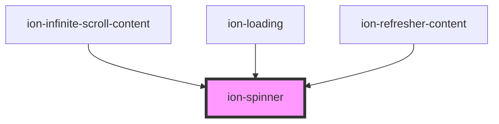

# ion-spinner

The Spinner component provides a variety of animated SVG spinners. Spinners are visual indicators that the app is loading content or performing another process that the user needs to wait on.

The default spinner to use is based on the platform. The default spinner for `ios` is `"lines"`, and the default for `android` is `"crescent"`. If the platform is not `ios` or `android`, the spinner will default to `crescent`. If the `name` property is set, then that spinner will be used instead of the platform specific spinner.


<!-- Auto Generated Below -->


## Usage

### Angular / javascript

```html
<!-- Default Spinner -->
<ion-spinner></ion-spinner>

<!-- Lines -->
<ion-spinner name="lines"></ion-spinner>

<!-- Lines Small -->
<ion-spinner name="lines-small"></ion-spinner>

<!-- Dots -->
<ion-spinner name="dots"></ion-spinner>

<!-- Bubbles -->
<ion-spinner name="bubbles"></ion-spinner>

<!-- Circles -->
<ion-spinner name="circles"></ion-spinner>

<!-- Crescent -->
<ion-spinner name="crescent"></ion-spinner>

<!-- Paused Default Spinner -->
<ion-spinner paused></ion-spinner>
```


### React

```tsx
import React from 'react';
import { IonSpinner, IonContent } from '@ionic/react';

export const SpinnerExample: React.FunctionComponent = () => (
  <IonContent>
    {/*-- Default Spinner --*/}
    <IonSpinner />

    {/*-- Lines --*/}
    <IonSpinner name="lines" />

    {/*-- Lines Small --*/}
    <IonSpinner name="lines-small" />

    {/*-- Dots --*/}
    <IonSpinner name="dots" />

    {/*-- Bubbles --*/}
    <IonSpinner name="bubbles" />

    {/*-- Circles --*/}
    <IonSpinner name="circles" />

    {/*-- Crescent --*/}
    <IonSpinner name="crescent" />

    {/*-- Paused Default Spinner --*/}
    <IonSpinner paused />
  </IonContent>
);
```


### Vue

```html
<template>
  <!-- Default Spinner -->
  <ion-spinner></ion-spinner>

  <!-- Lines -->
  <ion-spinner name="lines"></ion-spinner>

  <!-- Lines Small -->
  <ion-spinner name="lines-small"></ion-spinner>

  <!-- Dots -->
  <ion-spinner name="dots"></ion-spinner>

  <!-- Bubbles -->
  <ion-spinner name="bubbles"></ion-spinner>

  <!-- Circles -->
  <ion-spinner name="circles"></ion-spinner>

  <!-- Crescent -->
  <ion-spinner name="crescent"></ion-spinner>

  <!-- Paused Default Spinner -->
  <ion-spinner paused></ion-spinner>
</template>
```


## Properties

| Property   | Attribute  | Description                                                                                                                                                                                                                                                            | Type                                                                                      | Default     |
| ---------- | ---------- | ---------------------------------------------------------------------------------------------------------------------------------------------------------------------------------------------------------------------------------------------------------------------- | ----------------------------------------------------------------------------------------- | ----------- |
| `color`    | `color`    | The color to use from your application's color palette. Default options are: `"primary"`, `"secondary"`, `"tertiary"`, `"success"`, `"warning"`, `"danger"`, `"light"`, `"medium"`, and `"dark"`. For more information on colors, see [theming](/docs/theming/basics). | `string \| undefined`                                                                     | `undefined` |
| `duration` | `duration` | Duration of the spinner animation in milliseconds. The default varies based on the spinner.                                                                                                                                                                            | `number \| undefined`                                                                     | `undefined` |
| `name`     | `name`     | The name of the SVG spinner to use. If a name is not provided, the platform's default spinner will be used.                                                                                                                                                            | `"bubbles" \| "circles" \| "crescent" \| "dots" \| "lines" \| "lines-small" \| undefined` | `undefined` |
| `paused`   | `paused`   | If `true`, the spinner's animation will be paused.                                                                                                                                                                                                                     | `boolean`                                                                                 | `false`     |


## CSS Custom Properties

| Name      | Description          |
| --------- | -------------------- |
| `--color` | Color of the spinner |


## Dependencies

### Used by

 - [ion-infinite-scroll-content](../infinite-scroll-content)
 - [ion-loading](../loading)
 - [ion-refresher-content](../refresher-content)

### Graph


----------------------------------------------

*Built with [StencilJS](https://stenciljs.com/)*
