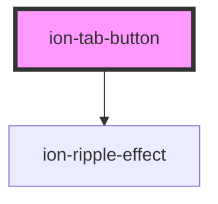

# ion-tab-button

A tab button is a UI component that is placed inside of a [tab bar](../tab-bar). The tab button can specify the layout of the icon and label and connect to a [tab view](../tab).

See the [tabs documentation](../tabs) for more details on configuring tabs.


<!-- Auto Generated Below -->


## Usage

### Angular

```html
<ion-tabs>

  <ion-tab-bar slot="bottom">
    <ion-tab-button tab="schedule">
      <ion-icon name="calendar"></ion-icon>
      <ion-label>Schedule</ion-label>
    </ion-tab-button>

    <ion-tab-button tab="speakers">
      <ion-icon name="contacts"></ion-icon>
      <ion-label>Speakers</ion-label>
    </ion-tab-button>

    <ion-tab-button tab="map">
      <ion-icon name="map"></ion-icon>
      <ion-label>Map</ion-label>
    </ion-tab-button>

    <ion-tab-button tab="about">
      <ion-icon name="information-circle"></ion-icon>
      <ion-label>About</ion-label>
    </ion-tab-button>
  </ion-tab-bar>

</ion-tabs>
```


### Javascript

```html
<ion-tabs>

  <ion-tab-bar slot="bottom">
    <ion-tab-button tab="schedule" href="/app/tabs/(schedule:schedule)">
      <ion-icon name="calendar"></ion-icon>
      <ion-label>Schedule</ion-label>
    </ion-tab-button>

    <ion-tab-button tab="speakers" href="/app/tabs/(speakers:speakers)">
      <ion-icon name="contacts"></ion-icon>
      <ion-label>Speakers</ion-label>
    </ion-tab-button>

    <ion-tab-button tab="map" href="/app/tabs/(map:map)">
      <ion-icon name="map"></ion-icon>
      <ion-label>Map</ion-label>
    </ion-tab-button>

    <ion-tab-button tab="about" href="/app/tabs/(about:about)">
      <ion-icon name="information-circle"></ion-icon>
      <ion-label>About</ion-label>
    </ion-tab-button>
  </ion-tab-bar>

  <ion-tab tab="schedule">
    <ion-router-outlet name="schedule"></ion-router-outlet>
  </ion-tab>

  <ion-tab tab="speakers">
    <ion-router-outlet name="speakers"></ion-router-outlet>
  </ion-tab>

  <ion-tab tab="map">
    <ion-router-outlet name="map"></ion-router-outlet>
  </ion-tab>

  <ion-tab tab="about">
    <ion-router-outlet name="about"></ion-router-outlet>
  </ion-tab>

</ion-tabs>
```


### React

```tsx
import React from 'react';
import { IonTabs, IonTabBar, IonTabButton, IonIcon, IonLabel, IonContent } from '@ionic/react';

export const TabButtonExample: React.FunctionComponent = () => (
  <IonContent>
    <IonTabs>
      <IonTabBar slot="bottom">
        <IonTabButton tab="schedule">
          <IonIcon name="calendar" />
          <IonLabel>Schedule</IonLabel>
        </IonTabButton>

        <IonTabButton tab="speakers">
          <IonIcon name="contacts" />
          <IonLabel>Speakers</IonLabel>
        </IonTabButton>

        <IonTabButton tab="map">
          <IonIcon name="map" />
          <IonLabel>Map</IonLabel>
        </IonTabButton>

        <IonTabButton tab="about">
          <IonIcon name="information-circle" />
          <IonLabel>About</IonLabel>
        </IonTabButton>
      </IonTabBar>
    </IonTabs>
  </IonContent>
);
```


### Vue

```html
<template>
  <ion-tabs>

    <ion-tab-bar slot="bottom">
      <ion-tab-button tab="schedule">
        <ion-icon name="calendar"></ion-icon>
        <ion-label>Schedule</ion-label>
      </ion-tab-button>

      <ion-tab-button tab="speakers">
        <ion-icon name="contacts"></ion-icon>
        <ion-label>Speakers</ion-label>
      </ion-tab-button>

      <ion-tab-button tab="map">
        <ion-icon name="map"></ion-icon>
        <ion-label>Map</ion-label>
      </ion-tab-button>

      <ion-tab-button tab="about">
        <ion-icon name="information-circle"></ion-icon>
        <ion-label>About</ion-label>
      </ion-tab-button>
    </ion-tab-bar>

  </ion-tabs>
</template>
```


## Properties

| Property   | Attribute  | Description                                                                                                                                                                                                                                                                               | Type                                                                                                    | Default     |
| ---------- | ---------- | ----------------------------------------------------------------------------------------------------------------------------------------------------------------------------------------------------------------------------------------------------------------------------------------- | ------------------------------------------------------------------------------------------------------- | ----------- |
| `disabled` | `disabled` | If `true`, the user cannot interact with the tab button.                                                                                                                                                                                                                                  | `boolean`                                                                                               | `false`     |
| `download` | `download` | This attribute instructs browsers to download a URL instead of navigating to it, so the user will be prompted to save it as a local file. If the attribute has a value, it is used as the pre-filled file name in the Save prompt (the user can still change the file name if they want). | `string \| undefined`                                                                                   | `undefined` |
| `href`     | `href`     | Contains a URL or a URL fragment that the hyperlink points to. If this property is set, an anchor tag will be rendered.                                                                                                                                                                   | `string \| undefined`                                                                                   | `undefined` |
| `layout`   | `layout`   | Set the layout of the text and icon in the tab bar. It defaults to `'icon-top'`.                                                                                                                                                                                                          | `"icon-bottom" \| "icon-end" \| "icon-hide" \| "icon-start" \| "icon-top" \| "label-hide" \| undefined` | `undefined` |
| `mode`     | `mode`     | The mode determines which platform styles to use.                                                                                                                                                                                                                                         | `"ios" \| "md"`                                                                                         | `undefined` |
| `rel`      | `rel`      | Specifies the relationship of the target object to the link object. The value is a space-separated list of [link types](https://developer.mozilla.org/en-US/docs/Web/HTML/Link_types).                                                                                                    | `string \| undefined`                                                                                   | `undefined` |
| `selected` | `selected` | The selected tab component                                                                                                                                                                                                                                                                | `boolean`                                                                                               | `false`     |
| `tab`      | `tab`      | A tab id must be provided for each `ion-tab`. It's used internally to reference the selected tab or by the router to switch between them.                                                                                                                                                 | `string \| undefined`                                                                                   | `undefined` |
| `target`   | `target`   | Specifies where to display the linked URL. Only applies when an `href` is provided. Special keywords: `"_blank"`, `"_self"`, `"_parent"`, `"_top"`.                                                                                                                                       | `string \| undefined`                                                                                   | `undefined` |


## CSS Custom Properties

| Name                   | Description                                                                                                   |
| ---------------------- | ------------------------------------------------------------------------------------------------------------- |
| `--background`         | Background of the tab button                                                                                  |
| `--background-focused` | Background of the tab button when focused with the tab key                                                    |
| `--color`              | Color of the tab button                                                                                       |
| `--color-selected`     | Color of the selected tab button                                                                              |
| `--padding-bottom`     | Bottom padding of the tab button                                                                              |
| `--padding-end`        | Right padding if direction is left-to-right, and left padding if direction is right-to-left of the tab button |
| `--padding-start`      | Left padding if direction is left-to-right, and right padding if direction is right-to-left of the tab button |
| `--padding-top`        | Top padding of the tab button                                                                                 |
| `--ripple-color`       | Color of the button ripple effect                                                                             |


## Dependencies

### Depends on

- [ion-ripple-effect](../ripple-effect)

### Graph


----------------------------------------------

*Built with [StencilJS](https://stenciljs.com/)*
