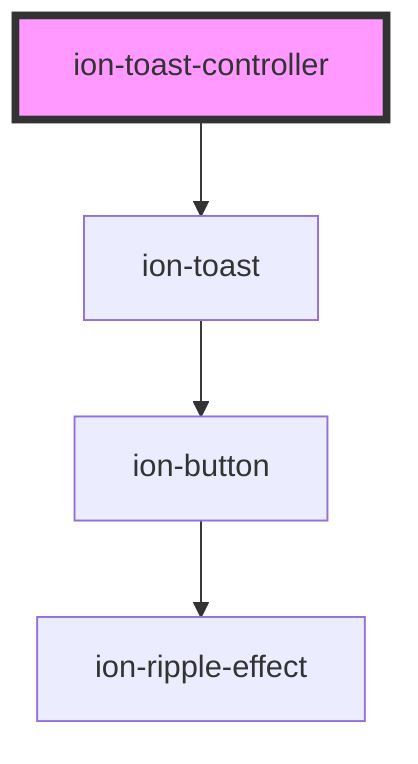

# ion-toast-controller

ToastController is a component use to create Toast components. Please see the docs for [Toast](../toast).

<!-- Auto Generated Below -->

## Methods

### `create(opts?: ToastOptions | undefined) => Promise<HTMLIonToastElement>`

Create a toast overlay with toast options.

#### Returns

Type: `Promise<HTMLIonToastElement>`

### `dismiss(data?: any, role?: string | undefined, id?: string | undefined) => Promise<boolean>`

Dismiss the open toast overlay.

#### Returns

Type: `Promise<boolean>`

### `getTop() => Promise<HTMLIonToastElement | undefined>`

Get the most recently opened toast overlay.

#### Returns

Type: `Promise<HTMLIonToastElement | undefined>`

## Dependencies

#### Depends on
 - [ion-toast](../toast)

#### Graph

----------------------------------------------

*Built with [StencilJS](https://stenciljs.com/)*
