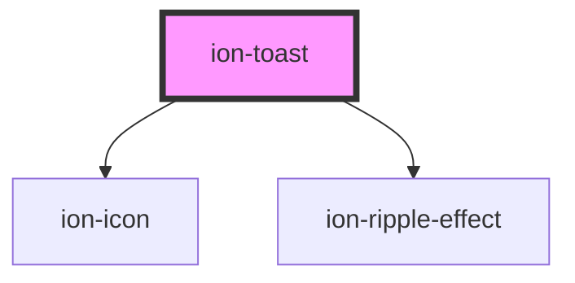

# ion-toast

A Toast is a subtle notification commonly used in modern applications. It can be used to provide feedback about an operation or to display a system message. The toast appears on top of the app's content, and can be dismissed by the app to resume user interaction with the app.

### Creating

All of the toast options should be passed in the create method. The message to display should be passed in the `message` property. The `showCloseButton` option can be set to true in order to display a close button on the toast. See the properties below for all available options.

### Positioning

Toasts can be positioned at the top, bottom or middle of the viewport. The position can be passed upon creation. The possible values are `top`, `bottom` and `middle`. If the position is not specified, the toast will be displayed at the bottom of the viewport.

### Dismissing

The toast can be dismissed automatically after a specific amount of time by passing the number of milliseconds to display it in the `duration` of the toast options. If `showCloseButton` is set to true, then the close button will dismiss the toast. To dismiss the toast after creation, call the `dismiss()` method on the instance.


<!-- Auto Generated Below -->


## Usage

### Angular

```typescript
import { Component } from '@angular/core';
import { ToastController } from '@ionic/angular';

@Component({
  selector: 'toast-example',
  templateUrl: 'toast-example.html',
  styleUrls: ['./toast-example.css'],
})
export class ToastExample {

  constructor(public toastController: ToastController) {}

  async presentToast() {
    const toast = await this.toastController.create({
      message: 'Your settings have been saved.',
      duration: 2000
    });
    toast.present();
  }

  async presentToastWithOptions() {
    const toast = await this.toastController.create({
      header: 'Toast header',
      message: 'Click to Close',
      position: 'top',
      buttons: [
        {
          side: 'start',
          icon: 'star',
          text: 'Favorite',
          handler: () => {
            console.log('Favorite clicked');
          }
        }, {
          text: 'Done',
          role: 'cancel',
          handler: () => {
            console.log('Cancel clicked');
          }
        }
      ]
    });
    toast.present();
  }

}
```


### Javascript

```javascript
async function presentToast() {
  const toastController = document.querySelector('ion-toast-controller');
  await toastController.componentOnReady();

  const toast = await toastController.create({
    message: 'Your settings have been saved.',
    duration: 2000
  });
  return await toast.present();
}

async function presentToastWithOptions() {
  const toastController = document.querySelector('ion-toast-controller');
  await toastController.componentOnReady();

  const toast = await toastController.create({
    header: 'Toast header',
    message: 'Click to Close',
    position: 'top',
    buttons: [
      {
        side: 'start',
        icon: 'star',
        text: 'Favorite',
        handler: () => {
          console.log('Favorite clicked');
        }
      }, {
        text: 'Done',
        role: 'cancel',
        handler: () => {
          console.log('Cancel clicked');
        }
      }
    ]
  });

  return await toast.present();
}
```


### React

```tsx
import React, { useState } from 'react';
import { IonToast, IonContent, IonButton } from '@ionic/react';

export const ToastExample: React.FunctionComponent = () => {
  const [showToast1, setShowToast1] = useState(false);
  const [showToast2, setShowToast2] = useState(false);

  return (
    <IonContent>
      <IonButton onClick={() => setShowToast1(true)} expand="block">Show Toast 1</IonButton>
      <IonButton onClick={() => setShowToast2(true)} expand="block">Show Toast 2</IonButton>
      <IonToast
        isOpen={showToast1}
        onDidDismiss={() => setShowToast1(false)}
        message="Your settings have been saved."
        duration={200}
      />

      <IonToast
        isOpen={showToast2}
        onDidDismiss={() => setShowToast2(false)}
        message="Click to Close"
        position="top"
        buttons={[
          {
            side: 'start',
            icon: 'star',
            text: 'Favorite',
            handler: () => {
              console.log('Favorite clicked');
            }
          },
          {
            text: 'Done',
            role: 'cancel',
            handler: () => {
              console.log('Cancel clicked');
            }
          }
        ]}
      />
    </IonContent>
  );
};
```


## Properties

| Property          | Attribute           | Description                                                                                                                                                                                                                                                            | Type                                                                                   | Default     |
| ----------------- | ------------------- | ---------------------------------------------------------------------------------------------------------------------------------------------------------------------------------------------------------------------------------------------------------------------- | -------------------------------------------------------------------------------------- | ----------- |
| `animated`        | `animated`          | If `true`, the toast will animate.                                                                                                                                                                                                                                     | `boolean`                                                                              | `true`      |
| `buttons`         | --                  | An array of buttons for the toast.                                                                                                                                                                                                                                     | `(string \| ToastButton)[] \| undefined`                                               | `undefined` |
| `closeButtonText` | `close-button-text` | Text to display in the close button.                                                                                                                                                                                                                                   | `string \| undefined`                                                                  | `undefined` |
| `color`           | `color`             | The color to use from your application's color palette. Default options are: `"primary"`, `"secondary"`, `"tertiary"`, `"success"`, `"warning"`, `"danger"`, `"light"`, `"medium"`, and `"dark"`. For more information on colors, see [theming](/docs/theming/basics). | `string \| undefined`                                                                  | `undefined` |
| `cssClass`        | `css-class`         | Additional classes to apply for custom CSS. If multiple classes are provided they should be separated by spaces.                                                                                                                                                       | `string \| string[] \| undefined`                                                      | `undefined` |
| `duration`        | `duration`          | How many milliseconds to wait before hiding the toast. By default, it will show until `dismiss()` is called.                                                                                                                                                           | `number`                                                                               | `0`         |
| `enterAnimation`  | --                  | Animation to use when the toast is presented.                                                                                                                                                                                                                          | `((Animation: Animation, baseEl: any, opts?: any) => Promise<Animation>) \| undefined` | `undefined` |
| `header`          | `header`            | Header to be shown in the toast.                                                                                                                                                                                                                                       | `string \| undefined`                                                                  | `undefined` |
| `keyboardClose`   | `keyboard-close`    | If `true`, the keyboard will be automatically dismissed when the overlay is presented.                                                                                                                                                                                 | `boolean`                                                                              | `false`     |
| `leaveAnimation`  | --                  | Animation to use when the toast is dismissed.                                                                                                                                                                                                                          | `((Animation: Animation, baseEl: any, opts?: any) => Promise<Animation>) \| undefined` | `undefined` |
| `message`         | `message`           | Message to be shown in the toast.                                                                                                                                                                                                                                      | `string \| undefined`                                                                  | `undefined` |
| `mode`            | `mode`              | The mode determines which platform styles to use.                                                                                                                                                                                                                      | `"ios" \| "md"`                                                                        | `undefined` |
| `position`        | `position`          | The position of the toast on the screen.                                                                                                                                                                                                                               | `"bottom" \| "middle" \| "top"`                                                        | `'bottom'`  |
| `showCloseButton` | `show-close-button` | If `true`, the close button will be displayed.                                                                                                                                                                                                                         | `boolean`                                                                              | `false`     |
| `translucent`     | `translucent`       | If `true`, the toast will be translucent.                                                                                                                                                                                                                              | `boolean`                                                                              | `false`     |


## Events

| Event                 | Description                             | Type                                   |
| --------------------- | --------------------------------------- | -------------------------------------- |
| `ionToastDidDismiss`  | Emitted after the toast has dismissed.  | `CustomEvent<OverlayEventDetail<any>>` |
| `ionToastDidPresent`  | Emitted after the toast has presented.  | `CustomEvent<void>`                    |
| `ionToastWillDismiss` | Emitted before the toast has dismissed. | `CustomEvent<OverlayEventDetail<any>>` |
| `ionToastWillPresent` | Emitted before the toast has presented. | `CustomEvent<void>`                    |


## Methods

### `dismiss(data?: any, role?: string | undefined) => Promise<boolean>`

Dismiss the toast overlay after it has been presented.

#### Returns

Type: `Promise<boolean>`


### `onDidDismiss() => Promise<OverlayEventDetail<any>>`

Returns a promise that resolves when the toast did dismiss.

#### Returns

Type: `Promise<OverlayEventDetail<any>>`


### `onWillDismiss() => Promise<OverlayEventDetail<any>>`

Returns a promise that resolves when the toast will dismiss.

#### Returns

Type: `Promise<OverlayEventDetail<any>>`


### `present() => Promise<void>`

Present the toast overlay after it has been created.

#### Returns

Type: `Promise<void>`


## CSS Custom Properties

| Name              | Description                                                                                            |
| ----------------- | ------------------------------------------------------------------------------------------------------ |
| `--background`    | Background of the toast                                                                                |
| `--border-color`  | Border color of the toast                                                                              |
| `--border-radius` | Border radius of the toast                                                                             |
| `--border-style`  | Border style of the toast                                                                              |
| `--border-width`  | Border width of the toast                                                                              |
| `--box-shadow`    | Box shadow of the toast                                                                                |
| `--button-color`  | Color of the button text                                                                               |
| `--color`         | Color of the toast text                                                                                |
| `--end`           | Position from the right if direction is left-to-right, and from the left if direction is right-to-left |
| `--height`        | Height of the toast                                                                                    |
| `--max-height`    | Maximum height of the toast                                                                            |
| `--max-width`     | Maximum width of the toast                                                                             |
| `--min-height`    | Minimum height of the toast                                                                            |
| `--min-width`     | Minimum width of the toast                                                                             |
| `--start`         | Position from the left if direction is left-to-right, and from the right if direction is right-to-left |
| `--width`         | Width of the toast                                                                                     |


## Dependencies

### Depends on

- ion-icon
- [ion-ripple-effect](../ripple-effect)

### Graph


----------------------------------------------

*Built with [StencilJS](https://stenciljs.com/)*
