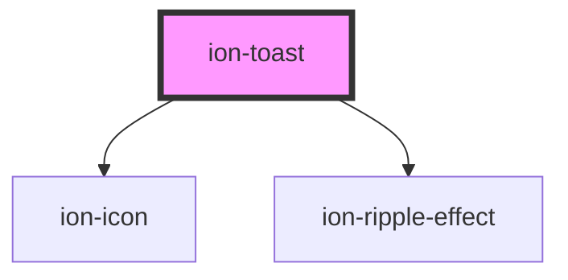

# ion-toast

A Toast is a subtle notification commonly used in modern applications. It can be used to provide feedback about an operation or to display a system message. The toast appears on top of the app's content, and can be dismissed by the app to resume user interaction with the app.

## Positioning

Toasts can be positioned at the top, bottom or middle of the viewport. The position can be passed upon creation. The possible values are `top`, `bottom` and `middle`. If the position is not specified, the toast will be displayed at the bottom of the viewport.

## Dismissing

The toast can be dismissed automatically after a specific amount of time by passing the number of milliseconds to display it in the `duration` of the toast options. If a button with a role of `"cancel"` is added, then that button will dismiss the toast. To dismiss the toast after creation, call the `dismiss()` method on the instance.

## Icons

An icon can be added next to the content inside of the toast. In general, icons in toasts should be used to add additional style or context, not to grab the user's attention or elevate the priority of the toast. If you wish to convey a higher priority message to the user or guarantee a response, we recommend using an [Alert](../alert) instead.

## Interfaces

### ToastButton

```typescript
interface ToastButton {
  text?: string;
  icon?: string;
  side?: 'start' | 'end';
  role?: 'cancel' | string;
  cssClass?: string | string[];
  handler?: () => boolean | void | Promise<boolean | void>;
}
```

### ToastOptions

```typescript
interface ToastOptions {
  header?: string;
  message?: string | IonicSafeString;
  cssClass?: string | string[];
  duration?: number;
  buttons?: (ToastButton | string)[];
  position?: 'top' | 'bottom' | 'middle';
  translucent?: boolean;
  animated?: boolean;
  icon?: string;
  htmlAttributes?: { [key: string]: any };

  color?: Color;
  mode?: Mode;
  keyboardClose?: boolean;
  id?: string;

  enterAnimation?: AnimationBuilder;
  leaveAnimation?: AnimationBuilder;
}
```

## Accessibility

### Focus Management

Toasts are intended to be subtle notifications and are not intended to interrupt the user. User interaction should not be required to dismiss the toast. As a result, focus is not automatically moved to a toast when one is presented.

### Screen Readers

`ion-toast` has `aria-live="polite"` and `aria-atomic="true"` set by default.

`aria-live` causes screen readers to announce the content of the toast when it is presented. However, since the attribute is set to `'polite'`, screen readers generally do not interrupt the current task. Developers can customize this behavior by using the `htmlAttributes` property to set `aria-live` to `'assertive'`. This will cause screen readers to immediately notify the user when a toast is presented, potentially interrupting any previous updates.

`aria-atomic="true"` is set to ensure that the entire toast is announced as a single unit. This is useful when dynamically updating the content of the toast as it prevents screen readers from announcing only the content that has changed. 

### Tips

While this is not a complete list, here are some guidelines to follow when using toasts.

* Do not require user interaction to dismiss toasts. For example, having a "Dismiss" button in the toast is fine, but the toast should also automatically dismiss on its own after a timeout period. If you need user interaction for a notification, consider using [ion-alert](./alert) instead.

* Avoid opening multiple toasts in quick succession. If `aria-live` is set to `'assertive'`, screen readers may interrupt the reading of the current task to announce the new toast, causing the context of the previous toast to be lost.

* For toasts with long messages, consider adjusting the `duration` property to allow users enough time to read the content of the toast.

<!-- Auto Generated Below -->


## Usage

### Angular

```typescript
import { Component } from '@angular/core';
import { ToastController } from '@ionic/angular';

@Component({
  selector: 'toast-example',
  templateUrl: 'toast-example.html',
  styleUrls: ['./toast-example.css'],
})
export class ToastExample {

  constructor(public toastController: ToastController) {}

  async presentToast() {
    const toast = await this.toastController.create({
      message: 'Your settings have been saved.',
      duration: 2000
    });
    toast.present();
  }

  async presentToastWithOptions() {
    const toast = await this.toastController.create({
      header: 'Toast header',
      message: 'Click to Close',
      icon: 'information-circle',
      position: 'top',
      buttons: [
        {
          side: 'start',
          icon: 'star',
          text: 'Favorite',
          handler: () => {
            console.log('Favorite clicked');
          }
        }, {
          text: 'Done',
          role: 'cancel',
          handler: () => {
            console.log('Cancel clicked');
          }
        }
      ]
    });
    await toast.present();

    const { role } = await toast.onDidDismiss();
    console.log('onDidDismiss resolved with role', role);
  }

}
```


### Javascript

```javascript
async function presentToast() {
  const toast = document.createElement('ion-toast');
  toast.message = 'Your settings have been saved.';
  toast.duration = 2000;

  document.body.appendChild(toast);
  return toast.present();
}

async function presentToastWithOptions() {
  const toast = document.createElement('ion-toast');
  toast.header = 'Toast header';
  toast.message = 'Click to Close';
  toast.icon = 'information-circle',
  toast.position = 'top';
  toast.buttons = [
    {
      side: 'start',
      icon: 'star',
      text: 'Favorite',
      handler: () => {
        console.log('Favorite clicked');
      }
    }, {
      text: 'Done',
      role: 'cancel',
      handler: () => {
        console.log('Cancel clicked');
      }
    }
  ];

  document.body.appendChild(toast);
  await toast.present();

  const { role } = await toast.onDidDismiss();
  console.log('onDidDismiss resolved with role', role);
}
```


### React

```tsx
/* Using the useIonToast Hook */

import React from 'react';
import { IonButton, IonContent, IonPage, useIonToast } from '@ionic/react';

const ToastExample: React.FC = () => {
  const [present, dismiss] = useIonToast();

  return (
    <IonPage>
      <IonContent>
        <IonButton
          expand="block"
          onClick={() =>
            present({
              buttons: [{ text: 'hide', handler: () => dismiss() }],
              message: 'toast from hook, click hide to dismiss',
              onDidDismiss: () => console.log('dismissed'),
              onWillDismiss: () => console.log('will dismiss'),
            })
          }
        >
          Show Toast
        </IonButton>
        <IonButton
          expand="block"
          onClick={() => present('hello from hook', 3000)}
        >
          Show Toast using params, closes in 3 secs
        </IonButton>
        <IonButton expand="block" onClick={dismiss}>
          Hide Toast
        </IonButton>
      </IonContent>
    </IonPage>
  );
};
```

```tsx
/* Using the IonToast Component */

import React, { useState } from 'react';
import { IonToast, IonContent, IonButton } from '@ionic/react';
import { informationCircle } from 'ionicons/icons';

export const ToastExample: React.FC = () => {
  const [showToast1, setShowToast1] = useState(false);
  const [showToast2, setShowToast2] = useState(false);

  return (
    <IonContent>
      <IonButton onClick={() => setShowToast1(true)} expand="block">Show Toast 1</IonButton>
      <IonButton onClick={() => setShowToast2(true)} expand="block">Show Toast 2</IonButton>
      <IonToast
        isOpen={showToast1}
        onDidDismiss={() => setShowToast1(false)}
        message="Your settings have been saved."
        duration={200}
      />

      <IonToast
        isOpen={showToast2}
        onDidDismiss={() => setShowToast2(false)}
        message="Click to Close"
        icon={informationCircle}
        position="top"
        buttons={[
          {
            side: 'start',
            icon: 'star',
            text: 'Favorite',
            handler: () => {
              console.log('Favorite clicked');
            }
          },
          {
            text: 'Done',
            role: 'cancel',
            handler: () => {
              console.log('Cancel clicked');
            }
          }
        ]}
      />
    </IonContent>
  );
};
```


### Stencil

```tsx
import { Component, h } from '@stencil/core';

import { toastController } from '@ionic/core';

@Component({
  tag: 'toast-example',
  styleUrl: 'toast-example.css'
})
export class ToastExample {
  async presentToast() {
    const toast = await toastController.create({
      message: 'Your settings have been saved.',
      duration: 2000
    });
    toast.present();
  }

  async presentToastWithOptions() {
    const toast = await toastController.create({
      header: 'Toast header',
      message: 'Click to Close',
      icon: 'information-circle',
      position: 'top',
      buttons: [
        {
          side: 'start',
          icon: 'star',
          text: 'Favorite',
          handler: () => {
            console.log('Favorite clicked');
          }
        }, {
          text: 'Done',
          role: 'cancel',
          handler: () => {
            console.log('Cancel clicked');
          }
        }
      ]
    });
    await toast.present();

    const { role } = await toast.onDidDismiss();
    console.log('onDidDismiss resolved with role', role);
  }

  render() {
    return [
      <ion-content>
        <ion-button onClick={() => this.presentToast()}>Present Toast</ion-button>
        <ion-button onClick={() => this.presentToastWithOptions()}>Present Toast: Options</ion-button>
      </ion-content>
    ];
  }
}
```


### Vue

```html
<template>
  <ion-page>
    <ion-content class="ion-padding">
      <ion-button @click="openToast">Open Toast</ion-button>
      <ion-button @click="openToastOptions">Open Toast: Options</ion-button>
    </ion-content>
  </ion-page>
</template>

<script>
import { IonButton, IonContent, IonPage, toastController } from '@ionic/vue';
import { informationCircle } from 'ionicons/icons';

export default {
  components: { IonButton, IonContent, IonPage },
  methods: {
    async openToast() {
      const toast = await toastController
        .create({
          message: 'Your settings have been saved.',
          duration: 2000
        })
      return toast.present();
    },
    async openToastOptions() {
      const toast = await toastController
        .create({
          header: 'Toast header',
          message: 'Click to Close',
          icon: informationCircle,
          position: 'top',
          buttons: [
            {
              side: 'start',
              icon: 'star',
              text: 'Favorite',
              handler: () => {
                console.log('Favorite clicked');
              }
            }, {
              text: 'Done',
              role: 'cancel',
              handler: () => {
                console.log('Cancel clicked');
              }
            }
          ]
        })
      await toast.present();

      const { role } = await toast.onDidDismiss();
      console.log('onDidDismiss resolved with role', role);
    },
  },
}
</script>
```

Developers can also use this component directly in their template:

```html
<template>
  <ion-button @click="setOpen(true)">Show Toast</ion-button>
  <ion-toast
    :is-open="isOpenRef"
    message="Your settings have been saved."
    :duration="2000"
    @didDismiss="setOpen(false)"
  >
  </ion-toast>
</template>

<script>
import { IonToast, IonButton } from '@ionic/vue';
import { defineComponent, ref } from 'vue';

export default defineComponent({
  components: { IonToast, IonButton },
  setup() {
    const isOpenRef = ref(false);
    const setOpen = (state: boolean) => isOpenRef.value = state;

    return { isOpenRef, setOpen }
  }
});
</script>
```


## Properties

| Property         | Attribute        | Description                                                                                                                                                                                                                                                            | Type                                                    | Default     |
| ---------------- | ---------------- | ---------------------------------------------------------------------------------------------------------------------------------------------------------------------------------------------------------------------------------------------------------------------- | ------------------------------------------------------- | ----------- |
| `animated`       | `animated`       | If `true`, the toast will animate.                                                                                                                                                                                                                                     | `boolean`                                               | `true`      |
| `buttons`        | --               | An array of buttons for the toast.                                                                                                                                                                                                                                     | `(string \| ToastButton)[] \| undefined`                | `undefined` |
| `color`          | `color`          | The color to use from your application's color palette. Default options are: `"primary"`, `"secondary"`, `"tertiary"`, `"success"`, `"warning"`, `"danger"`, `"light"`, `"medium"`, and `"dark"`. For more information on colors, see [theming](/docs/theming/basics). | `string \| undefined`                                   | `undefined` |
| `cssClass`       | `css-class`      | Additional classes to apply for custom CSS. If multiple classes are provided they should be separated by spaces.                                                                                                                                                       | `string \| string[] \| undefined`                       | `undefined` |
| `duration`       | `duration`       | How many milliseconds to wait before hiding the toast. By default, it will show until `dismiss()` is called.                                                                                                                                                           | `number`                                                | `0`         |
| `enterAnimation` | --               | Animation to use when the toast is presented.                                                                                                                                                                                                                          | `((baseEl: any, opts?: any) => Animation) \| undefined` | `undefined` |
| `header`         | `header`         | Header to be shown in the toast.                                                                                                                                                                                                                                       | `string \| undefined`                                   | `undefined` |
| `htmlAttributes` | --               | Additional attributes to pass to the toast.                                                                                                                                                                                                                            | `undefined \| { [key: string]: any; }`                  | `undefined` |
| `icon`           | `icon`           | The name of the icon to display, or the path to a valid SVG file. See `ion-icon`. https://ionic.io/ionicons                                                                                                                                                            | `string \| undefined`                                   | `undefined` |
| `keyboardClose`  | `keyboard-close` | If `true`, the keyboard will be automatically dismissed when the overlay is presented.                                                                                                                                                                                 | `boolean`                                               | `false`     |
| `leaveAnimation` | --               | Animation to use when the toast is dismissed.                                                                                                                                                                                                                          | `((baseEl: any, opts?: any) => Animation) \| undefined` | `undefined` |
| `message`        | `message`        | Message to be shown in the toast.                                                                                                                                                                                                                                      | `IonicSafeString \| string \| undefined`                | `undefined` |
| `mode`           | `mode`           | The mode determines which platform styles to use.                                                                                                                                                                                                                      | `"ios" \| "md"`                                         | `undefined` |
| `position`       | `position`       | The position of the toast on the screen.                                                                                                                                                                                                                               | `"bottom" \| "middle" \| "top"`                         | `'bottom'`  |
| `translucent`    | `translucent`    | If `true`, the toast will be translucent. Only applies when the mode is `"ios"` and the device supports [`backdrop-filter`](https://developer.mozilla.org/en-US/docs/Web/CSS/backdrop-filter#Browser_compatibility).                                                   | `boolean`                                               | `false`     |


## Events

| Event                 | Description                             | Type                                   |
| --------------------- | --------------------------------------- | -------------------------------------- |
| `ionToastDidDismiss`  | Emitted after the toast has dismissed.  | `CustomEvent<OverlayEventDetail<any>>` |
| `ionToastDidPresent`  | Emitted after the toast has presented.  | `CustomEvent<void>`                    |
| `ionToastWillDismiss` | Emitted before the toast has dismissed. | `CustomEvent<OverlayEventDetail<any>>` |
| `ionToastWillPresent` | Emitted before the toast has presented. | `CustomEvent<void>`                    |


## Methods

### `dismiss(data?: any, role?: string | undefined) => Promise<boolean>`

Dismiss the toast overlay after it has been presented.

#### Returns

Type: `Promise<boolean>`


### `onDidDismiss<T = any>() => Promise<OverlayEventDetail<T>>`

Returns a promise that resolves when the toast did dismiss.

#### Returns

Type: `Promise<OverlayEventDetail<T>>`


### `onWillDismiss<T = any>() => Promise<OverlayEventDetail<T>>`

Returns a promise that resolves when the toast will dismiss.

#### Returns

Type: `Promise<OverlayEventDetail<T>>`


### `present() => Promise<void>`

Present the toast overlay after it has been created.

#### Returns

Type: `Promise<void>`


## Shadow Parts

| Part          | Description                                               |
| ------------- | --------------------------------------------------------- |
| `"button"`    | Any button element that is displayed inside of the toast. |
| `"container"` | The element that wraps all child elements.                |
| `"header"`    | The header text of the toast.                             |
| `"icon"`      | The icon that appears next to the toast content.          |
| `"message"`   | The body text of the toast.                               |


## CSS Custom Properties

| Name              | Description                                                                                            |
| ----------------- | ------------------------------------------------------------------------------------------------------ |
| `--background`    | Background of the toast                                                                                |
| `--border-color`  | Border color of the toast                                                                              |
| `--border-radius` | Border radius of the toast                                                                             |
| `--border-style`  | Border style of the toast                                                                              |
| `--border-width`  | Border width of the toast                                                                              |
| `--box-shadow`    | Box shadow of the toast                                                                                |
| `--button-color`  | Color of the button text                                                                               |
| `--color`         | Color of the toast text                                                                                |
| `--end`           | Position from the right if direction is left-to-right, and from the left if direction is right-to-left |
| `--height`        | Height of the toast                                                                                    |
| `--max-height`    | Maximum height of the toast                                                                            |
| `--max-width`     | Maximum width of the toast                                                                             |
| `--min-height`    | Minimum height of the toast                                                                            |
| `--min-width`     | Minimum width of the toast                                                                             |
| `--start`         | Position from the left if direction is left-to-right, and from the right if direction is right-to-left |
| `--white-space`   | White space of the toast message                                                                       |
| `--width`         | Width of the toast                                                                                     |


## Dependencies

### Depends on

- ion-icon
- [ion-ripple-effect](../ripple-effect)

### Graph


----------------------------------------------

*Built with [StencilJS](https://stenciljs.com/)*
