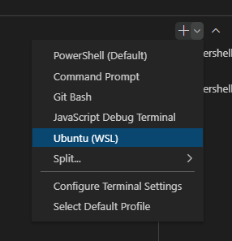

# Usage Instructions

E2E tests verify Ionic components in a real browser. This is useful for testing user interaction and catching visual regressions. We use Playwright as it allows us to test in multiple browsers. Tests can be written and run using Playwright's public API.

## Table of Contents

- [Installing Dependencies](#installing-dependencies)
- [Configuring Docker](#configuring-docker)
- [Running Tests](#running-tests)
- [Managing Screenshots](#managing-screenshots)
- [Further Reading](#further-reading)

## Installing Dependencies

Follow these steps to install Playwright dependencies. These steps must also be run whenever the installed version of Playwright changes to ensure that you are testing with the correct browser binaries.

1. Install the Playwright dependency in the `core` directory: `npm ci`
2. Download the correct browsers: `npx playwright install`

## Configuring Docker

Ionic uses [Docker](https://www.docker.com) to provide a way to run tests locally in the same environment that is used on CI. Using Docker is **optional** as all tests can be run locally on your host machine, but there are a few reasons why you might want to use Docker to run tests locally:

1. You want to run screenshot tests against the same ground truths used on CI to test your work. Screenshots must be tested in a consistent environment otherwise there will be screenshot mismatches. Without Docker, you would first need to generate ground truths in your local environment.
2. You want to update ground truths locally. Ground truths can be updated using a GitHub Action on CI, but this can take ~15 minutes.
3. You are a community contributor and you do not have access to the GitHub Action to update ground truths.
4. You want to debug an issue that only happen on CI. While this is rare, there are sometimes Linux-specific issues that pop up during development.

The [Running Tests](#running-tests) and [Managing Screenshots](#managing-screenshots) sections show how to perform various tasks in Playwright with Docker. The section below shows how to configure your environment to get set up with Docker.

### Installing Docker

Docker can be installed by [following the steps on the Docker website](https://docs.docker.com/get-docker/).

### Docker and Windows Development

Developers using Windows who wish to run tests using Docker must use the [Windows Subsystem for Linux v2 (WSL 2)](https://learn.microsoft.com/en-us/windows/wsl/about). Developers who wish to run headed tests will also need to use WSLg.

If you are running Docker Desktop on Windows 10 or 11 you likely already have both WSL and WSLg installed. The following steps show how to verify that WSL and WSLg are installed. If either of the below verification checks fail, then developers should [download the latest version of WSL](https://apps.microsoft.com/store/detail/9P9TQF7MRM4R?hl=en-us&gl=US).

1. To verify WSL is installed, launch "WSL" from the start menu. If "WSL" does not show up in the start menu then you do not have WSL installed.
2. With WSL open, verify that WSLg is installed: `ls -a -w 1 /mnt/wslg`. If the command fails with `No such file or directory` then your system is either missing WSLg or running an old version.
3. Verify that you have a Linux subsystem installed (such as Ubuntu) by running `wsl --list --verbose`. If you do not see a Linux subsystem in the list, run `wsl --install` to install it. Once installed, it's recommended to set this subsystem as the default Linux subsystem using `wsl --set-default [subsystem]`. Example: `wsl --set-default Ubuntu`.
4. Verify that your local version of Ubuntu (or other Linux subsystem) is using WSL 2 by running `wsl --list --verbose`. If your subsystem has a `1` under the "VERSION" heading, then that means it is using WSL 1, not WSL 2. To correct this, run `wsl --set-version [subsystem] 2`. Example: `wsl --set-version Ubuntu 2`.

If you are using VSCode, the WSL terminal can be accessed by selecting "Ubuntu (WSL)" from the terminal dropdown menu:



### Configuring Docker for Headed Tests (Optional)

Additional software is needed to run headed tests inside of Docker. The Docker-specific test commands such as `npm run test.e2e.docker` are configured to use this additional software, but it is up to the developer to ensure that the software is installed and running.

Playwright relies on [XServer](https://www.x.org/wiki/XServer/), a windowing system used to draw and move windows on a display, in order to run tests in headed mode. Follow the steps below to install XServer on your computer.

> [!NOTE]
> The following instructions are based off https://www.oddbird.net/2022/11/30/headed-playwright-in-docker/

#### macOS

macOS uses [XQuartz](https://www.xquartz.org) to use XServer on macOS.

1. Install [Homebrew](https://brew.sh) if not already installed. You can run `brew --version` to check if Homebrew is installed.
2. Install XQuartz: `brew install --cask xquartz`
3. Open XQuartz, go to `Preferences > Security`, and check “Allow connections from network clients”.
4. Restart your computer.
5. Start XQuartz from the command line: `xhost +localhost`
6. Open Docker Desktop and edit settings to give access to `/tmp/.X11-unix` in `Preferences > Resources > File sharing`.
7. In the `core` directory run `echo host.docker.internal:0 > docker-display.txt`. This information is used to set the `DISPLAY` environment variable which tells Playwright how to render a headed UI from the Docker container.
8. In the `core` directory run `echo /tmp/.X11-unix:/tmp/.X11-unix > docker-display-volume.txt`. This information is used to make XServer available inside of the Docker container.

#### Windows

Windows has a native XServer called [WSLg](https://github.com/microsoft/wslg#readme) that is included as part of the [Windows Subsystem for Linux (WSL)](https://learn.microsoft.com/en-us/windows/wsl/about). See [Docker and Windows Development](#docker-and-windows-development) for information on how to ensure both WSL and WSLg are installed. Once completed, follow the steps below to configure headed tests to use XServer.

> [!NOTE]
> The following steps should be done in WSL, not PowerShell. Running the commands in PowerShell may result in extra hidden characters being added.

1. In the `core` directory run `echo :0 > docker-display.txt`. This information is used to set the `DISPLAY` environment variable which tells Playwright how to render a headed UI from the Docker container.
2. In the `core` directory run `echo /tmp/.X11-unix:/tmp/.X11-unix > docker-display-volume.txt`. This information is used to make XServer available inside of the Docker container.

## Running Tests

### Running All Test Files

All E2E tests can be run using the following command:

```shell
npm run test.e2e
```

> [!NOTE]
> This command is a wrapper for `npx playwright test`. All data passed to `npm run test.e2e` can also be passed to `npx playwright test`.

### Running Specific Test Files

Specific test files can be run by passing the file paths or a directory that contains multiple test files. See [Managing Screenshots](#managing-screenshots) for generating ground truths before running screenshot tests.

**Specific Test Files**

```shell
npm run test.e2e src/components/button/test/basic/button.e2e.ts src/components/button/test/a11y/button.e2e.ts
```

**Test Directory with Multiple Files**

```shell
# Will run all the test files in the `test` directory
npm run test.e2e src/components/button/test
```

### Running Tests Inside Docker

While `npm run test.e2e` can be used to run tests in the same environment that you are developing in, `npm run test.e2e.docker` can be used to run tests in a Docker environment provided by the Ionic team. This command supports all the same features as `npm run test.e2e` detailed in the previous section.

This command builds a Docker image before tests run. It will also re-build the Docker image in the event that a Playwright update was merged into the repo.

Note that the Playwright report will not automatically open in your web browser when tests are complete because the tests were run in Docker. Run `npx playwright show-report` outside of Docker to open the most recent test report.

> [!NOTE]
> Additional setup is needed to run Playwright tests with headed mode in Docker. See [Configuring Docker for Headed Tests](#configuring-docker-for-headed-tests-optional) for more information.

### Headed vs. Headless Tests

Playwright tests in Ionic are run in headless mode by default. This means that a visual representation of the browser does not appear on your computer while running.

No additional steps are needed in order to run the tests in headless mode:

```shell
# Will run tests in headless mode
npm run test.e2e src/components/chip
```

 Playwright supports the `--headed` flag to run in headed mode which causes the visual representation of the browser to appear:

 ```shell
 # Will run tests in headed mode
 npm run test.e2e src/components/chip -- --headed
 ```

### Debugging Tests

Playwright offers several ways to efficiently isolate and debug specific issues, helping to quickly identify and resolve problems within your test suite.

#### 1. Running Only Individual Tests

The `.only` suffix can be added to individual tests to limit execution to just those tests during debugging. If you add `.only` to a specific test, only that test will be executed, and all other tests in the test suite will be skipped.

**Example:**

```ts
test.only('should do something', async ({ page }) => {
  // test code here
});
```

> [!IMPORTANT]
> After debugging, make sure to remove the `.only` suffix to ensure all tests run again during normal execution.

#### 2. Running Only a Test Suite

Similarly, you can focus on an entire test suite by adding `.only` to a `describe` block. This ensures that only the tests within that suite will be executed, while others will be skipped.

**Example:**

```ts
test.describe.only('group of tests', () => {
  test('test 1', async ({ page }) => {
    // test 1 code here
  });

  test('test 2', async ({ page }) => {
    // test 2 code here
  });
});
```

> [!IMPORTANT]
> After debugging, make sure to remove the `.only` suffix to ensure all tests run again during normal execution.

#### 3. Pausing Test Execution

Additionally, you can pause execution of a test by using the `page.pause()` method. This pauses the script execution and allows you to manually inspect the page in the browser.

**Example:**

```ts
const { test, expect } = require('@playwright/test');

test('example test', async ({ page }) => {
  await page.goto('https://example.com');

  // Pausing the page to inspect manually
  await page.pause();

  // Further actions will resume after unpausing
  const title = await page.title();
  expect(title).toBe('Example Domain');
});
```

> [!IMPORTANT]
> After debugging, make sure to remove the `page.pause()` call to restore normal test execution.

## Managing Screenshots

If you are running a test that takes a screenshot, you must first generate the reference screenshot from your reference branch. This is known as generating a "ground truth screenshot". All other screenshots will be compared to this ground truth.

### Generating or Updating Ground Truths With Docker (Local Development)

We recommend generating ground truths inside of [Docker](https://www.docker.com). This allows anyone contributing to Ionic Framework to create or update ground truths.

To create or update ground truths, run the following command:

```shell
npm run test.e2e.docker.update-snapshots
```

Optionally, you can pass a directory to only update the ground truths for that directory & subdirectories. This is useful when working on a specific component.

```shell
npm run test.e2e.docker.update-snapshots src/components/alert/
```

The resulting screenshots should be committed and pushed to your branch.

### Generating or Updating Ground Truths Without Docker (Local Development)

While we recommend generating ground truths inside of Docker it is possible to generate ground truths without it. Note that these generated ground truths can only be used for local testing and will not update the ground truths stored in the repo.

If the reference branch has changed since the last time you generated ground truths you may need to update your local ground truths.

For most types of work the reference branch is typically `main`. Features are merged into a different branch, so developers should use that as the reference branch. For example, if branch `foo` will be merged into `bar`, then the reference branch is `bar`.

The examples provided in the [Running Tests](#running-tests) section also apply here, allowing you to update screenshots for a specific test file.

Note that since you are generating the reference branch ground truth screenshots, you must be on the reference branch locally. Don't forget to pull the latest reference branch changes and then re-build using `npm run build`.

```shell
npm run test.e2e.update-snapshots
```

Optionally, you can pass a directory to only update the ground truths for that directory & subdirectories. This is useful when working on a specific component.

```shell
npm run test.e2e.update-snapshots src/components/alert/
```

From here, you can switch back to your branch and run the tests.

> [!NOTE]
> Locally generated ground truths should not be committed to the repo. The `.gitignore` file prevents this from accidentally happening.

### Generating or Updating Ground Truths (CI)

> [!IMPORTANT]
> Only Ionic Team members can update ground truths on the main repo. Ground truths cannot be updated on forked versions of the repo. Instead, we recommend generating ground truths in Docker.

When making an intentional visual change, you will need to update the ground truth screenshots or add new ones. It is important that the ground truth and comparison screenshots are taken in the same environment, so do not update the ground truth screenshots locally and commit them to the repo.

Instead, use the [Update Reference Screenshots GitHub Action](https://github.com/ionic-team/ionic-framework/actions/workflows/update-screenshots.yml).

1. Click the **Run workflow** dropdown.
2. Select your branch.
3. Leave the input field blank.
4. Click **Run workflow**.

This workflow will re-run all of the the screenshot tests. Instead of failing any tests with mismatched screenshots, it will take new ground truth screenshots. These ground truth screenshots will be pushed as a single commit to your branch once the workflow is completed.

If you want to update ground truths for a specific test, you can pass the test file path as an input to the workflow. This is useful when working on a specific component.

1. Click the **Run workflow** dropdown.
2. Select your branch.
3. Enter the file path in the input field. Example: `src/components/alert/test/basic/`
4. Click **Run workflow**.

The input field also accepts component names, such as `alert`. You can enter multiple components by separating them with spaces, for example, `alert button`. For a full list of options, refer to Playwright's [Command Line page](https://playwright.dev/docs/test-cli).

### Verifying Screenshot Differences

When any of the screenshot tests fail, it means a potential regression was caught. Developers must manually verify the difference in the Playwright test report.

If the screenshots fail on CI then developers must download the build artifact. On the **Summary** page for a particular workflow, find the **Artifacts** section. Screenshot tests are currently parallelized across several test runners, and the results from each of those runners is included in an artifact with the following naming scheme:

```
test-results-[current shard]-[total shards]

Example:

test-results-2-5 --> Test results from job runner 2 out of 5.
```

Download the appropriate artifact and unzip the file.

In the newly created directory, open the `playwright-report/index.html` in your browser. From here, you will be able to see the tests that failed as well as the expected screenshot, the actual screenshot, and the pixel differences.

> [!WARNING]
> It is recommended to verify the screenshot difference within the Playwright test report first. If you choose to try and reproduce the difference in a browser manually, make sure you are using the **exact** same browser version that Playwright is using.

## Further Reading

For more info on how to use Playwright, please see the [Playwright documentation](https://playwright.dev/docs/intro).
